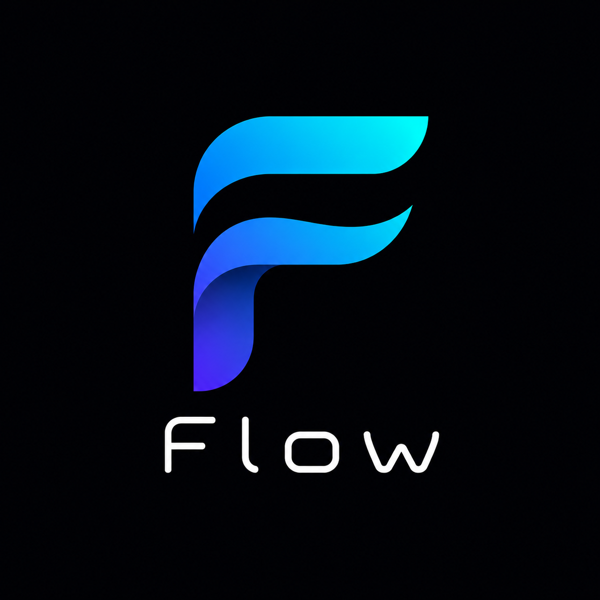

<p align="center">
  
</p>

<p align="center">
  A language for systems that evolve through time
</p>

<p align="center">
  <a href="https://flooooooooooow.github.io/flow/">Docs</a>
  ·
  <a href="docs/getting-started.md">Getting started</a>
  ·
  <a href="VISION.md">Vision</a>
  ·
  <a href="https://discord.gg/YK7VaHy24T">Discord</a>
  ·
  <a href="CONTRIBUTING.md">Contributing</a>
</p>

<p align="center">
  <a href="https://github.com/flooooooooooow/flow/actions/workflows/ci.yml"></a>
  <a href="https://flooooooooooow.github.io/flow/"></a>
  <a href="https://github.com/flooooooooooow/flow/releases"></a>
  <a href="LICENSE"></a>
  <a href="https://discord.gg/YK7VaHy24T"></a>
</p>

<p align="center">
  <a href="docs/generated/repository-stats.json"></a>
  <a href="lib/stdlib"></a>
  <a href="examples"></a>
  <a href="tests"></a>
</p>

Flow is a statically typed, compiled language with algebraic effects, autodiff in the stdlib, dynamics and control analysis, and native graphics. You write how a system evolves; that description is what runs.

| | |
|--|--|
| Version | 0.9.0 |
| Install | `brew tap flooooooooooow/flow && brew install flow` |
| License | [MIT](LICENSE) |
| Cite | [CITATION.cff](CITATION.cff) |

```flow
function main() -> i32 {
    println("Hello, Flow!")
    return 0
}
```

```bash
flow run hello.flow
```

---

## What you get

- Dynamical systems, controllers, and simulations in one language ([VISION](VISION.md)).
- Algebraic effects so you can swap I/O and other handlers without rewriting call sites.
- Forward and reverse autodiff helpers in the stdlib; ML demos train on CPU in seconds.
- C backend by default (no LLVM required). MLIR, WASM, and Metal when you need them.
- Games, morphogenesis, neurodynamics, and real-time DSP as ordinary examples under `examples/`.

---

## Installation

### Homebrew

```bash
brew tap flooooooooooow/flow
brew install flow
flow version
flow run examples/basics/hello_world.flow
```

Track `main` with `brew install --HEAD flow`. Formula: [`packaging/homebrew`](packaging/homebrew).

### From source

```bash
git clone https://github.com/flooooooooooow/flow.git
cd flow
./flow run examples/basics/hello_world.flow
```

Needs Python 3.9+ and Clang or GCC (Xcode Command Line Tools on macOS).

Optional: `./flow install` puts `flow` on your PATH (`~/.local/bin`).

Longer walkthrough: [Getting started](docs/getting-started.md).

---

## Examples

Each GIF is a recording of the compiled program. Frames come from the real `gfx` backend.

| | | |
|:---:|:---:|:---:|
|  |  |  |
| Lorenz (RK4) | Tetris (full game loop) | 2048 (grid logic) |

```bash
./flow gfx examples/games/tetris_gfx.flow
./flow gfx examples/evolution/lorenz_gfx.flow
./flow run examples/ml/models/mlp_xor.flow
./flow gfx examples/morphogenesis/gray_scott.flow
./flow gfx examples/neuro/hodgkin_huxley.flow
```

| Domain | Gallery | Index |
|--------|---------|-------|
| Games (24) | [demos](docs/demos/games.md) | [`examples/games`](examples/games) |
| Morphogenesis | [demos](docs/demos/morphogenesis.md) | [`examples/morphogenesis`](examples/morphogenesis) |
| Neurons and networks | [demos](docs/demos/neuro.md) | [`examples/neuro`](examples/neuro) |
| Evolutionary biology | [demos](docs/demos/evoleco.md) | [`examples/evoleco`](examples/evoleco) |
| AI / ML training | [tutorials](docs/tutorials/game-ai.md) | [`examples/ai`](examples/ai), [`examples/ml`](examples/ml) |

Entrypoints by domain: [examples/README.md](examples/README.md).

---

## Language at a glance

### Core syntax

```flow
let x: i32 = 42              # Immutable
let mut counter: i32 = 0     # Mutable

function add(a: i32, b: i32) -> i32 {
    return a + b
}

struct Point { x: f32, y: f32 }

if x > 0 { ... } elif x < 0 { ... } else { ... }
while condition { ... }
for i in 0 to 10 { ... }
```

### Types

```
Primitives:  i32, i64, f32, f64, bool, string, void
Pointers:    ptr<T>, ptr<void>
Arrays:      array<T, N>
Generics:    function identity<T>(x: T) -> T
```

### Algebraic effects

```flow
effect Logger {
    log(msg: string) -> void
}

capability ConsoleLogger {
    effect Logger
    function log(msg: string) -> void {
        println(msg)
    }
}
```

Walkthrough: [docs/effects-showcase.md](docs/effects-showcase.md) · `examples/effects/showcase.flow`.

### Automatic differentiation

Forward-mode dual numbers and reverse helpers live in the stdlib (`lib/stdlib/autodiff.flow`). The XOR tourist demo trains via checked-in grad codegen in `examples/ml/models/mlp_xor.flow`. Compiler-integrated `loss.grad` is still on the roadmap.

### FFI

```flow
extern {
    function malloc(size: i64) -> ptr<void>
    function free(p: ptr<void>) -> void
}
```

---

## Documentation

| Resource | Description |
|----------|-------------|
| [Getting started](docs/getting-started.md) | Install, first program, basics |
| [Language overview](docs/language/overview.md) | Features and design |
| [Language spec](docs/LANGUAGE_SPEC.md) | Full reference |
| [Effects showcase](docs/effects-showcase.md) | Algebraic effects end to end |
| [Examples index](examples/README.md) | Demos by domain |
| [Examples status](examples/STATUS.md) | Compile status of every example |
| [Vision](VISION.md) | Why Flow exists |
| [Roadmap](ROADMAP.md) | Near-term work |
| [Changelog](docs/project/CHANGELOG.md) | Version history |
| [Self-hosting](docs/project/self-hosting.md) | Stage-A `flowc` in [`compiler/`](compiler/) |
| [Security](SECURITY.md) · [Conduct](CODE_OF_CONDUCT.md) · [Governance](GOVERNANCE.md) | Project policy |

Site: [flooooooooooow.github.io/flow](https://flooooooooooow.github.io/flow/)

---

## Project layout

| Path | Contents |
|------|----------|
| [`flow`](flow) | CLI entry point |
| [`src/flow/`](src/flow/) | Python-host compiler (parser, type checker, C/MLIR/Metal backends) |
| [`compiler/`](compiler/) | Self-hosted Stage-A `flowc` |
| [`lib/stdlib/`](lib/stdlib/) | Standard library |
| [`runtime/`](runtime/) | Native runtime (graphics, audio, recording) |
| [`examples/`](examples/) | Domain demos and verify corpus |
| [`tests/`](tests/) | Language and stdlib tests |
| [`apps/`](apps/) | Applications (`flowdb`, `flow-http`, …) |
| [`benchmarks/`](benchmarks/) | Microbenchmarks and harness |
| [`docs/`](docs/) | Spec, tutorials, demos, project docs |
| [`third_party/integrations/vscode/`](third_party/integrations/vscode/) | VS Code / Cursor extension |
| [`site/`](site/) | Wiki shell and site assets |

---

## Build and develop

```bash
./flow run <file>              # Compile and run (default host: flowc)
./flow compile <file>          # Compile only → build/
FLOW_HOST=python ./flow run <file>   # Full Python-host language surface
./flow test                    # Test suite (strict by default)
./flow test --strict --tier2   # + transpile / clang compile checks
./flow fmt <file>              # Format
./flow repl                    # Interactive mode
./flow lsp                     # Language server
./flow gfx <file>              # Compile and run with graphics
./flow mlir <file>             # Emit MLIR (requires LLVM/MLIR tools)
```

Host switch: `FLOW_HOST=flowc|python|auto` (default `flowc` for `run` / `compile`).

```bash
# Fuzz the compiler
python3 tests/fuzz/run_fuzz.py --seconds 30

# Regenerate examples compile-status table
python3 scripts/verify_examples.py
```

### Editor support

```bash
./scripts/publish_vscode_extension.sh --install
# Or: cursor --install-extension quilio.flow-language
```

Extension source: `third_party/integrations/vscode/flow-language/`.

### Python wheels from Flow

```bash
./flow python mylib.flow --name mylib
pip install dist/mylib-*.whl
```

Details: [docs/python-target.md](docs/python-target.md).

### Compiler pipeline

```
Flow source → Parser → AST → C / MLIR / Metal → Clang / LLVM / shaders
```

---

## Project statistics

Counted from tracked files by CI so the numbers match the tree.

<!-- repo-stats:start -->
| Metric | Files / modules | Physical lines |
|---|---:|---:|
| **Tracked source** | 2,814 | 378,173 |
| **Flow language** | 1,965 | 197,414 |
| **Python compiler (`src/flow`)** | 54 | 44,759 |
| **Self-hosted compiler (`compiler/src`)** | 17 | 9,440 |
| **Standard library modules** | 105 | 31,989 |
| **Native runtime** | 41 | 7,105 |
| **Examples (excluding verify corpus)** | 399 | 103,972 |
| **Verify corpus** | 1,078 | 18,715 |
| **Tests (`.py` + `.flow`)** | 342 | 37,510 |
| **Application programs** | 8 | 1,537 |
| **Registry packages** | 19 | - |
| **Documentation pages** | 132 | 28,628 |

<details>
<summary>Tracked source by language</summary>

| Language | Files | Physical lines |
|---|---:|---:|
| Flow | 1,965 | 197,414 |
| Python | 295 | 99,213 |
| HTML | 170 | 28,741 |
| C | 94 | 14,135 |
| C/C++ headers | 46 | 10,968 |
| C++ | 23 | 9,414 |
| JavaScript | 145 | 7,164 |
| Shell | 49 | 5,150 |
| CSS | 11 | 3,448 |
| Objective-C | 4 | 1,266 |
| Objective-C++ | 2 | 654 |
| Rust | 10 | 606 |

</details>

*Generated by CI from tracked files at `8045a985e083`. Proof documents: 1,080. [Raw JSON](docs/generated/repository-stats.json) · [Flow counter](scripts/tools/repo_stats/main.flow) · [Python fallback](scripts/update_repo_stats.py).*
<!-- repo-stats:end -->

---

## Contributing

Flow is built with humans directing design and agents writing a lot of the code. See [CONTRIBUTING.md](CONTRIBUTING.md) for decision authority and how to land changes.

Priorities: [ROADMAP.md](ROADMAP.md) · [docs/NEXT.md](docs/NEXT.md).

---

## License

MIT. See [LICENSE](LICENSE).

---

<p align="center">
  
  <br>
  <em>Made with care by humans and AI · mascot: <a href="docs/assets/mascot.md">Flowy the Hedgehog</a></em>
</p>
