<p align="center">
  
</p>

<p align="center">
  A language for systems that evolve through time
</p>

<p align="center">
  <a href="https://flooooooooooow.github.io/flow/">Docs</a>
  ·
  <a href="docs/getting-started.md">Getting started</a>
  ·
  <a href="https://flooooooooooow.github.io/flow/#demos/overview.md">Galleries</a>
  ·
  <a href="VISION.md">Vision</a>
  ·
  <a href="https://discord.gg/YK7VaHy24T">Discord</a>
  ·
  <a href="CONTRIBUTING.md">Contributing</a>
</p>

<p align="center">
  <a href="https://github.com/flooooooooooow/flow/actions/workflows/ci.yml"></a>
  <a href="https://flooooooooooow.github.io/flow/"></a>
  <a href="https://github.com/flooooooooooow/flow/releases"></a>
  <a href="LICENSE"></a>
  <a href="https://discord.gg/YK7VaHy24T"></a>
</p>

<p align="center">
  <a href="docs/generated/repository-stats.json"></a>
  <a href="lib/stdlib"></a>
  <a href="examples"></a>
  <a href="tests"></a>
</p>

Flow is a statically typed, compiled language with algebraic effects, autodiff in the stdlib, dynamics and control analysis, and native graphics. You write how a system evolves; that description is what runs.

| | |
|--|--|
| Version | 0.11.1 |
| Install | `brew tap flooooooooooow/flow && brew install flow` |
| License | [MIT](LICENSE) |
| Cite | [CITATION.cff](CITATION.cff) |

```flow
function main() -> i32 {
    println("Hello, Flow!")
    return 0
}
```

```bash
flow run hello.flow
```

---

## Why Flow

Most languages are built around computation: sequences of instructions that transform inputs to outputs.

Flow is built around evolution. You describe how a system changes through time. That description is what runs.

An engineer working on a physical system today crosses Python for analysis, MATLAB for controller design, Simulink for block diagrams, C/C++ for deployment, Verilog for hardware, and vendor tools for the rest. Every handoff loses information. The mathematical model drifts from the deployed code.

Flow collapses those boundaries. The model is the program. The compiler understands units, sample rates, timing contracts, memory topology, and numeric precision as part of the type system, and emits portable C by default.

```flow
flow Pendulum {
    state angle: f64 = 0.5
    state velocity: f64 = 0.0
    param damping: f64 = 0.3

    angle evolves as velocity
    velocity evolves as -9.81 * sin(angle) - damping * velocity
}
```

That is a complete program. The compiler hands the right-hand side to an RK4 solver and runs it at native speed. No notebook, no glue code, no translation step between model and deployment.

Full thesis: [VISION.md](VISION.md). Vision mapped onto grammar: [docs/vision/north-star.md](docs/vision/north-star.md). Phase sequencing: [ROADMAP.md](ROADMAP.md).

---

## What you get

- Dynamical systems, controllers, and simulations in one language ([VISION](VISION.md)).
- Algebraic effects so you can swap I/O and other handlers without rewriting call sites.
- Forward and reverse autodiff helpers in the stdlib; ML demos train on CPU in seconds.
- C backend by default (no LLVM required). MLIR, WASM, and Metal when you need them.
- Games, morphogenesis, neurodynamics, and real-time DSP as ordinary examples under `examples/`.

---

## Installation

### Homebrew

```bash
brew tap flooooooooooow/flow
brew install flow
flow version
flow run examples/basics/hello_world.flow
```

Track `main` with `brew install --HEAD flow`. Formula: [`packaging/homebrew`](packaging/homebrew).

### From source

```bash
git clone https://github.com/flooooooooooow/flow.git
cd flow
./flow run examples/basics/hello_world.flow
```

Needs Python 3.9+ and Clang or GCC (Xcode Command Line Tools on macOS).

Optional: `./flow install` puts `flow` on your PATH (`~/.local/bin`).

Longer walkthrough: [Getting started](docs/getting-started.md).

New to programming: [Start here](docs/start-here.md) goes from an empty
terminal to a running simulation, and sets up an AI assistant to write Flow
with you.

### Working with an AI assistant

Flow is not in any model's training data, so an assistant does much better with
the current facts in front of it. Two things help:

- [Working with AI on Flow](docs/AI_FLOW_HANDBOOK.md), the operating handbook.
- [flow-skills](https://github.com/flooooooooooow/flow-skills), a pack of
  skills, references, and command-line tools. `./install.sh` and your
  assistant knows the syntax, the compiler hosts, and how to verify its own
  work.

---

## Examples

Each GIF is a recording of the compiled program. Frames come from the real `gfx` backend.

| | | |
|:---:|:---:|:---:|
| **Games** |||
|  |  |  |
| Snake | Asteroids | Breakout |
|  |  |  |
| Flappy | Invaders | Pong |
| **Morphogenesis** |||
| 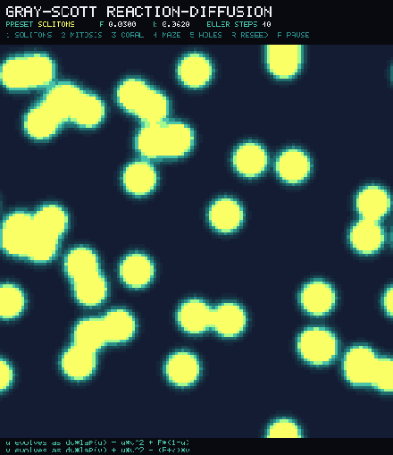 |  | 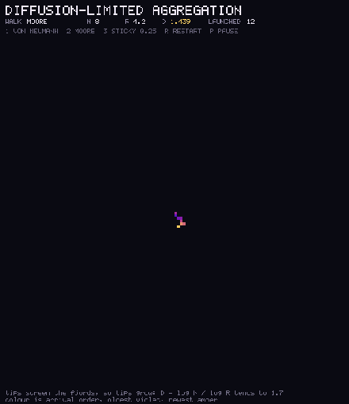 |
| Gray-Scott | Turing spots | Diffusion-limited aggregation |
| 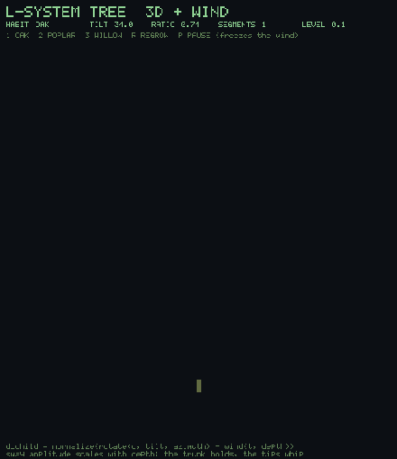 | 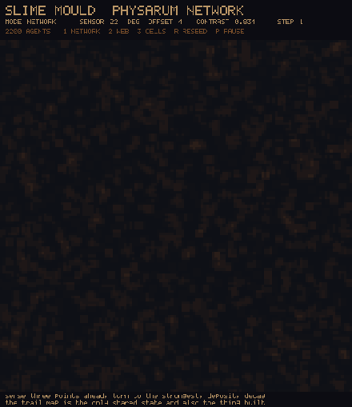 |  |
| L-system tree | Slime mold | Sandpile |
| **Neurons and networks** |||
|  |  |  |
| Hodgkin-Huxley | Izhikevich zoo | Balanced network |
| **Evolutionary biology** |||
| 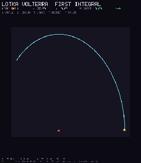 | 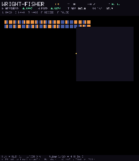 | 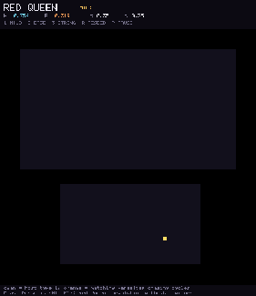 |
| Lotka-Volterra | Wright-Fisher | Red Queen |
| 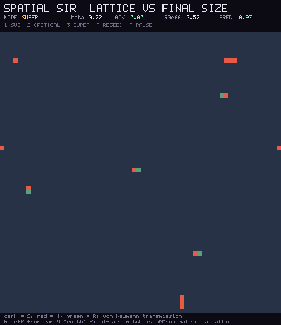 | 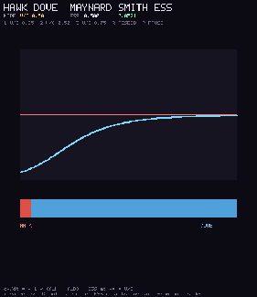 | 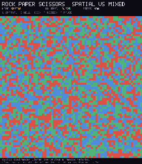 |
| Spatial SIR | Hawk-Dove | Rock-paper-scissors |
| **Planet** |||
| 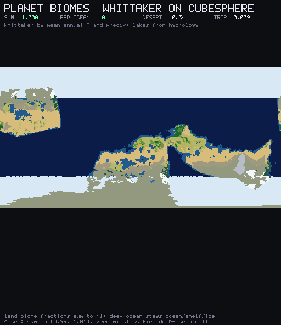 | 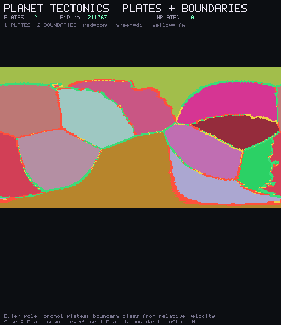 | 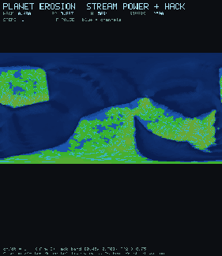 |
| Biomes | Tectonics | Erosion |
| **Procedural generation** |||
| 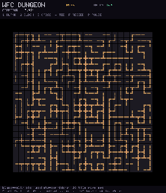 |  | 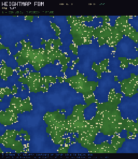 |
| Wavefunction dungeon | Voronoi sites | Heightmap fBm |
| **3D** |||
| 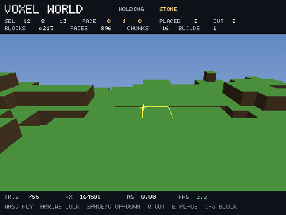 | 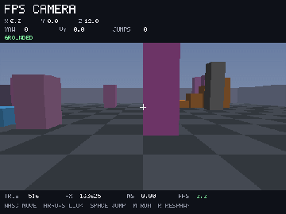 | 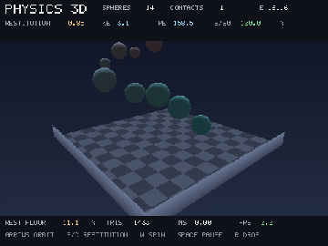 |
| Voxel world | FPS camera | Physics 3D |
| **Numerical and social** |||
| 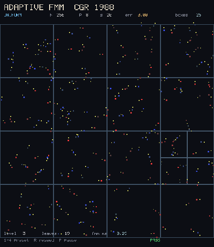 | 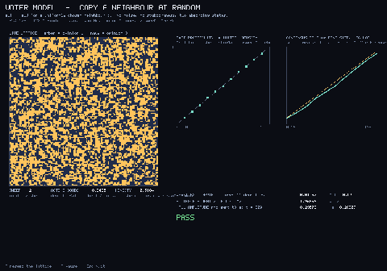 | 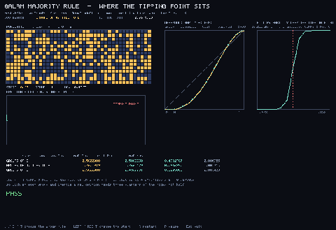 |
| Adaptive FMM | Voter model | Majority rule |

```bash
./flow gfx examples/games/tetris_gfx.flow
./flow gfx examples/evolution/lorenz_gfx.flow
./flow run examples/ml/models/mlp_xor.flow
./flow gfx examples/morphogenesis/gray_scott.flow
./flow gfx examples/neuro/hodgkin_huxley.flow
./flow gfx examples/evoleco/lotka_volterra_gfx.flow
./flow gfx examples/planet/planet_biomes.flow
./flow gfx examples/procgen/wfc_dungeon.flow
./flow gfx examples/threed/voxel_world.flow
```

| Domain | Gallery | Index |
|--------|---------|-------|
| Games (24) | [demos](docs/demos/games.md) | [`examples/games`](examples/games) |
| Morphogenesis | [demos](docs/demos/morphogenesis.md) | [`examples/morphogenesis`](examples/morphogenesis) |
| Neurons and networks | [demos](docs/demos/neuro.md) | [`examples/neuro`](examples/neuro) |
| Evolutionary biology | [demos](docs/demos/evoleco.md) | [`examples/evoleco`](examples/evoleco) |
| AI / ML training | [tutorials](docs/tutorials/game-ai.md) | [`examples/ai`](examples/ai), [`examples/ml`](examples/ml) |

Entrypoints by domain: [examples/README.md](examples/README.md).

---

## Language at a glance

### Core syntax

```flow-pseudocode
let x: i32 = 42              # Immutable
let mut counter: i32 = 0     # Mutable

function add(a: i32, b: i32) -> i32 {
    return a + b
}

struct Point { x: f32, y: f32 }

if x > 0 { ... } elif x < 0 { ... } else { ... }
while condition { ... }
for i in 0 to 10 { ... }
```

### Types

```
Primitives:  i32, i64, f32, f64, bool, string, void
Pointers:    ptr<T>, ptr<void>
Arrays:      array<T, N>
Generics:    function identity<T>(x: T) -> T
```

### Algebraic effects

```flow
effect Logger {
    log(msg: string) -> void
}

capability ConsoleLogger {
    effect Logger
    function log(msg: string) -> void {
        println(msg)
    }
}
```

Walkthrough: [docs/effects-showcase.md](docs/effects-showcase.md) · `examples/effects/showcase.flow`.

### Automatic differentiation

Forward-mode dual numbers and reverse helpers live in the stdlib (`lib/stdlib/autodiff.flow`). The XOR tourist demo trains via checked-in grad codegen in `examples/ml/models/mlp_xor.flow`. Compiler-integrated `loss.grad` is still on the roadmap.

### FFI

```flow
extern {
    function malloc(size: i64) -> ptr<void>
    function free(p: ptr<void>) -> void
}
```

---

## Documentation

| Resource | Description |
|----------|-------------|
| [Getting started](docs/getting-started.md) | Install, first program, basics |
| [Language overview](docs/language/overview.md) | Features and design |
| [Language design](docs/language/language_design.md) | Idioms and why Flow favors fluid abstraction |
| [Language spec](docs/LANGUAGE_SPEC.md) | Full reference |
| [Effects showcase](docs/effects-showcase.md) | Algebraic effects end to end |
| [Examples index](examples/README.md) | Demos by domain |
| [Examples status](examples/STATUS.md) | Compile status of every example |
| [Vision](VISION.md) | Why Flow exists |
| [Roadmap](ROADMAP.md) | Near-term work |
| [Changelog](docs/project/CHANGELOG.md) | Version history |
| [Self-hosting](docs/project/self-hosting.md) | Stage-A `flowc` in [`compiler/`](compiler/) |
| [Security](SECURITY.md) · [Conduct](CODE_OF_CONDUCT.md) · [Governance](GOVERNANCE.md) | Project policy |

Site: [flooooooooooow.github.io/flow](https://flooooooooooow.github.io/flow/)

---

## Project layout

| Path | Contents |
|------|----------|
| [`flow`](flow) | CLI entry point |
| [`src/flow/`](src/flow/) | Python-host compiler (parser, type checker, C/MLIR/Metal backends) |
| [`compiler/`](compiler/) | Self-hosted Stage-A `flowc` |
| [`lib/stdlib/`](lib/stdlib/) | Standard library |
| [`runtime/`](runtime/) | Native runtime (graphics, audio, recording) |
| [`examples/`](examples/) | Domain demos and verify corpus |
| [`tests/`](tests/) | Language and stdlib tests |
| [`apps/`](apps/) | Applications (`flowdb`, `flow-http`, …) |
| [`benchmarks/`](benchmarks/) | Microbenchmarks and harness |
| [`docs/`](docs/) | Spec, tutorials, demos, project docs |
| [`third_party/integrations/vscode/`](third_party/integrations/vscode/) | VS Code / Cursor extension |
| [`site/`](site/) | Wiki shell and site assets |

---

## Self-hosting status

The self-hosted compiler (`compiler/src/`, written in Flow) is the default host
for `./flow run` and `./flow compile`. It compiles itself end to end: three
consecutive generation fixed-points are byte-identical, and a clean checkout
needs no Python to build a working compiler.

The bootstrap language suite (`tests/lang/`, 90 `.flow` files) is the
regression target for self-hosted parity. Current result, run with
`FLOWC_IN`/`FLOWC_OUT` environment variables:

```
pass=79  fail=11
```

The 11 failures fall into five categories:

| Category | Tests | Root cause |
|----------|-------|------------|
| DSL parse failures | `test_effects`, `test_hybrid_events`, `test_time_blocks` | `effect`, `capability`, `flow`, `state`, `solver`, `evolves`, `every` keywords are not parsed |
| Generic monomorphization | `test_generics`, `test_generic_channels` | Parser accepts generic syntax but the monomorphizer is missing; `struct Box<T>` emits `T value` instead of a concrete type |
| Overload resolution | `test_unsigned_ints` | Type checker rejects duplicate function names; overload selection is not implemented |
| Closure snapshot semantics | `test_closures` | Captured variables are hoisted to globals without snapshotting the value at closure creation time |
| Stdlib codegen | `test_gif_encoder`, `test_fir_opts` | LZW encoder emits a variable used as a function call; FIR inline-pure bonus constant gets a float-to-int truncation |
| External C headers | `test_c_import_julia`, `test_c_import_python` | System headers for Julia and Python embedding are not available in the test environment |

The Python-host compiler (`src/flow/`, 46,695 lines) remains the full language
surface: generics, effects, MLIR, GPU, DSLs, and all advanced type checking.
The self-hosted compiler (`compiler/src/`, 10,863 lines) covers the subset
needed to compile itself plus a growing set of language features. See
[docs/project/self-hosting.md](docs/project/self-hosting.md) for the full plan
and [compiler/README.md](compiler/README.md) for the supported syntax list.

---

## Build and develop

```bash
./flow run <file>              # Compile and run (default host: flowc)
./flow compile <file>          # Compile only → build/
FLOW_HOST=python ./flow run <file>   # Full Python-host language surface
./flow test                    # Test suite (strict by default)
./flow test --strict --tier2   # + transpile / clang compile checks
./flow fmt <file>              # Format
./flow repl                    # Interactive mode
./flow lsp                     # Language server
./flow gfx <file>              # Compile and run with graphics
./flow mlir <file>             # Emit MLIR (requires LLVM/MLIR tools)
```

Host switch: `FLOW_HOST=flowc|python|auto` (default `flowc` for `run` / `compile`).

```bash
# Fuzz the compiler
python3 tests/fuzz/run_fuzz.py --seconds 30

# Regenerate examples compile-status table
python3 scripts/verify_examples.py
```

### Editor support

```bash
./scripts/publish_vscode_extension.sh --install
# Or: cursor --install-extension quilio.flow-language
```

Extension source: `third_party/integrations/vscode/flow-language/`.

### Python wheels from Flow

```bash
./flow python mylib.flow --name mylib
pip install dist/mylib-*.whl
```

Details: [docs/python-target.md](docs/python-target.md).

### Compiler pipeline

```
Flow source → Parser → AST → C / MLIR / Metal → Clang / LLVM / shaders
```

---

## Project statistics

Counted from tracked files by CI so the numbers match the tree.

<!-- repo-stats:start -->
| Metric | Files / modules | Physical lines |
|---|---:|---:|
| **Tracked source** | 3,117 | 442,972 |
| **Flow language** | 2,089 | 226,359 |
| **Python compiler (`src/flow`)** | 73 | 51,614 |
| **Self-hosted compiler (`compiler/src`)** | 40 | 22,752 |
| **Standard library modules** | 111 | 33,350 |
| **Native runtime** | 44 | 8,035 |
| **Examples (excluding verify corpus)** | 426 | 112,671 |
| **Verify corpus** | 1,078 | 18,715 |
| **Tests (`.py` + `.flow`)** | 455 | 48,539 |
| **Application programs** | 8 | 1,537 |
| **Registry packages** | 19 | — |
| **Documentation pages** | 173 | 39,462 |

<details>
<summary>Tracked source by language</summary>

| Language | Files | Physical lines |
|---|---:|---:|
| Flow | 2,089 | 226,359 |
| Python | 376 | 114,884 |
| HTML | 214 | 38,604 |
| C | 97 | 23,485 |
| C/C++ headers | 49 | 11,017 |
| C++ | 23 | 9,414 |
| JavaScript | 191 | 7,573 |
| Shell | 50 | 5,329 |
| CSS | 12 | 3,611 |
| Objective-C | 4 | 1,436 |
| Objective-C++ | 2 | 654 |
| Rust | 10 | 606 |

</details>

*Generated by CI from tracked files at `8cd159414c4a`. Proof documents: 1,080. [Raw JSON](docs/generated/repository-stats.json) · [Flow counter](scripts/tools/repo_stats/main.flow) · [Python fallback](scripts/update_repo_stats.py).*
<!-- repo-stats:end -->

---

## Contributing

Flow is built with humans directing design and agents writing a lot of the code. See [CONTRIBUTING.md](CONTRIBUTING.md) for decision authority and how to land changes.

Priorities: [ROADMAP.md](ROADMAP.md) · [docs/NEXT.md](docs/NEXT.md).

---

## License

MIT. See [LICENSE](LICENSE).

---

<p align="center">
  
  <br>
  <em>Made with care by humans and AI · mascot: <a href="docs/assets/mascot.md">Flowy the Hedgehog</a></em>
</p>
