# Evolutionary biology gallery

Twenty-five evolutionary-biology and ecology simulations written in Flow.
Every clip below is recorded from the real compiled program through the
headless recorder. Every program also measures the thing it is demonstrating,
prints the measurement beside the closed form, and returns a nonzero exit
code if the comparison fails, so these are regression tests that happen to
draw pictures.

These programs follow the direction in [VISION.md](../vision.md): a system that
evolves through time is better written as a statement of how it evolves than as a
loop that steps it. The domain README lives at
[examples/evoleco](../../examples/evoleco/README.md).

Run any example natively:

```bash
./flow gfx examples/evoleco/<name>.flow
```

Record one headlessly, no display needed:

```bash
FLOW_HOST=python ./flow record examples/evoleco/wright_fisher.flow \
  --frames 120 --skip 2 --gif docs/demos/evoleco/wright_fisher.gif
```

Regenerate every GIF on this page:

```bash
python3 scripts/record_demos.py --group evoleco
```

`./flow run` does not link a graphics backend, so it cannot build these; use
`record` for the headless run and `gfx` for the window. The measurements are
all made before the window opens and do not depend on how many frames are
recorded.

## Population genetics

| | | |
|:---:|:---:|:---:|
|  | 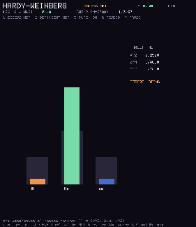 | 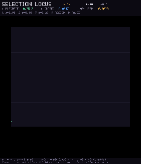 |
| **Wright-Fisher**. Neutral drift; H decays as (1-1/(2N))^t and absorption tracks 4 N ln 2<br>`wright_fisher.flow` | **Hardy-Weinberg**. Genotype bars recover p^2 : 2pq : q^2 in one generation<br>`hardy_weinberg.flow` | **Selection locus**. Allele frequency follows the discrete logistic closed form<br>`selection_locus.flow` |
| 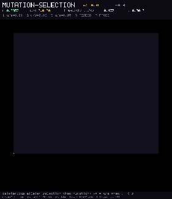 | 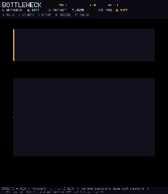 | 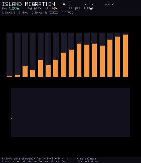 |
| **Mutation-selection**. Deleterious allele equilibrates near u/s<br>`mutation_selection.flow` | **Bottleneck**. Census crash; heterozygosity matches the product over N_t<br>`bottleneck.flow` | **Island migration**. Fst settles near 1/(1+4 N m K/(K-1))<br>`island_migration.flow` |
| 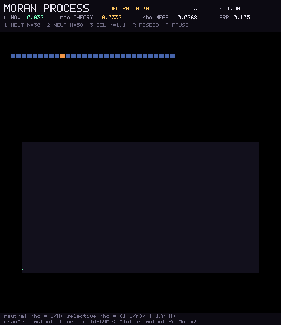 | | |
| **Moran process**. Neutral fixation probability is 1/N; selective rho gated too<br>`moran_process.flow` | | |

## Evolutionary dynamics and games

| | | |
|:---:|:---:|:---:|
| 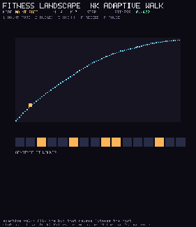 | 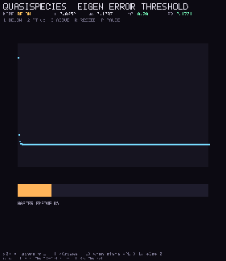 |  |
| **Fitness landscape**. NK adaptive walks climb to a local peak<br>`fitness_landscape.flow` | **Quasispecies**. Master sequence collapses past the error threshold<br>`quasispecies.flow` | **Hawk-Dove**. Mixed ESS at V/C with an invader assay<br>`hawk_dove.flow` |
| 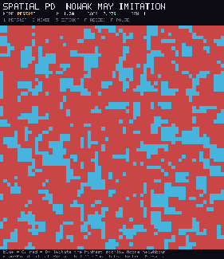 |  | 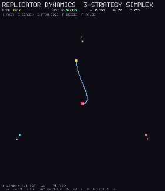 |
| **Spatial PD**. Cooperation persists where mean-field dies<br>`spatial_pd.flow` | **Spatial RPS**. Cyclic chasing; coexistence against well-mixed death<br>`rock_paper_scissors.flow` | **Replicator dynamics**. Simplex trajectory to the Nash rest point<br>`replicator_dynamics.flow` |

## Ecology (visual companions)

| | | |
|:---:|:---:|:---:|
|  |  | |
| **Lotka-Volterra**. Orbits and a conserved first integral<br>`lotka_volterra_gfx.flow` | **Spatial SIR**. Lattice attack rate vs final-size at R0_eff<br>`sir_spatial.flow` | |

## Extended evolutionary genetics

Ten more programs: irreversible load, competing sweeps, quantitative genetics,
kin selection, host-parasite cycles, and metapopulation / competitive ecology.

| | | |
|:---:|:---:|:---:|
| 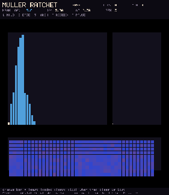 | 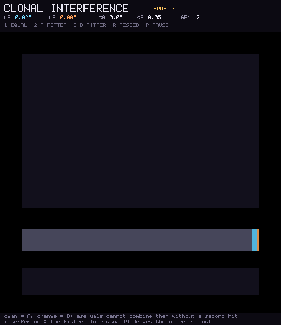 | 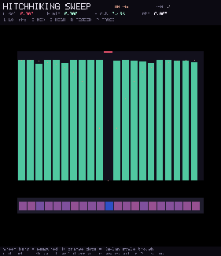 |
| **Muller's ratchet**. Deterministic mean load U/s; Haigh-scale click rate<br>`mullers_ratchet.flow` | **Clonal interference**. Dual beneficial clones; fixation ~ (2/s) ln N<br>`clonal_interference.flow` | **Hitchhiking**. Selective sweep carves a diversity trough<br>`hitchhiking.flow` |
| 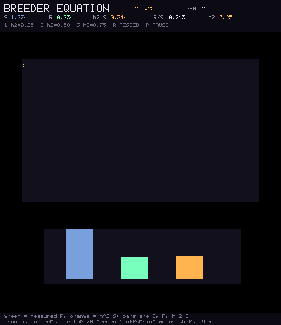 | 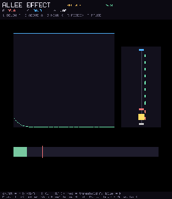 | 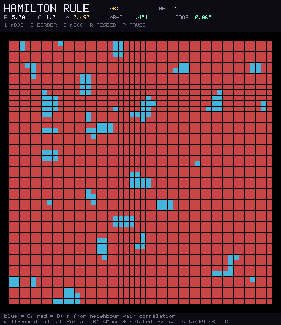 |
| **Breeder's equation**. Aggregate response R = h^2 S<br>`breeders_equation.flow` | **Allee effect**. Strong threshold A; below extinct, above to K<br>`allee_effect.flow` | **Hamilton's rule**. Spatial kin selection when rB > C<br>`hamilton_rule.flow` |
|  | 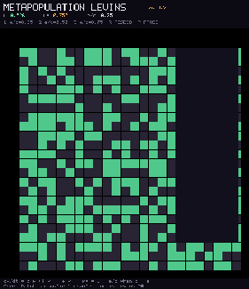 | 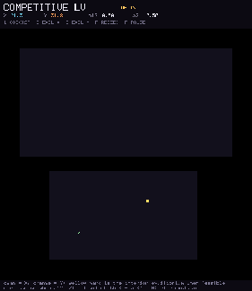 |
| **Red Queen**. Matching-alleles cycles; parasite tracks host<br>`red_queen.flow` | **Metapopulation**. Levins occupancy p* = 1 - e/c<br>`metapopulation.flow` | **Competitive LV**. Coexistence vs competitive exclusion<br>`competitive_lv.flow` |
| 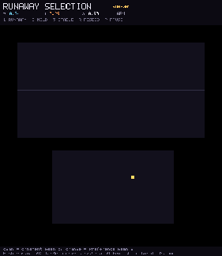 | | |
| **Runaway selection**. Fisherian trait-preference escalation<br>`runaway_selection.flow` | | |
