# Game Gallery

25 complete games written in Flow. Every clip below is recorded from the real
compiled program through the headless recorder; the pixels come from the same
drawing calls the native window receives.

Run any game natively:

```bash
./flow gfx examples/games/<name>_gfx.flow
```

Record one headlessly (no display needed):

```bash
FLOW_GFX_RECORD_FRAMES=240 ./flow record examples/games/<name>_gfx.flow
```

Regenerate every GIF on this page: `python3 scripts/record_demos.py`

Every game here also runs in a browser, from the same source, on a fourth gfx
backend that paints a canvas: [WebAssembly Gallery](wasm.md).

All games share the house controls: arrows or WASD to move, Space to act,
P pause, R restart, Esc quit. Per-game keys are in each file's header comment.

## Arcade

| | | |
|:---:|:---:|:---:|
| 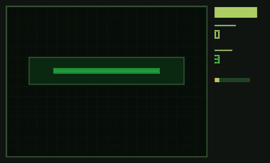 | 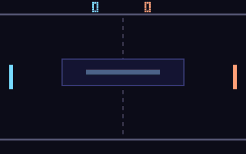 | 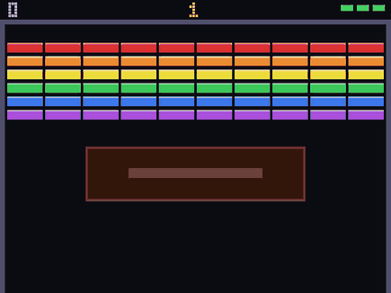 |
| **Snake** — growth, speed-up, wall and self death<br>`snake_gfx.flow` | **Pong** — vs AI, angle by paddle-hit position, first to 7<br>`pong_gfx.flow` | **Breakout** — 6 brick rows, 3 lives, staged speed-ups<br>`breakout_gfx.flow` |
| 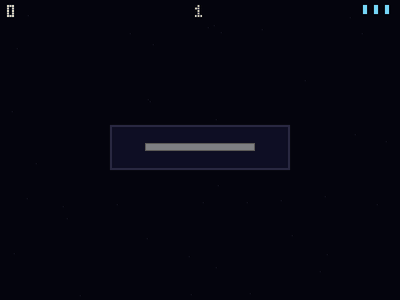 | 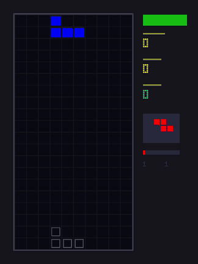 | 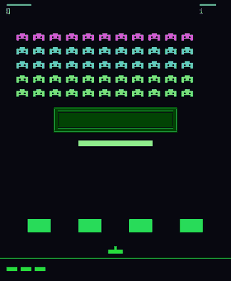 |
| **Asteroids** — inertial ship, splitting rocks, waves<br>`asteroids_gfx.flow` | **Tetris** — 7 tetrominoes, ghost piece, levels<br>`tetris_gfx.flow` | **Space Invaders** — marching grid, bombs, bunkers<br>`invaders_gfx.flow` |
| 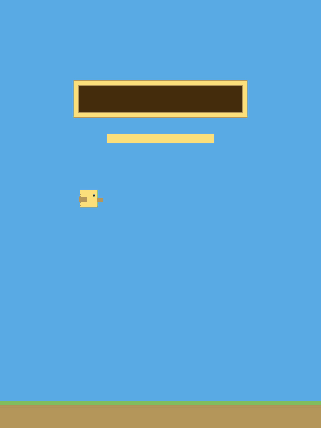 | 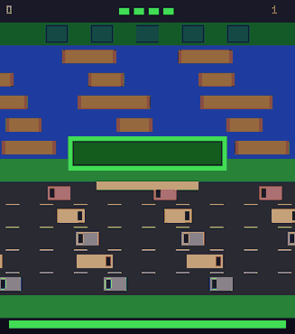 | 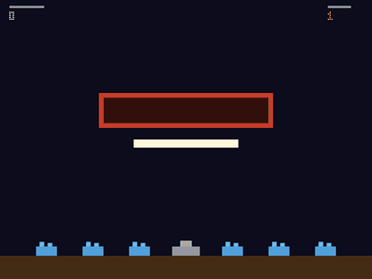 |
| **Flappy** — gravity and flap physics, session best<br>`flappy_gfx.flow` | **Frogger** — car lanes, ride-or-drown logs, home slots<br>`frogger_gfx.flow` | **Missile Command** — crosshair, blast rings, six cities<br>`missile_gfx.flow` |
| 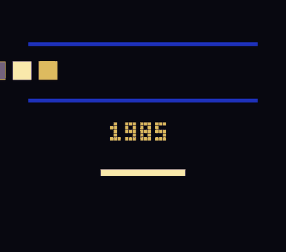 | 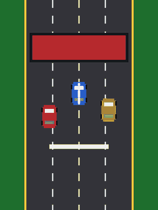 | 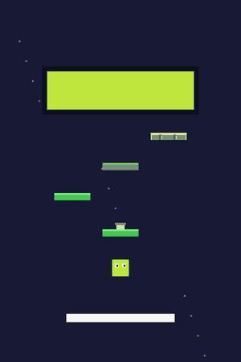 |
| **Maze Chase** — pellets, three ghost styles, power mode<br>`maze_chase_gfx.flow` | **Lane Racer** — traffic dodging, near-miss bonus, fuel<br>`lane_racer_gfx.flow` | **Jumper** — moving and crumbling platforms, springs<br>`jumper_gfx.flow` |
| 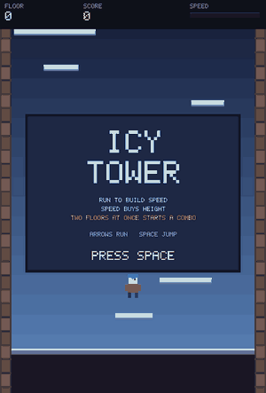 | | |
| **Icy Tower** — running speed sets jump height and reach, wall bounces keep it, multi-floor landings chain a named combo<br>`icy_tower_gfx.flow` | | |

## Puzzle and logic

| | | |
|:---:|:---:|:---:|
| 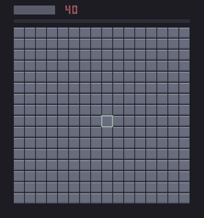 | 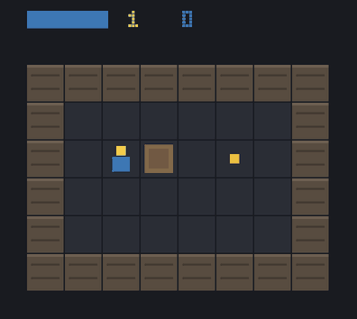 | 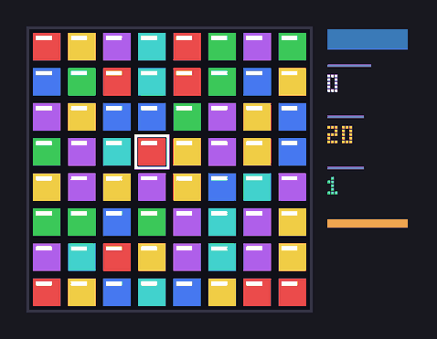 |
| **Minesweeper** — 16x16, flood fill, safe first click<br>`minesweeper_gfx.flow` | **Sokoban** — 5 levels, undo, move counter<br>`sokoban_gfx.flow` | **Match-3** — cascade chains, move limit<br>`match3_gfx.flow` |
| 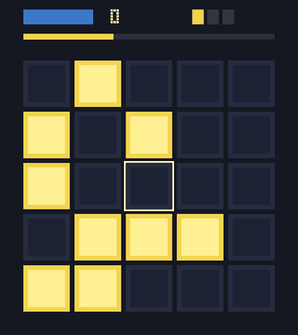 | 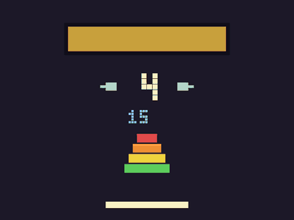 | 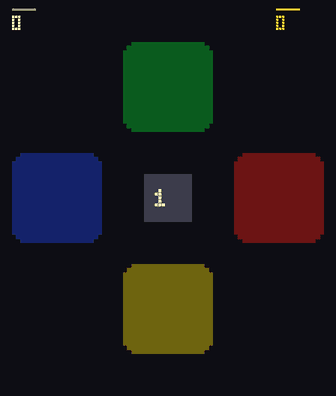 |
| **Lights Out** — cross toggles, always solvable<br>`lightsout_gfx.flow` | **Tower of Hanoi** — 3-7 disks, optimal-move compare<br>`hanoi_gfx.flow` | **Simon** — growing sequences, strict fail<br>`simon_gfx.flow` |
| 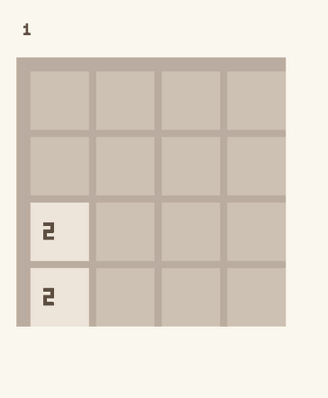 | | |
| **2048** — grid logic and tile merging<br>`2048_gfx.flow` | | |

## Board

| | | |
|:---:|:---:|:---:|
| 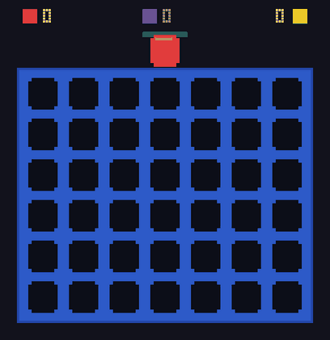 | 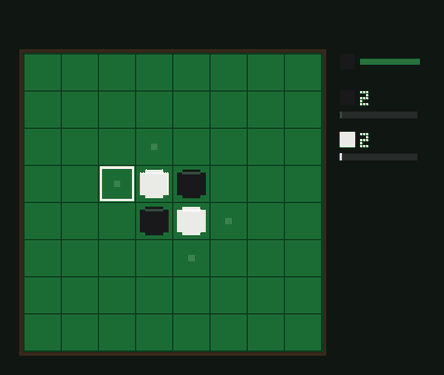 | 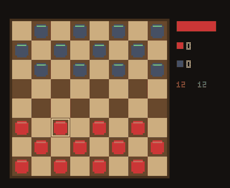 |
| **Connect Four** — vs AI that takes and blocks wins<br>`connect4_gfx.flow` | **Othello** — vs corner-aware AI, staged flips<br>`othello_gfx.flow` | **Checkers** — hotseat, forced captures, kings<br>`checkers_gfx.flow` |
| 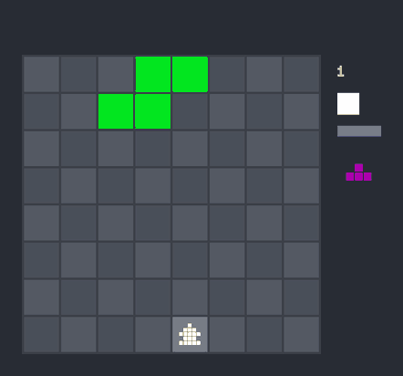 | | |
| **Chetris** — the Chess×Tetris hybrid ([writeup](chetris.md))<br>`chetris_gfx.flow` | | |

## Sandbox

| | | |
|:---:|:---:|:---:|
| 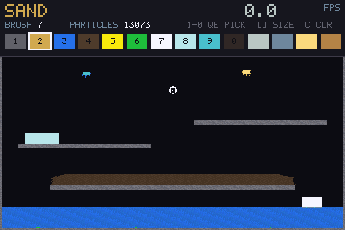 | | |
| **The Falling Sand Game** — 384×192 cells at one cell per pixel, eleven materials on a density ladder, keyboard pen<br>`falling_sand_gfx.flow` | | |

## How the recordings work

`runtime/gfx_record.c` plus `lib/runtime/gfx_record.flow` implement the same
API as the windowed backends, drawing into an off-screen buffer and writing
each presented frame. `scripts/record_demos.py` drives each game with a scripted
key sequence (`FLOW_GFX_RECORD_KEYS`) and assembles the frames into the GIFs on
this page. Details: [demos README](README.md).

Related: [examples/games](../../examples/games/) sources · [examples index](../../examples/README.md)
