# Morphogenesis Gallery

Simulations of pattern formation written in Flow. Every clip below is
recorded from the real compiled program through the headless recorder, and
every clip starts before the pattern exists. Compare the first frame with the
last one: that difference is the whole subject.

This is [VISION.md](../vision.md) as a picture. Flow's founding claim is that
the primary abstraction of a program should be the evolution of a system
through time rather than a sequence of instructions, and that the mathematical
model should be the executable. Morphogenesis is the cleanest argument
available for that claim. The interesting object is never the state at any one
instant, it is the trajectory, and each model is short enough to fit in a
comment at the top of its file.

Wherever the model is continuous, the dynamics are stated as a `flow` block
with `evolves as` and lowered by the compiler to a `_step` function:

```flow
flow GrayScottCell {
    state u : f64 = 1.0
    state v : f64 = 0.0
    param lap_u : f64 = 0.0
    ...
    solver { dt 1 s  method euler }

    u evolves as du * lap_u - u * v * v + feed * (1.0 - u)
    v evolves as dv * lap_v + u * v * v - (feed + kill) * v
}
```

The grid loop hands each cell its own laplacian and steps it. Nothing else in
`gray_scott.flow` knows what a Turing pattern is.

Run any example natively:

```bash
./flow gfx examples/morphogenesis/<name>.flow
```

Record one headlessly, no display needed:

```bash
./flow record examples/morphogenesis/gray_scott.flow \
  --frames 240 --skip 4 --gif docs/demos/morphogenesis/gray_scott.gif
```

Regenerate every GIF on this page:

```bash
python3 scripts/record_demos.py --group morphogenesis
```

Every example labels itself on screen with `stdlib/text.flow`: title, the
parameters in force, and a live measurement of the phenomenon being claimed.
Number keys switch presets, `R` reseeds, `P` pauses, `Esc` quits. Seeding is a
fixed LCG, so a preset replays identically every time, which is also why these
recordings reproduce bit for bit.

## Reaction-diffusion and continuous fields

| | | |
|:---:|:---:|:---:|
|  |  | 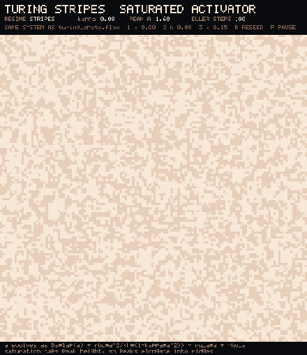 |
| **Gray-Scott**. One seeded blob divides into a field of solitons<br>`gray_scott.flow` | **Turing spots**. Noise resolves into a hexagonal lattice of peaks<br>`turing_spots.flow` | **Turing stripes**. The same system with saturation, so ridges<br>`turing_stripes.flow` |
| 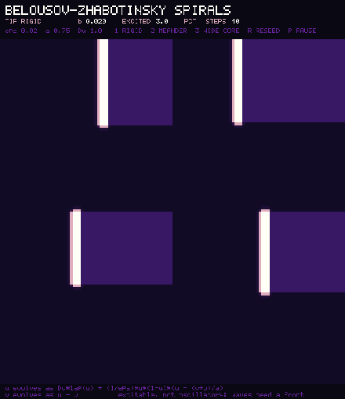 | 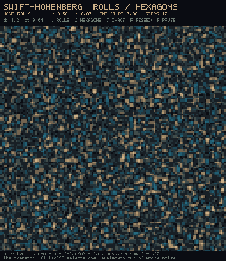 | 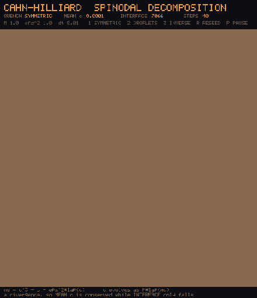 |
| **Belousov-Zhabotinsky**. Four broken waves wind into rotating spirals<br>`belousov.flow` | **Swift-Hohenberg**. One wavelength survives and anneals into rolls<br>`swift_hohenberg.flow` | **Cahn-Hilliard**. A quenched mixture unmixes and coarsens forever<br>`cahn_hilliard.flow` |
| 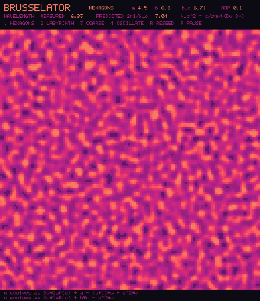 | 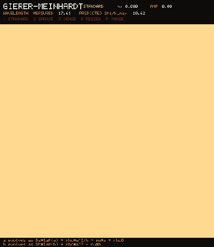 | 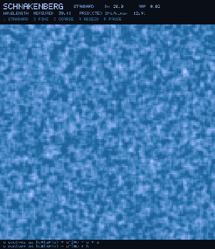 |
| **Brusselator**. The textbook autocatalytic pair at its predicted wavelength<br>`brusselator.flow` | **Gierer-Meinhardt**. Activator-inhibitor spots gated against linear k_max<br>`gierer_meinhardt.flow` | **Schnakenberg**. Cubic autocatalysis selecting a Turing wavelength<br>`schnakenberg.flow` |
| 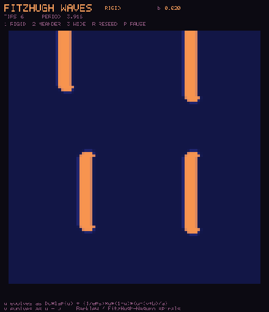 | 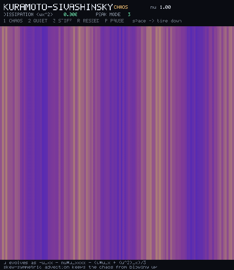 | 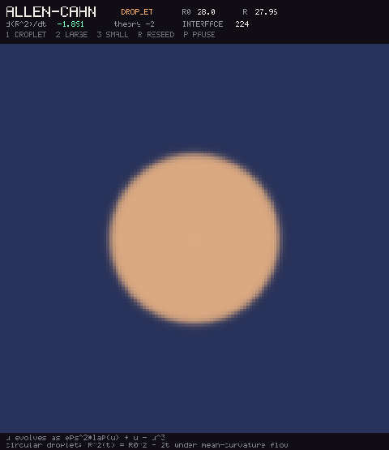 |
| **FitzHugh waves**. Broken fronts wind into rotating spiral tips<br>`fitzhugh_waves.flow` | **Kuramoto-Sivashinsky**. 1D spatiotemporal chaos as a space-time plot<br>`kuramoto_sivashinsky.flow` | **Allen-Cahn**. A circular droplet shrinks under mean-curvature flow<br>`allen_cahn.flow` |
| 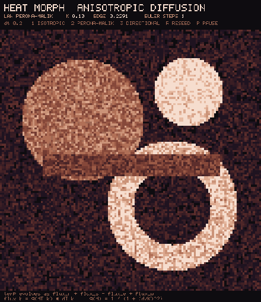 | | |
| **Perona-Malik**. Noise dissolves while boundaries sharpen<br>`heat_morph.flow` | | |

## Growth and aggregation

| | | |
|:---:|:---:|:---:|
|  | 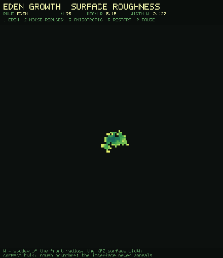 | 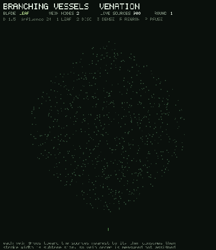 |
| **Diffusion-limited aggregation**. A fractal dendrite off one seed, D near 1.7<br>`dla.flow` | **Eden growth**. A compact colony with a rough KPZ front<br>`eden_growth.flow` | **Space colonization**. A midrib forks into full leaf venation<br>`branching_vessels.flow` |
| 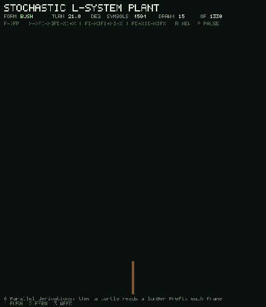 |  | 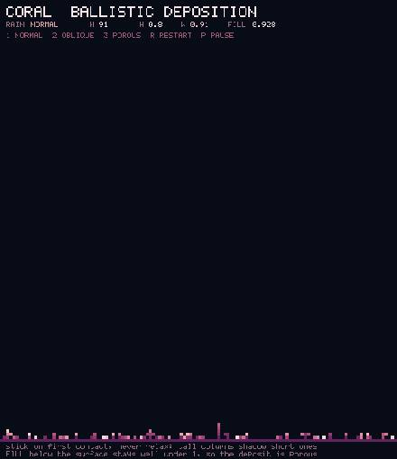 |
| **L-system plant**. A turtle walks a longer prefix of the string each frame<br>`lsystem_plant.flow` | **L-system tree**. Seven levels of 3D branching, then wind<br>`lsystem_tree.flow` | **Ballistic deposition**. Shadowing grows porous coral columns<br>`coral_ballistic.flow` |
| 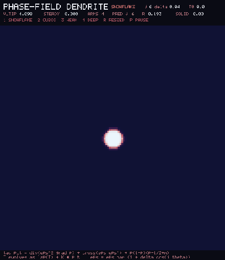 | 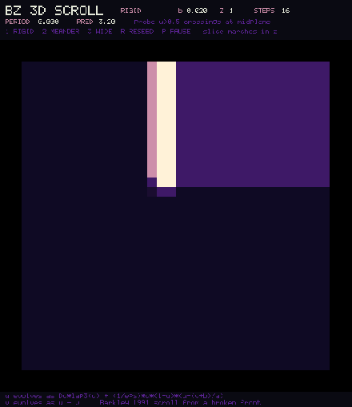 | 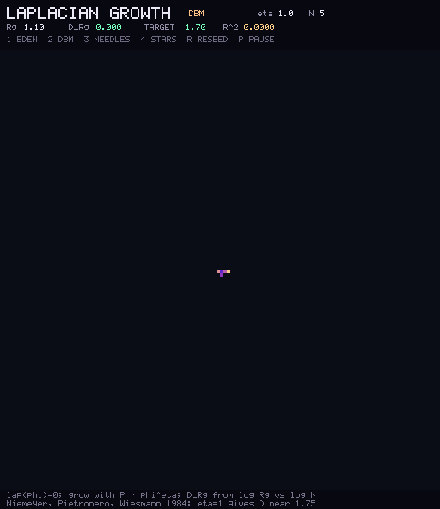 |
| **Phase-field dendrite**. Six-fold anisotropy selects primary arms<br>`phase_field_dendrite.flow` | **BZ 3D slice**. A scroll wave revealed as a marching z-cut<br>`bz_3d_slice.flow` | **Laplacian growth**. Dielectric breakdown; D from Rg scaling<br>`laplacian_growth.flow` |
| 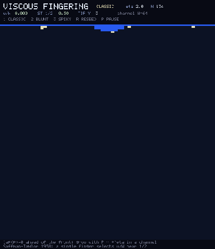 | 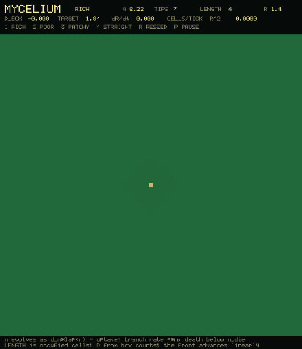 | |
| **Viscous fingering**. A Saffman-Taylor finger at half the channel<br>`viscous_fingering.flow` | **Mycelium**. Hyphal length grows under nutrient depletion<br>`mycelium.flow` | |

## Cellular and discrete

| | | |
|:---:|:---:|:---:|
| 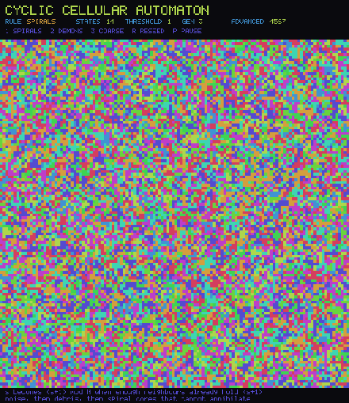 | 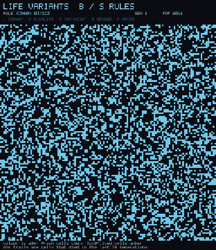 | 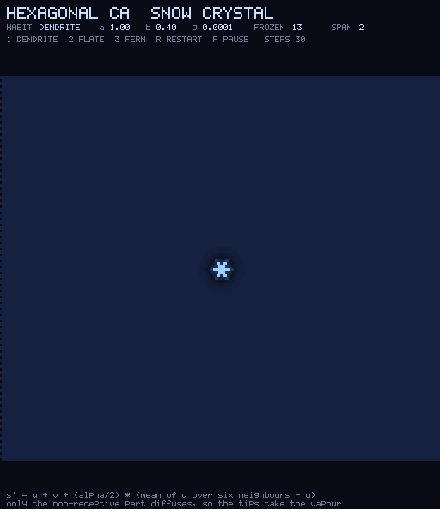 |
| **Cyclic CA**. Noise, then debris, then a tiling of spiral cores<br>`cyclic_ca.flow` | **Life variants**. A soup thins into gliders and still lifes<br>`life_variants.flow` | **Reiter snowflake**. Six-fold dendrites off one frozen cell<br>`hexagonal_ca.flow` |
| 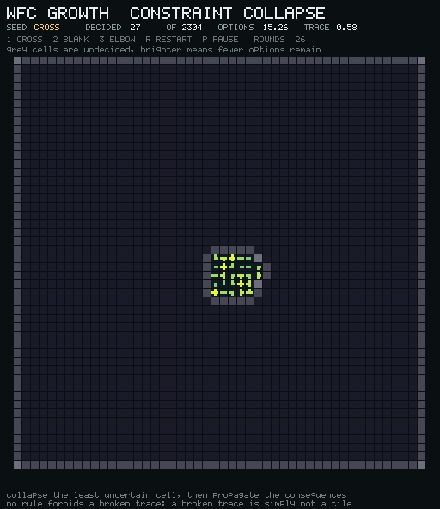 |  | 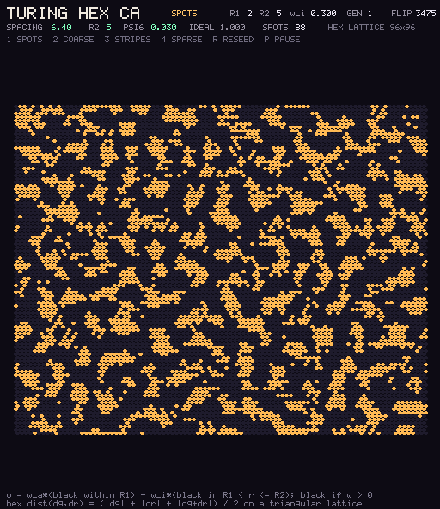 |
| **Wave function collapse**. A circuit resolves out of possibility<br>`wfc_growth.flow` | **Abelian sandpile**. Avalanche sizes on a power law<br>`sandpile.flow` | **Turing hex CA**. Activator-inhibitor spots on a triangular lattice<br>`turing_hex_ca.flow` |
| 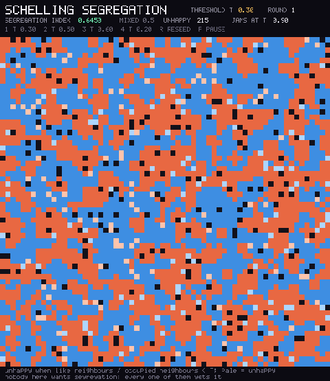 | 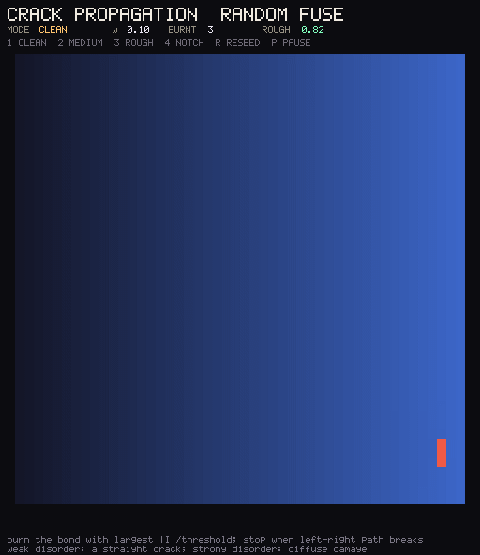 | 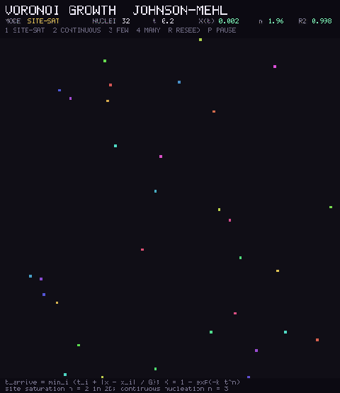 |
| **Schelling**. Mild preference produces strong segregation<br>`schelling_segregation.flow` | **Random fuse**. Disorder lengthens the failure path<br>`crack_propagation.flow` | **Johnson-Mehl**. Nucleation and growth with an Avrami exponent<br>`voronoi_growth.flow` |

## Biological pattern and agents

| | | |
|:---:|:---:|:---:|
|  | 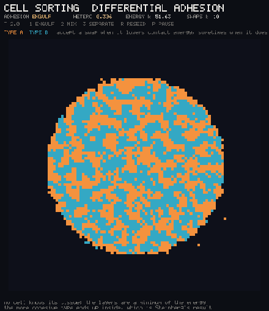 | 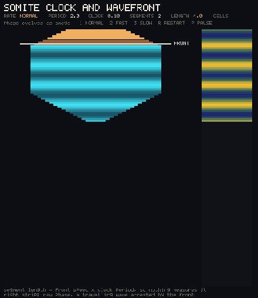 |
| **Physarum**. Agents and a decaying trail map build a transport network<br>`slime_mold.flow` | **Differential adhesion**. A 50/50 mixture sorts itself into layers<br>`cell_sorting.flow` | **Clock and wavefront**. Equal somites laid down one at a time<br>`somite_clock.flow` |
| 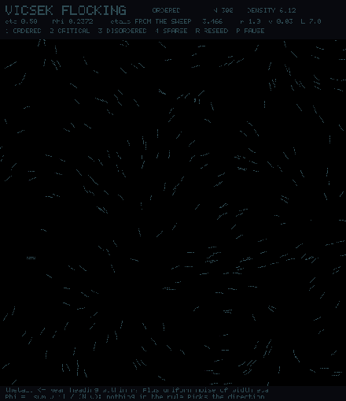 | 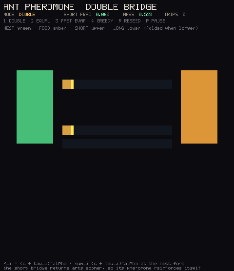 | 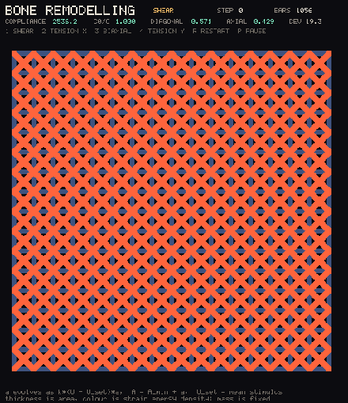 |
| **Vicsek flocking**. Order collapses with noise<br>`flocking_patterns.flow` | **Double bridge**. The short path wins by stigmergy<br>`ant_pheromone.flow` | **Bone remodelling**. Trabeculae align with load<br>`bone_remodelling.flow` |
| 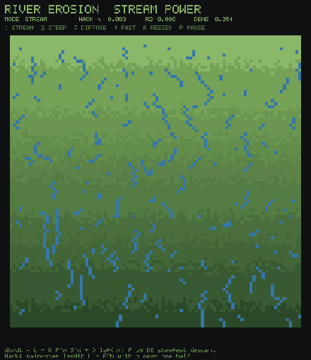 | | |
| **Stream power**. Drainage basins obey Hack's law<br>`river_erosion.flow` | | |

## Two worth reading side by side

`turing_spots.flow` and `turing_stripes.flow` are the same equations with one
coefficient changed. Nothing about the grid, the seed, the integrator or the
diffusion ratio differs between them; the saturation constant kappa moves the
animal from leopard to zebra. That is the point Turing's 1952 paper was making,
and it is easier to believe when the only difference on screen is one number in
the header.

## How the recordings work

`runtime/gfx_record.c` plus `lib/runtime/gfx_record.flow` implement the same API
as the windowed backends, drawing into an off-screen buffer and writing each
presented frame as a PPM. `scripts/record_demos.py` then assembles the frames
into the GIFs on this page.

These clips take no input at all, so the tuning is entirely in the frame budget.
Two numbers do the work. `--frames` is how far the simulation runs, and it has
to reach past the point where the pattern is finished. `--skip` keeps every Nth
presented frame, which sets both the pace and the file size. Several examples
finish, hold for a couple of seconds, and then reseed themselves; for those the
budget stops inside the hold, so the clip loops on the finished form instead of
cutting to a restart. The per-clip numbers in `record_demos.py` were read off a
change-over-time curve of the recorded frames: mean absolute pixel difference
against the first frame, which flattens when the pattern stops forming, and
against the previous frame, which spikes when the example restarts.

One encoder detail matters more than it sounds. These programs draw their grids
as blocks of identical pixels, so the frames are downscaled with a nearest
neighbour filter. Interpolating instead turns every block edge into a gradient,
which softens the picture and roughly doubles the encoded size, because the GIF
can no longer reuse runs of identical pixels.

Details: [demos README](README.md).

Every simulation here also runs live in a browser, from the same source:
[WebAssembly Gallery](wasm.md). The GIFs show the trajectory; the gallery lets
you press the preset keys yourself.

Related: [examples/morphogenesis](../../examples/morphogenesis/) sources ·
[neuron gallery](neuro.md) · [game gallery](games.md) ·
[examples index](../../examples/README.md)
