# Neuron and Network Gallery

Fifteen simulations of spiking dynamics written in Flow. Every clip below is
recorded from the real compiled program through the headless recorder. Every
program also measures the thing it is demonstrating, prints the measurement
beside the published value, and returns a nonzero exit code if the comparison
fails — so these are regression tests that happen to draw pictures.

This is the second domain of [the Example Atlas](../project/example-atlas.md),
after [morphogenesis](morphogenesis.md). Continuous models are declared as
`flow` blocks with `evolves as`; a spike reset is a hybrid event, not an
`if` inside a loop:

```text
when v reaches 30.0 {
    v becomes c
    u becomes u + d
}
```

Run any example natively:

```bash
./flow gfx examples/neuro/<name>.flow
```

Record one headlessly, no display needed:

```bash
./flow record examples/neuro/hodgkin_huxley.flow \
  --frames 120 --skip 2 --gif docs/demos/neuro/hodgkin_huxley.gif
```

Regenerate every GIF on this page:

```bash
python3 scripts/record_demos.py --group neuro
```

`./flow run` does not link a graphics backend, so it cannot build these; use
`record` for the headless run and `gfx` for the window. The measurements are
all made before the window opens and do not depend on how many frames are
recorded.

## Single-cell dynamics

| | | |
|:---:|:---:|:---:|
| 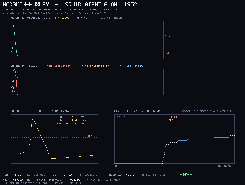 | 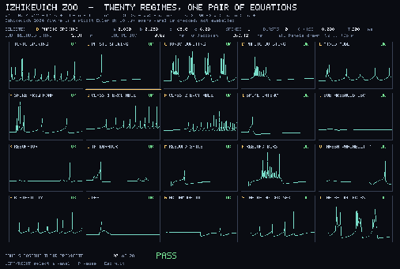 | 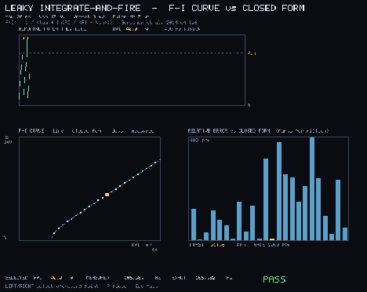 |
| **Hodgkin-Huxley**. Spike shape and type-II onset vs the 1952 paper<br>`hodgkin_huxley.flow` | **Izhikevich zoo**. Twenty firing regimes from one pair of equations<br>`izhikevich_zoo.flow` | **Leaky integrate-and-fire**. Measured F-I curve against its closed form<br>`lif_fi_curve.flow` |
| 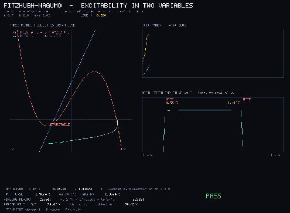 | 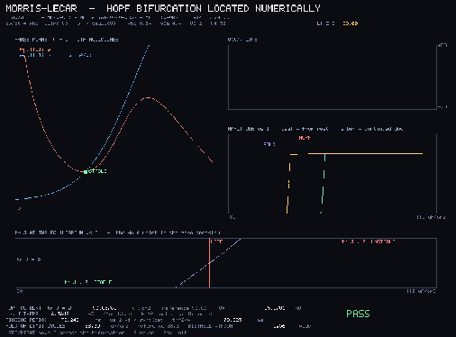 | |
| **FitzHugh-Nagumo**. Nullclines, Hopf window, and the limit cycle<br>`fitzhugh_nagumo.flow` | **Morris-Lecar**. Hopf and fold currents found by bisection on tr J<br>`morris_lecar.flow` | |

## Cable and compartments

| | | |
|:---:|:---:|:---:|
| 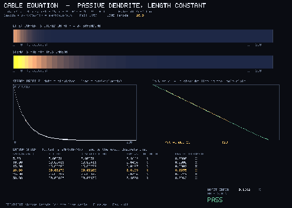 | 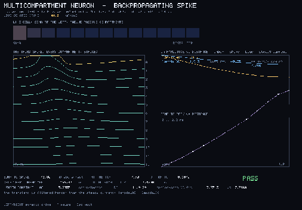 | |
| **Cable equation**. Attenuation vs the analytic length constant<br>`cable_equation.flow` | **Multicompartment**. A backpropagating action potential along a dendrite<br>`multicompartment.flow` | |

## Synapses and networks

| | | |
|:---:|:---:|:---:|
| 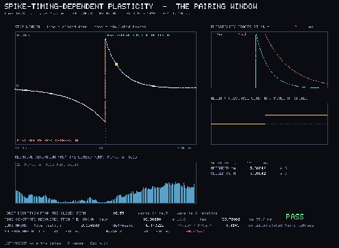 | 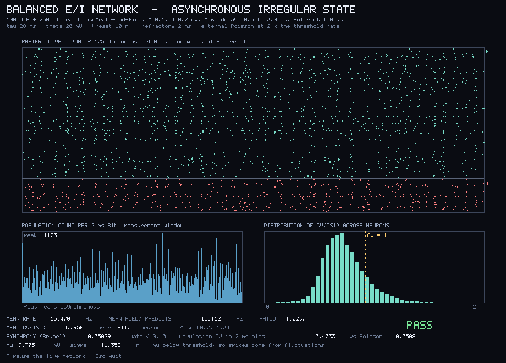 | 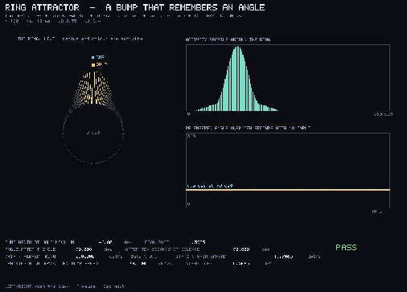 |
| **STDP**. The canonical asymmetric pairing window, parts in 1e14<br>`stdp_window.flow` | **Balanced E/I**. 12500 LIF neurons in the asynchronous irregular state<br>`balanced_network.flow` | **Ring attractor**. A bump that remembers and tracks a moving cue<br>`ring_attractor.flow` |
| 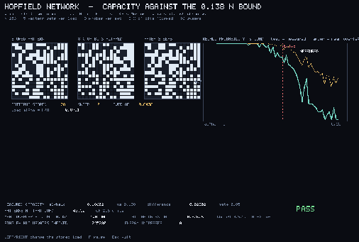 | 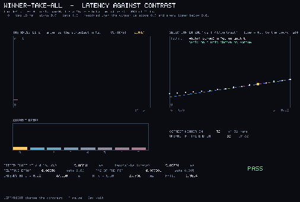 | 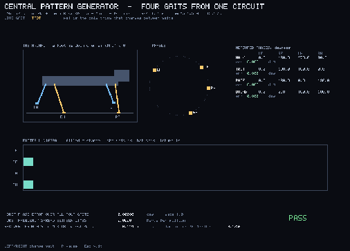 |
| **Hopfield**. Capacity against the 0.138 N bound, energy never rises<br>`hopfield.flow` | **Winner-take-all**. Selection latency vs contrast, R^2 near 1<br>`wta_circuit.flow` | **CPG gait**. Four quadruped gaits phase-locked from coupled oscillators<br>`cpg_gait.flow` |
| 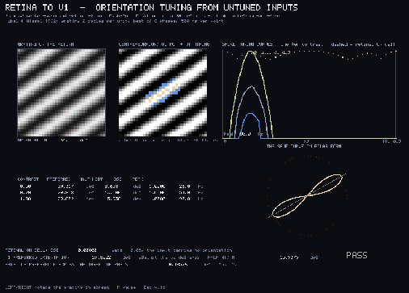 | 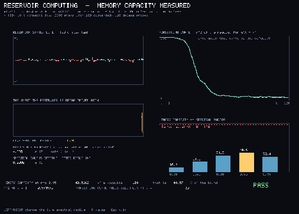 | |
| **Retina to V1**. Orientation tuning from untuned inputs<br>`orientation_tuning.flow` | **Reservoir**. Echo-state memory capacity against Jaeger's bound N<br>`reservoir.flow` | |

## How the recordings work

`runtime/gfx_record.c` plus `lib/runtime/gfx_record.flow` implement the same API
as the windowed backends, drawing into an off-screen buffer and writing each
presented frame as a PPM. `scripts/record_demos.py` then assembles the frames
into the GIFs on this page with nearest-neighbour downscaling and a shared
palette, the same path used for the morphogenesis gallery.

Details: [demos README](README.md).

Related: [examples/neuro](../../examples/neuro/) sources ·
[morphogenesis gallery](morphogenesis.md) · [evolution suite](evolution.md) ·
[examples index](../../examples/README.md)
