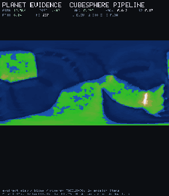
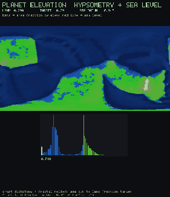
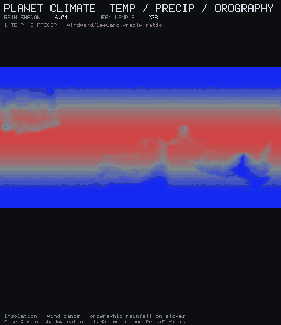

# Planet Gallery

Seven staged demos of the cubesphere planet pipeline in
[`lib/stdlib/planet.flow`](../library/planet.md). Every clip is recorded from
the real compiled program. Every program also measures the stage it is
demonstrating, prints the numbers, and returns a nonzero exit code if a gate
fails, so these are regression tests that happen to draw pictures.

Domain README: [examples/planet](../../examples/planet/README.md).

Run any example natively:

```bash
FLOW_HOST=python ./flow gfx examples/planet/planet_evidence.flow
```

Record one headlessly, no display needed:

```bash
FLOW_HOST=python ./flow record examples/planet/planet_evidence.flow \
  --frames 4 --out /tmp/pl
```

Regenerate every GIF on this page:

```bash
python3 scripts/record_demos.py --group planet
```

`./flow run` does not link a graphics backend, so it cannot build these; use
`record` for the headless run and `gfx` for the window. Measurements are made
before the window opens and do not depend on how many frames are recorded.

At `PLANET_FACE_N = 96` (55296 cells), a full generate with 24 erosion
iterations is about a quarter to one second depending on host. That cost is
paid once at startup.

## Stage demos

| | | |
|:---:|:---:|:---:|
|  |  |  |
| **Evidence**. Full `planet_generate`; solid angle, distortion, land, Hack, rain shadow<br>`planet_evidence.flow` | **Tectonics**. Euler-pole plates and boundary classes<br>`planet_tectonics.flow` | **Elevation**. Hypsometric curve; land fraction near target<br>`planet_elevation.flow` |
|  |  |  |
| **Erosion**. Stream power; Hack band [0.45, 0.70], R^2 > 0.75<br>`planet_erosion.flow` | **Climate**. Temp/precip maps; orographic rain_shadow > 1.05<br>`planet_climate.flow` | **Biomes**. Whittaker coloring; land fractions sum to ~1<br>`planet_biomes.flow` |
|  | | |
| **Spin**. Shaded rotating globe; regenerate(seed) elev checksum<br>`planet_spin.flow` | | |
