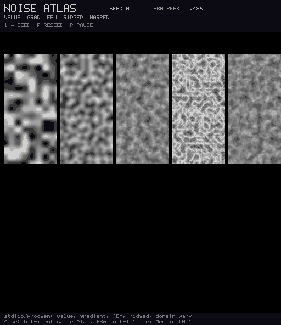
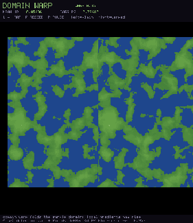
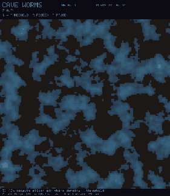
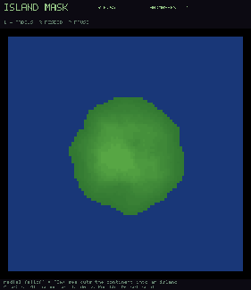
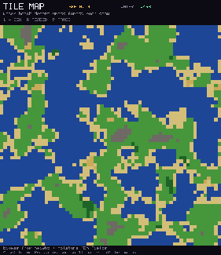

# Procedural generation gallery

Eight gated demos of noise, maps, and constraint collapse. Every clip is
recorded from the real compiled program. Every program also measures the
claim it is demonstrating, prints the numbers, and returns a nonzero exit
code if a gate fails.

Noise primitives: [`lib/stdlib/procgen.flow`](../library/procgen.md).
WFC bookkeeping: [`lib/stdlib/dynamics/wfc.flow`](../library/dynamics.md).
Cubesphere planet pipeline (separate gallery):
[planet](planet.md). Domain README:
[examples/procgen](../../examples/procgen/README.md).

Run any example natively:

```bash
FLOW_HOST=python ./flow gfx examples/procgen/noise_atlas.flow
```

Record one headlessly, no display needed:

```bash
FLOW_HOST=python ./flow record examples/procgen/noise_atlas.flow \
  --frames 4 --out /tmp/pg
```

Regenerate every GIF on this page:

```bash
python3 scripts/record_demos.py --group procgen
```

`./flow run` does not link a graphics backend, so it cannot build these; use
`record` for the headless run and `gfx` for the window. Measurements are made
before the window opens and do not depend on how many frames are recorded.

## Noise and fields

| | | |
|:---:|:---:|:---:|
|  |  |  |
| **Noise atlas**. Value / gradient / fBm / ridged / warped; deterministic ranges<br>`noise_atlas.flow` | **Heightmap fBm**. Sea cut and contours; land fraction gated<br>`heightmap_fbm.flow` | **Domain warp**. Plain vs warped; deterministic + field-diff gate<br>`domain_warp.flow` |
|  |  |  |
| **Cave worms**. 3D density threshold; porosity in a chosen band<br>`cave_worms.flow` | **Voronoi sites**. Cellular / Worley assignment covers the grid<br>`voronoi_sites.flow` | **Island mask**. Radial falloff * fBm; one connected landmass<br>`island_mask.flow` |
|  | | |
| **Tile map**. Height + moisture biomes; histogram sums to 1<br>`tile_map.flow` | | |

## Constraint generation

| | | |
|:---:|:---:|:---:|
|  | | |
| **WFC dungeon**. 16-tile pipe corridors; full collapse, sockets agree<br>`wfc_dungeon.flow` | | |
