# Photoreal FSL Gallery

64 shaders, recorded from the real Flow Shader Language → Metal pipeline. 
These are not mock-ups or screenshots reconstructed in another renderer: each GIF is 
captured offscreen from the generated Metal fragment shader with deterministic time.

<div class="demo-gallery-summary">
  <span><strong>64</strong> runnable shaders</span>
  <span><strong>4</strong> ray-marched scenes</span>
  <span><strong>60</strong> material studies</span>
  <span><strong>0</strong> external textures</span>
</div>

```bash
./flow shader examples/gpu/shader_photoreal.flow
./flow shader examples/gpu/shader_photoreal_materials.flow --name photoreal_gold
python3 scripts/record_shader_gallery.py --group photoreal
```

## Scene studies

The large studies exercise SDF composition, finite-difference normals, soft shadows, 
ambient occlusion, Fresnel response, reflection/refraction and procedural environments.

<div class="demo-feature-grid">
<figure class="demo-tile demo-tile-featured">
  <a class="demo-tile-media" href="../../examples/gpu/shader_photoreal.flow" aria-label="Open Studio source">
    
  </a>
  <figcaption>
    <div class="demo-tile-title"><strong>Studio</strong><span class="demo-badge">Scene studies</span></div>
    <code class="demo-run">./flow shader examples/gpu/shader_photoreal.flow --name photoreal_studio</code>
    <div class="demo-actions"><a href="../../examples/gpu/shader_photoreal.flow">Source</a><a href="../language/shaders.md">FSL guide</a></div>
  </figcaption>
</figure>
<figure class="demo-tile demo-tile-featured">
  <a class="demo-tile-media" href="../../examples/gpu/shader_photoreal.flow" aria-label="Open Glass source">
    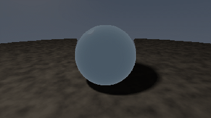
  </a>
  <figcaption>
    <div class="demo-tile-title"><strong>Glass</strong><span class="demo-badge">Scene studies</span></div>
    <code class="demo-run">./flow shader examples/gpu/shader_photoreal.flow --name photoreal_glass</code>
    <div class="demo-actions"><a href="../../examples/gpu/shader_photoreal.flow">Source</a><a href="../language/shaders.md">FSL guide</a></div>
  </figcaption>
</figure>
<figure class="demo-tile demo-tile-featured">
  <a class="demo-tile-media" href="../../examples/gpu/shader_photoreal.flow" aria-label="Open Marble source">
    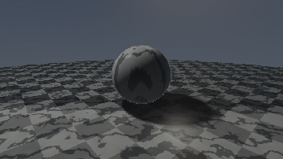
  </a>
  <figcaption>
    <div class="demo-tile-title"><strong>Marble</strong><span class="demo-badge">Scene studies</span></div>
    <code class="demo-run">./flow shader examples/gpu/shader_photoreal.flow --name photoreal_marble</code>
    <div class="demo-actions"><a href="../../examples/gpu/shader_photoreal.flow">Source</a><a href="../language/shaders.md">FSL guide</a></div>
  </figcaption>
</figure>
<figure class="demo-tile demo-tile-featured">
  <a class="demo-tile-media" href="../../examples/gpu/shader_photoreal.flow" aria-label="Open Chrome source">
    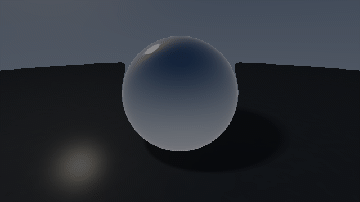
  </a>
  <figcaption>
    <div class="demo-tile-title"><strong>Chrome</strong><span class="demo-badge">Scene studies</span></div>
    <code class="demo-run">./flow shader examples/gpu/shader_photoreal.flow --name photoreal_chrome</code>
    <div class="demo-actions"><a href="../../examples/gpu/shader_photoreal.flow">Source</a><a href="../language/shaders.md">FSL guide</a></div>
  </figcaption>
</figure>
</div>

## Material library

<nav class="demo-chip-row" aria-label="Material categories">
  <a class="demo-chip" href="#metals">Metals</a>
  <a class="demo-chip" href="#glass-and-crystals">Glass and crystals</a>
  <a class="demo-chip" href="#stone-and-ceramics">Stone and ceramics</a>
  <a class="demo-chip" href="#coatings-and-automotive-finishes">Coatings and automotive finishes</a>
  <a class="demo-chip" href="#organic-and-textile-like-surfaces">Organic and textile-like surfaces</a>
  <a class="demo-chip" href="#industrial-materials">Industrial materials</a>
  <a class="demo-chip" href="#science-fiction-and-emissive-materials">Science-fiction and emissive materials</a>
  <a class="demo-chip" href="#cinematic-environment-studies">Cinematic environment studies</a>
</nav>

### Metals

<p class="demo-section-meta">7 runnable studies</p>

<div class="demo-tile-grid">
<figure class="demo-tile">
  <a class="demo-tile-media" href="../../examples/gpu/shader_photoreal_materials.flow" aria-label="Open Gold source">
    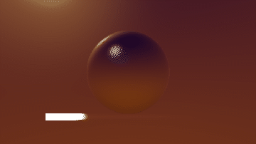
  </a>
  <figcaption>
    <div class="demo-tile-title"><strong>Gold</strong><span class="demo-badge">Metals</span></div>
    <code class="demo-run">./flow shader examples/gpu/shader_photoreal_materials.flow --name photoreal_gold</code>
    <div class="demo-actions"><a href="../../examples/gpu/shader_photoreal_materials.flow">Source</a><a href="../language/shaders.md">FSL guide</a></div>
  </figcaption>
</figure>
<figure class="demo-tile">
  <a class="demo-tile-media" href="../../examples/gpu/shader_photoreal_materials.flow" aria-label="Open Copper source">
    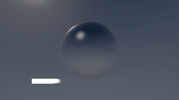
  </a>
  <figcaption>
    <div class="demo-tile-title"><strong>Copper</strong><span class="demo-badge">Metals</span></div>
    <code class="demo-run">./flow shader examples/gpu/shader_photoreal_materials.flow --name photoreal_copper</code>
    <div class="demo-actions"><a href="../../examples/gpu/shader_photoreal_materials.flow">Source</a><a href="../language/shaders.md">FSL guide</a></div>
  </figcaption>
</figure>
<figure class="demo-tile">
  <a class="demo-tile-media" href="../../examples/gpu/shader_photoreal_materials.flow" aria-label="Open Silver source">
    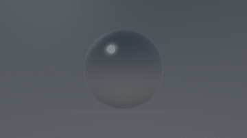
  </a>
  <figcaption>
    <div class="demo-tile-title"><strong>Silver</strong><span class="demo-badge">Metals</span></div>
    <code class="demo-run">./flow shader examples/gpu/shader_photoreal_materials.flow --name photoreal_silver</code>
    <div class="demo-actions"><a href="../../examples/gpu/shader_photoreal_materials.flow">Source</a><a href="../language/shaders.md">FSL guide</a></div>
  </figcaption>
</figure>
<figure class="demo-tile">
  <a class="demo-tile-media" href="../../examples/gpu/shader_photoreal_materials.flow" aria-label="Open Bronze source">
    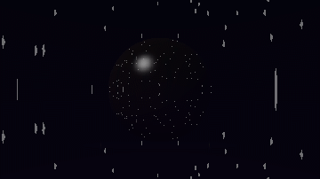
  </a>
  <figcaption>
    <div class="demo-tile-title"><strong>Bronze</strong><span class="demo-badge">Metals</span></div>
    <code class="demo-run">./flow shader examples/gpu/shader_photoreal_materials.flow --name photoreal_bronze</code>
    <div class="demo-actions"><a href="../../examples/gpu/shader_photoreal_materials.flow">Source</a><a href="../language/shaders.md">FSL guide</a></div>
  </figcaption>
</figure>
<figure class="demo-tile">
  <a class="demo-tile-media" href="../../examples/gpu/shader_photoreal_materials.flow" aria-label="Open Titanium source">
    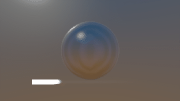
  </a>
  <figcaption>
    <div class="demo-tile-title"><strong>Titanium</strong><span class="demo-badge">Metals</span></div>
    <code class="demo-run">./flow shader examples/gpu/shader_photoreal_materials.flow --name photoreal_titanium</code>
    <div class="demo-actions"><a href="../../examples/gpu/shader_photoreal_materials.flow">Source</a><a href="../language/shaders.md">FSL guide</a></div>
  </figcaption>
</figure>
<figure class="demo-tile">
  <a class="demo-tile-media" href="../../examples/gpu/shader_photoreal_materials.flow" aria-label="Open Brushed Steel source">
    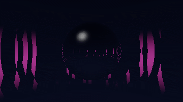
  </a>
  <figcaption>
    <div class="demo-tile-title"><strong>Brushed Steel</strong><span class="demo-badge">Metals</span></div>
    <code class="demo-run">./flow shader examples/gpu/shader_photoreal_materials.flow --name photoreal_brushed_steel</code>
    <div class="demo-actions"><a href="../../examples/gpu/shader_photoreal_materials.flow">Source</a><a href="../language/shaders.md">FSL guide</a></div>
  </figcaption>
</figure>
<figure class="demo-tile">
  <a class="demo-tile-media" href="../../examples/gpu/shader_photoreal_materials.flow" aria-label="Open Gunmetal source">
    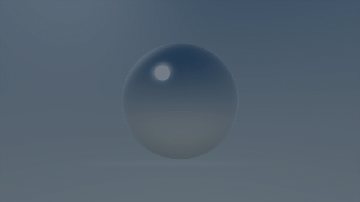
  </a>
  <figcaption>
    <div class="demo-tile-title"><strong>Gunmetal</strong><span class="demo-badge">Metals</span></div>
    <code class="demo-run">./flow shader examples/gpu/shader_photoreal_materials.flow --name photoreal_gunmetal</code>
    <div class="demo-actions"><a href="../../examples/gpu/shader_photoreal_materials.flow">Source</a><a href="../language/shaders.md">FSL guide</a></div>
  </figcaption>
</figure>
</div>

### Glass and crystals

<p class="demo-section-meta">7 runnable studies</p>

<div class="demo-tile-grid">
<figure class="demo-tile">
  <a class="demo-tile-media" href="../../examples/gpu/shader_photoreal_materials.flow" aria-label="Open Smoked Glass source">
    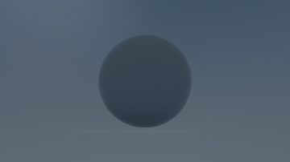
  </a>
  <figcaption>
    <div class="demo-tile-title"><strong>Smoked Glass</strong><span class="demo-badge">Glass and crystals</span></div>
    <code class="demo-run">./flow shader examples/gpu/shader_photoreal_materials.flow --name photoreal_smoked_glass</code>
    <div class="demo-actions"><a href="../../examples/gpu/shader_photoreal_materials.flow">Source</a><a href="../language/shaders.md">FSL guide</a></div>
  </figcaption>
</figure>
<figure class="demo-tile">
  <a class="demo-tile-media" href="../../examples/gpu/shader_photoreal_materials.flow" aria-label="Open Amber Glass source">
    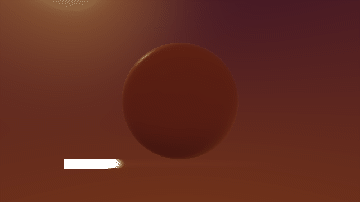
  </a>
  <figcaption>
    <div class="demo-tile-title"><strong>Amber Glass</strong><span class="demo-badge">Glass and crystals</span></div>
    <code class="demo-run">./flow shader examples/gpu/shader_photoreal_materials.flow --name photoreal_amber_glass</code>
    <div class="demo-actions"><a href="../../examples/gpu/shader_photoreal_materials.flow">Source</a><a href="../language/shaders.md">FSL guide</a></div>
  </figcaption>
</figure>
<figure class="demo-tile">
  <a class="demo-tile-media" href="../../examples/gpu/shader_photoreal_materials.flow" aria-label="Open Aqua Glass source">
    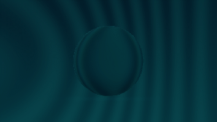
  </a>
  <figcaption>
    <div class="demo-tile-title"><strong>Aqua Glass</strong><span class="demo-badge">Glass and crystals</span></div>
    <code class="demo-run">./flow shader examples/gpu/shader_photoreal_materials.flow --name photoreal_aqua_glass</code>
    <div class="demo-actions"><a href="../../examples/gpu/shader_photoreal_materials.flow">Source</a><a href="../language/shaders.md">FSL guide</a></div>
  </figcaption>
</figure>
<figure class="demo-tile">
  <a class="demo-tile-media" href="../../examples/gpu/shader_photoreal_materials.flow" aria-label="Open Frosted Glass source">
    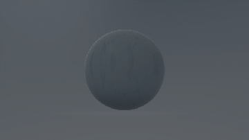
  </a>
  <figcaption>
    <div class="demo-tile-title"><strong>Frosted Glass</strong><span class="demo-badge">Glass and crystals</span></div>
    <code class="demo-run">./flow shader examples/gpu/shader_photoreal_materials.flow --name photoreal_frosted_glass</code>
    <div class="demo-actions"><a href="../../examples/gpu/shader_photoreal_materials.flow">Source</a><a href="../language/shaders.md">FSL guide</a></div>
  </figcaption>
</figure>
<figure class="demo-tile">
  <a class="demo-tile-media" href="../../examples/gpu/shader_photoreal_materials.flow" aria-label="Open Ruby Crystal source">
    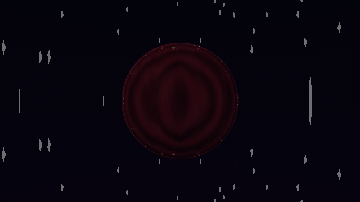
  </a>
  <figcaption>
    <div class="demo-tile-title"><strong>Ruby Crystal</strong><span class="demo-badge">Glass and crystals</span></div>
    <code class="demo-run">./flow shader examples/gpu/shader_photoreal_materials.flow --name photoreal_ruby_crystal</code>
    <div class="demo-actions"><a href="../../examples/gpu/shader_photoreal_materials.flow">Source</a><a href="../language/shaders.md">FSL guide</a></div>
  </figcaption>
</figure>
<figure class="demo-tile">
  <a class="demo-tile-media" href="../../examples/gpu/shader_photoreal_materials.flow" aria-label="Open Sapphire Crystal source">
    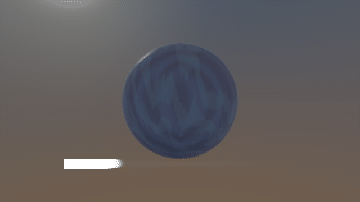
  </a>
  <figcaption>
    <div class="demo-tile-title"><strong>Sapphire Crystal</strong><span class="demo-badge">Glass and crystals</span></div>
    <code class="demo-run">./flow shader examples/gpu/shader_photoreal_materials.flow --name photoreal_sapphire_crystal</code>
    <div class="demo-actions"><a href="../../examples/gpu/shader_photoreal_materials.flow">Source</a><a href="../language/shaders.md">FSL guide</a></div>
  </figcaption>
</figure>
<figure class="demo-tile">
  <a class="demo-tile-media" href="../../examples/gpu/shader_photoreal_materials.flow" aria-label="Open Emerald Crystal source">
    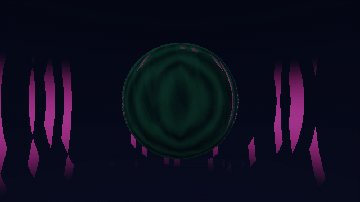
  </a>
  <figcaption>
    <div class="demo-tile-title"><strong>Emerald Crystal</strong><span class="demo-badge">Glass and crystals</span></div>
    <code class="demo-run">./flow shader examples/gpu/shader_photoreal_materials.flow --name photoreal_emerald_crystal</code>
    <div class="demo-actions"><a href="../../examples/gpu/shader_photoreal_materials.flow">Source</a><a href="../language/shaders.md">FSL guide</a></div>
  </figcaption>
</figure>
</div>

### Stone and ceramics

<p class="demo-section-meta">7 runnable studies</p>

<div class="demo-tile-grid">
<figure class="demo-tile">
  <a class="demo-tile-media" href="../../examples/gpu/shader_photoreal_materials.flow" aria-label="Open Nero Marble source">
    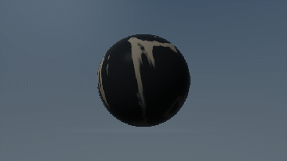
  </a>
  <figcaption>
    <div class="demo-tile-title"><strong>Nero Marble</strong><span class="demo-badge">Stone and ceramics</span></div>
    <code class="demo-run">./flow shader examples/gpu/shader_photoreal_materials.flow --name photoreal_nero_marble</code>
    <div class="demo-actions"><a href="../../examples/gpu/shader_photoreal_materials.flow">Source</a><a href="../language/shaders.md">FSL guide</a></div>
  </figcaption>
</figure>
<figure class="demo-tile">
  <a class="demo-tile-media" href="../../examples/gpu/shader_photoreal_materials.flow" aria-label="Open Jade source">
    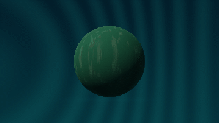
  </a>
  <figcaption>
    <div class="demo-tile-title"><strong>Jade</strong><span class="demo-badge">Stone and ceramics</span></div>
    <code class="demo-run">./flow shader examples/gpu/shader_photoreal_materials.flow --name photoreal_jade</code>
    <div class="demo-actions"><a href="../../examples/gpu/shader_photoreal_materials.flow">Source</a><a href="../language/shaders.md">FSL guide</a></div>
  </figcaption>
</figure>
<figure class="demo-tile">
  <a class="demo-tile-media" href="../../examples/gpu/shader_photoreal_materials.flow" aria-label="Open Granite source">
    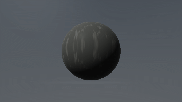
  </a>
  <figcaption>
    <div class="demo-tile-title"><strong>Granite</strong><span class="demo-badge">Stone and ceramics</span></div>
    <code class="demo-run">./flow shader examples/gpu/shader_photoreal_materials.flow --name photoreal_granite</code>
    <div class="demo-actions"><a href="../../examples/gpu/shader_photoreal_materials.flow">Source</a><a href="../language/shaders.md">FSL guide</a></div>
  </figcaption>
</figure>
<figure class="demo-tile">
  <a class="demo-tile-media" href="../../examples/gpu/shader_photoreal_materials.flow" aria-label="Open Travertine source">
    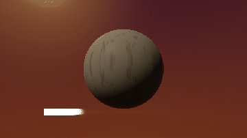
  </a>
  <figcaption>
    <div class="demo-tile-title"><strong>Travertine</strong><span class="demo-badge">Stone and ceramics</span></div>
    <code class="demo-run">./flow shader examples/gpu/shader_photoreal_materials.flow --name photoreal_travertine</code>
    <div class="demo-actions"><a href="../../examples/gpu/shader_photoreal_materials.flow">Source</a><a href="../language/shaders.md">FSL guide</a></div>
  </figcaption>
</figure>
<figure class="demo-tile">
  <a class="demo-tile-media" href="../../examples/gpu/shader_photoreal_materials.flow" aria-label="Open Porcelain source">
    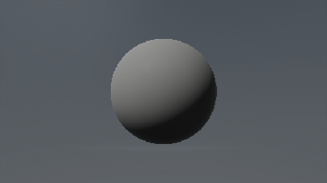
  </a>
  <figcaption>
    <div class="demo-tile-title"><strong>Porcelain</strong><span class="demo-badge">Stone and ceramics</span></div>
    <code class="demo-run">./flow shader examples/gpu/shader_photoreal_materials.flow --name photoreal_porcelain</code>
    <div class="demo-actions"><a href="../../examples/gpu/shader_photoreal_materials.flow">Source</a><a href="../language/shaders.md">FSL guide</a></div>
  </figcaption>
</figure>
<figure class="demo-tile">
  <a class="demo-tile-media" href="../../examples/gpu/shader_photoreal_materials.flow" aria-label="Open Terracotta source">
    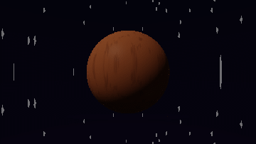
  </a>
  <figcaption>
    <div class="demo-tile-title"><strong>Terracotta</strong><span class="demo-badge">Stone and ceramics</span></div>
    <code class="demo-run">./flow shader examples/gpu/shader_photoreal_materials.flow --name photoreal_terracotta</code>
    <div class="demo-actions"><a href="../../examples/gpu/shader_photoreal_materials.flow">Source</a><a href="../language/shaders.md">FSL guide</a></div>
  </figcaption>
</figure>
<figure class="demo-tile">
  <a class="demo-tile-media" href="../../examples/gpu/shader_photoreal_materials.flow" aria-label="Open Obsidian source">
    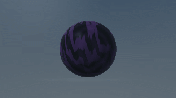
  </a>
  <figcaption>
    <div class="demo-tile-title"><strong>Obsidian</strong><span class="demo-badge">Stone and ceramics</span></div>
    <code class="demo-run">./flow shader examples/gpu/shader_photoreal_materials.flow --name photoreal_obsidian</code>
    <div class="demo-actions"><a href="../../examples/gpu/shader_photoreal_materials.flow">Source</a><a href="../language/shaders.md">FSL guide</a></div>
  </figcaption>
</figure>
</div>

### Coatings and automotive finishes

<p class="demo-section-meta">8 runnable studies</p>

<div class="demo-tile-grid">
<figure class="demo-tile">
  <a class="demo-tile-media" href="../../examples/gpu/shader_photoreal_materials.flow" aria-label="Open Piano Lacquer source">
    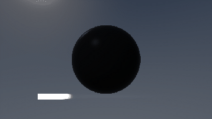
  </a>
  <figcaption>
    <div class="demo-tile-title"><strong>Piano Lacquer</strong><span class="demo-badge">Coatings and automotive finishes</span></div>
    <code class="demo-run">./flow shader examples/gpu/shader_photoreal_materials.flow --name photoreal_piano_lacquer</code>
    <div class="demo-actions"><a href="../../examples/gpu/shader_photoreal_materials.flow">Source</a><a href="../language/shaders.md">FSL guide</a></div>
  </figcaption>
</figure>
<figure class="demo-tile">
  <a class="demo-tile-media" href="../../examples/gpu/shader_photoreal_materials.flow" aria-label="Open Candy Red source">
    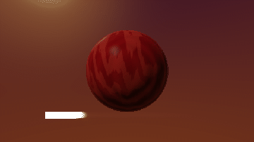
  </a>
  <figcaption>
    <div class="demo-tile-title"><strong>Candy Red</strong><span class="demo-badge">Coatings and automotive finishes</span></div>
    <code class="demo-run">./flow shader examples/gpu/shader_photoreal_materials.flow --name photoreal_candy_red</code>
    <div class="demo-actions"><a href="../../examples/gpu/shader_photoreal_materials.flow">Source</a><a href="../language/shaders.md">FSL guide</a></div>
  </figcaption>
</figure>
<figure class="demo-tile">
  <a class="demo-tile-media" href="../../examples/gpu/shader_photoreal_materials.flow" aria-label="Open Pearl source">
    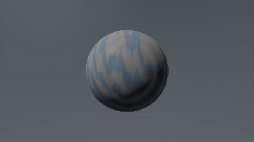
  </a>
  <figcaption>
    <div class="demo-tile-title"><strong>Pearl</strong><span class="demo-badge">Coatings and automotive finishes</span></div>
    <code class="demo-run">./flow shader examples/gpu/shader_photoreal_materials.flow --name photoreal_pearl</code>
    <div class="demo-actions"><a href="../../examples/gpu/shader_photoreal_materials.flow">Source</a><a href="../language/shaders.md">FSL guide</a></div>
  </figcaption>
</figure>
<figure class="demo-tile">
  <a class="demo-tile-media" href="../../examples/gpu/shader_photoreal_materials.flow" aria-label="Open Iridescent source">
    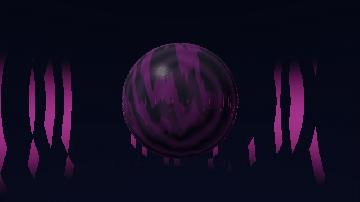
  </a>
  <figcaption>
    <div class="demo-tile-title"><strong>Iridescent</strong><span class="demo-badge">Coatings and automotive finishes</span></div>
    <code class="demo-run">./flow shader examples/gpu/shader_photoreal_materials.flow --name photoreal_iridescent</code>
    <div class="demo-actions"><a href="../../examples/gpu/shader_photoreal_materials.flow">Source</a><a href="../language/shaders.md">FSL guide</a></div>
  </figcaption>
</figure>
<figure class="demo-tile">
  <a class="demo-tile-media" href="../../examples/gpu/shader_photoreal_materials.flow" aria-label="Open Enamel Blue source">
    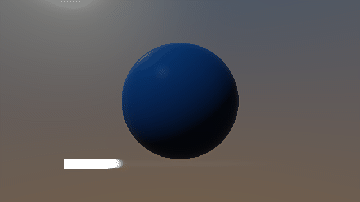
  </a>
  <figcaption>
    <div class="demo-tile-title"><strong>Enamel Blue</strong><span class="demo-badge">Coatings and automotive finishes</span></div>
    <code class="demo-run">./flow shader examples/gpu/shader_photoreal_materials.flow --name photoreal_enamel_blue</code>
    <div class="demo-actions"><a href="../../examples/gpu/shader_photoreal_materials.flow">Source</a><a href="../language/shaders.md">FSL guide</a></div>
  </figcaption>
</figure>
<figure class="demo-tile">
  <a class="demo-tile-media" href="../../examples/gpu/shader_photoreal_materials.flow" aria-label="Open Clearcoat Black source">
    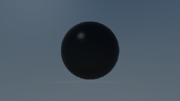
  </a>
  <figcaption>
    <div class="demo-tile-title"><strong>Clearcoat Black</strong><span class="demo-badge">Coatings and automotive finishes</span></div>
    <code class="demo-run">./flow shader examples/gpu/shader_photoreal_materials.flow --name photoreal_clearcoat_black</code>
    <div class="demo-actions"><a href="../../examples/gpu/shader_photoreal_materials.flow">Source</a><a href="../language/shaders.md">FSL guide</a></div>
  </figcaption>
</figure>
<figure class="demo-tile">
  <a class="demo-tile-media" href="../../examples/gpu/shader_photoreal_materials.flow" aria-label="Open Automotive Silver source">
    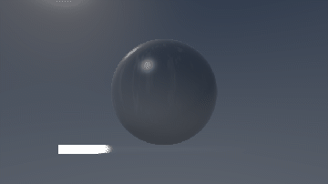
  </a>
  <figcaption>
    <div class="demo-tile-title"><strong>Automotive Silver</strong><span class="demo-badge">Coatings and automotive finishes</span></div>
    <code class="demo-run">./flow shader examples/gpu/shader_photoreal_materials.flow --name photoreal_automotive_silver</code>
    <div class="demo-actions"><a href="../../examples/gpu/shader_photoreal_materials.flow">Source</a><a href="../language/shaders.md">FSL guide</a></div>
  </figcaption>
</figure>
<figure class="demo-tile">
  <a class="demo-tile-media" href="../../examples/gpu/shader_photoreal_materials.flow" aria-label="Open Carbon Clearcoat source">
    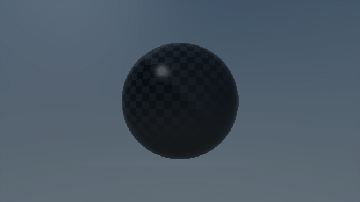
  </a>
  <figcaption>
    <div class="demo-tile-title"><strong>Carbon Clearcoat</strong><span class="demo-badge">Coatings and automotive finishes</span></div>
    <code class="demo-run">./flow shader examples/gpu/shader_photoreal_materials.flow --name photoreal_carbon_clearcoat</code>
    <div class="demo-actions"><a href="../../examples/gpu/shader_photoreal_materials.flow">Source</a><a href="../language/shaders.md">FSL guide</a></div>
  </figcaption>
</figure>
</div>

### Organic and textile-like surfaces

<p class="demo-section-meta">8 runnable studies</p>

<div class="demo-tile-grid">
<figure class="demo-tile">
  <a class="demo-tile-media" href="../../examples/gpu/shader_photoreal_materials.flow" aria-label="Open Walnut source">
    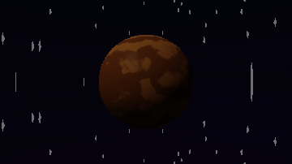
  </a>
  <figcaption>
    <div class="demo-tile-title"><strong>Walnut</strong><span class="demo-badge">Organic and textile-like surfaces</span></div>
    <code class="demo-run">./flow shader examples/gpu/shader_photoreal_materials.flow --name photoreal_walnut</code>
    <div class="demo-actions"><a href="../../examples/gpu/shader_photoreal_materials.flow">Source</a><a href="../language/shaders.md">FSL guide</a></div>
  </figcaption>
</figure>
<figure class="demo-tile">
  <a class="demo-tile-media" href="../../examples/gpu/shader_photoreal_materials.flow" aria-label="Open Mahogany source">
    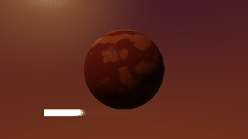
  </a>
  <figcaption>
    <div class="demo-tile-title"><strong>Mahogany</strong><span class="demo-badge">Organic and textile-like surfaces</span></div>
    <code class="demo-run">./flow shader examples/gpu/shader_photoreal_materials.flow --name photoreal_mahogany</code>
    <div class="demo-actions"><a href="../../examples/gpu/shader_photoreal_materials.flow">Source</a><a href="../language/shaders.md">FSL guide</a></div>
  </figcaption>
</figure>
<figure class="demo-tile">
  <a class="demo-tile-media" href="../../examples/gpu/shader_photoreal_materials.flow" aria-label="Open Oak source">
    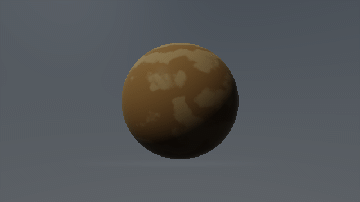
  </a>
  <figcaption>
    <div class="demo-tile-title"><strong>Oak</strong><span class="demo-badge">Organic and textile-like surfaces</span></div>
    <code class="demo-run">./flow shader examples/gpu/shader_photoreal_materials.flow --name photoreal_oak</code>
    <div class="demo-actions"><a href="../../examples/gpu/shader_photoreal_materials.flow">Source</a><a href="../language/shaders.md">FSL guide</a></div>
  </figcaption>
</figure>
<figure class="demo-tile">
  <a class="demo-tile-media" href="../../examples/gpu/shader_photoreal_materials.flow" aria-label="Open Leather source">
    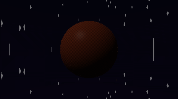
  </a>
  <figcaption>
    <div class="demo-tile-title"><strong>Leather</strong><span class="demo-badge">Organic and textile-like surfaces</span></div>
    <code class="demo-run">./flow shader examples/gpu/shader_photoreal_materials.flow --name photoreal_leather</code>
    <div class="demo-actions"><a href="../../examples/gpu/shader_photoreal_materials.flow">Source</a><a href="../language/shaders.md">FSL guide</a></div>
  </figcaption>
</figure>
<figure class="demo-tile">
  <a class="demo-tile-media" href="../../examples/gpu/shader_photoreal_materials.flow" aria-label="Open Velvet source">
    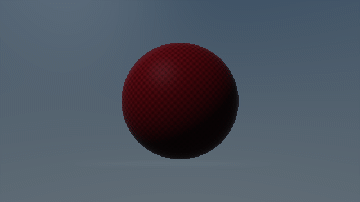
  </a>
  <figcaption>
    <div class="demo-tile-title"><strong>Velvet</strong><span class="demo-badge">Organic and textile-like surfaces</span></div>
    <code class="demo-run">./flow shader examples/gpu/shader_photoreal_materials.flow --name photoreal_velvet</code>
    <div class="demo-actions"><a href="../../examples/gpu/shader_photoreal_materials.flow">Source</a><a href="../language/shaders.md">FSL guide</a></div>
  </figcaption>
</figure>
<figure class="demo-tile">
  <a class="demo-tile-media" href="../../examples/gpu/shader_photoreal_materials.flow" aria-label="Open Satin source">
    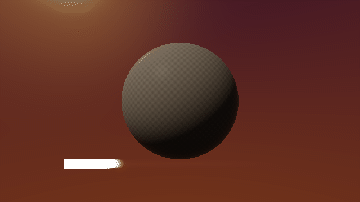
  </a>
  <figcaption>
    <div class="demo-tile-title"><strong>Satin</strong><span class="demo-badge">Organic and textile-like surfaces</span></div>
    <code class="demo-run">./flow shader examples/gpu/shader_photoreal_materials.flow --name photoreal_satin</code>
    <div class="demo-actions"><a href="../../examples/gpu/shader_photoreal_materials.flow">Source</a><a href="../language/shaders.md">FSL guide</a></div>
  </figcaption>
</figure>
<figure class="demo-tile">
  <a class="demo-tile-media" href="../../examples/gpu/shader_photoreal_materials.flow" aria-label="Open Silk source">
    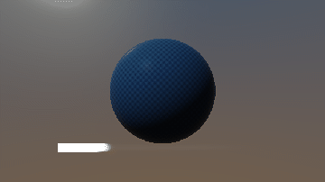
  </a>
  <figcaption>
    <div class="demo-tile-title"><strong>Silk</strong><span class="demo-badge">Organic and textile-like surfaces</span></div>
    <code class="demo-run">./flow shader examples/gpu/shader_photoreal_materials.flow --name photoreal_silk</code>
    <div class="demo-actions"><a href="../../examples/gpu/shader_photoreal_materials.flow">Source</a><a href="../language/shaders.md">FSL guide</a></div>
  </figcaption>
</figure>
<figure class="demo-tile">
  <a class="demo-tile-media" href="../../examples/gpu/shader_photoreal_materials.flow" aria-label="Open Wax source">
    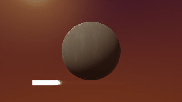
  </a>
  <figcaption>
    <div class="demo-tile-title"><strong>Wax</strong><span class="demo-badge">Organic and textile-like surfaces</span></div>
    <code class="demo-run">./flow shader examples/gpu/shader_photoreal_materials.flow --name photoreal_wax</code>
    <div class="demo-actions"><a href="../../examples/gpu/shader_photoreal_materials.flow">Source</a><a href="../language/shaders.md">FSL guide</a></div>
  </figcaption>
</figure>
</div>

### Industrial materials

<p class="demo-section-meta">8 runnable studies</p>

<div class="demo-tile-grid">
<figure class="demo-tile">
  <a class="demo-tile-media" href="../../examples/gpu/shader_photoreal_materials.flow" aria-label="Open Concrete source">
    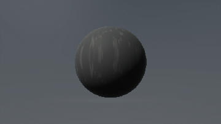
  </a>
  <figcaption>
    <div class="demo-tile-title"><strong>Concrete</strong><span class="demo-badge">Industrial materials</span></div>
    <code class="demo-run">./flow shader examples/gpu/shader_photoreal_materials.flow --name photoreal_concrete</code>
    <div class="demo-actions"><a href="../../examples/gpu/shader_photoreal_materials.flow">Source</a><a href="../language/shaders.md">FSL guide</a></div>
  </figcaption>
</figure>
<figure class="demo-tile">
  <a class="demo-tile-media" href="../../examples/gpu/shader_photoreal_materials.flow" aria-label="Open Wet Concrete source">
    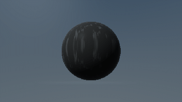
  </a>
  <figcaption>
    <div class="demo-tile-title"><strong>Wet Concrete</strong><span class="demo-badge">Industrial materials</span></div>
    <code class="demo-run">./flow shader examples/gpu/shader_photoreal_materials.flow --name photoreal_wet_concrete</code>
    <div class="demo-actions"><a href="../../examples/gpu/shader_photoreal_materials.flow">Source</a><a href="../language/shaders.md">FSL guide</a></div>
  </figcaption>
</figure>
<figure class="demo-tile">
  <a class="demo-tile-media" href="../../examples/gpu/shader_photoreal_materials.flow" aria-label="Open Asphalt source">
    
  </a>
  <figcaption>
    <div class="demo-tile-title"><strong>Asphalt</strong><span class="demo-badge">Industrial materials</span></div>
    <code class="demo-run">./flow shader examples/gpu/shader_photoreal_materials.flow --name photoreal_asphalt</code>
    <div class="demo-actions"><a href="../../examples/gpu/shader_photoreal_materials.flow">Source</a><a href="../language/shaders.md">FSL guide</a></div>
  </figcaption>
</figure>
<figure class="demo-tile">
  <a class="demo-tile-media" href="../../examples/gpu/shader_photoreal_materials.flow" aria-label="Open Wet Asphalt source">
    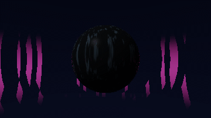
  </a>
  <figcaption>
    <div class="demo-tile-title"><strong>Wet Asphalt</strong><span class="demo-badge">Industrial materials</span></div>
    <code class="demo-run">./flow shader examples/gpu/shader_photoreal_materials.flow --name photoreal_wet_asphalt</code>
    <div class="demo-actions"><a href="../../examples/gpu/shader_photoreal_materials.flow">Source</a><a href="../language/shaders.md">FSL guide</a></div>
  </figcaption>
</figure>
<figure class="demo-tile">
  <a class="demo-tile-media" href="../../examples/gpu/shader_photoreal_materials.flow" aria-label="Open Rubber source">
    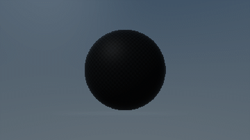
  </a>
  <figcaption>
    <div class="demo-tile-title"><strong>Rubber</strong><span class="demo-badge">Industrial materials</span></div>
    <code class="demo-run">./flow shader examples/gpu/shader_photoreal_materials.flow --name photoreal_rubber</code>
    <div class="demo-actions"><a href="../../examples/gpu/shader_photoreal_materials.flow">Source</a><a href="../language/shaders.md">FSL guide</a></div>
  </figcaption>
</figure>
<figure class="demo-tile">
  <a class="demo-tile-media" href="../../examples/gpu/shader_photoreal_materials.flow" aria-label="Open Plastic source">
    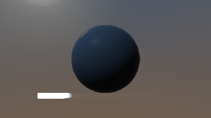
  </a>
  <figcaption>
    <div class="demo-tile-title"><strong>Plastic</strong><span class="demo-badge">Industrial materials</span></div>
    <code class="demo-run">./flow shader examples/gpu/shader_photoreal_materials.flow --name photoreal_plastic</code>
    <div class="demo-actions"><a href="../../examples/gpu/shader_photoreal_materials.flow">Source</a><a href="../language/shaders.md">FSL guide</a></div>
  </figcaption>
</figure>
<figure class="demo-tile">
  <a class="demo-tile-media" href="../../examples/gpu/shader_photoreal_materials.flow" aria-label="Open Acrylic source">
    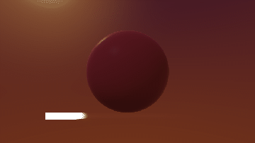
  </a>
  <figcaption>
    <div class="demo-tile-title"><strong>Acrylic</strong><span class="demo-badge">Industrial materials</span></div>
    <code class="demo-run">./flow shader examples/gpu/shader_photoreal_materials.flow --name photoreal_acrylic</code>
    <div class="demo-actions"><a href="../../examples/gpu/shader_photoreal_materials.flow">Source</a><a href="../language/shaders.md">FSL guide</a></div>
  </figcaption>
</figure>
<figure class="demo-tile">
  <a class="demo-tile-media" href="../../examples/gpu/shader_photoreal_materials.flow" aria-label="Open Ceramic Tile source">
    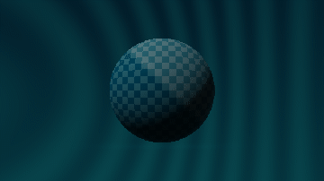
  </a>
  <figcaption>
    <div class="demo-tile-title"><strong>Ceramic Tile</strong><span class="demo-badge">Industrial materials</span></div>
    <code class="demo-run">./flow shader examples/gpu/shader_photoreal_materials.flow --name photoreal_ceramic_tile</code>
    <div class="demo-actions"><a href="../../examples/gpu/shader_photoreal_materials.flow">Source</a><a href="../language/shaders.md">FSL guide</a></div>
  </figcaption>
</figure>
</div>

### Science-fiction and emissive materials

<p class="demo-section-meta">8 runnable studies</p>

<div class="demo-tile-grid">
<figure class="demo-tile">
  <a class="demo-tile-media" href="../../examples/gpu/shader_photoreal_materials.flow" aria-label="Open Neon Glass source">
    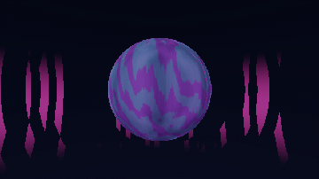
  </a>
  <figcaption>
    <div class="demo-tile-title"><strong>Neon Glass</strong><span class="demo-badge">Science-fiction and emissive materials</span></div>
    <code class="demo-run">./flow shader examples/gpu/shader_photoreal_materials.flow --name photoreal_neon_glass</code>
    <div class="demo-actions"><a href="../../examples/gpu/shader_photoreal_materials.flow">Source</a><a href="../language/shaders.md">FSL guide</a></div>
  </figcaption>
</figure>
<figure class="demo-tile">
  <a class="demo-tile-media" href="../../examples/gpu/shader_photoreal_materials.flow" aria-label="Open Holographic source">
    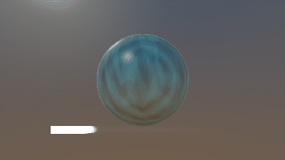
  </a>
  <figcaption>
    <div class="demo-tile-title"><strong>Holographic</strong><span class="demo-badge">Science-fiction and emissive materials</span></div>
    <code class="demo-run">./flow shader examples/gpu/shader_photoreal_materials.flow --name photoreal_holographic</code>
    <div class="demo-actions"><a href="../../examples/gpu/shader_photoreal_materials.flow">Source</a><a href="../language/shaders.md">FSL guide</a></div>
  </figcaption>
</figure>
<figure class="demo-tile">
  <a class="demo-tile-media" href="../../examples/gpu/shader_photoreal_materials.flow" aria-label="Open Plasma Core source">
    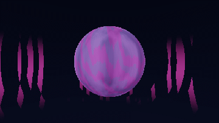
  </a>
  <figcaption>
    <div class="demo-tile-title"><strong>Plasma Core</strong><span class="demo-badge">Science-fiction and emissive materials</span></div>
    <code class="demo-run">./flow shader examples/gpu/shader_photoreal_materials.flow --name photoreal_plasma_core</code>
    <div class="demo-actions"><a href="../../examples/gpu/shader_photoreal_materials.flow">Source</a><a href="../language/shaders.md">FSL guide</a></div>
  </figcaption>
</figure>
<figure class="demo-tile">
  <a class="demo-tile-media" href="../../examples/gpu/shader_photoreal_materials.flow" aria-label="Open Lava Rock source">
    
  </a>
  <figcaption>
    <div class="demo-tile-title"><strong>Lava Rock</strong><span class="demo-badge">Science-fiction and emissive materials</span></div>
    <code class="demo-run">./flow shader examples/gpu/shader_photoreal_materials.flow --name photoreal_lava_rock</code>
    <div class="demo-actions"><a href="../../examples/gpu/shader_photoreal_materials.flow">Source</a><a href="../language/shaders.md">FSL guide</a></div>
  </figcaption>
</figure>
<figure class="demo-tile">
  <a class="demo-tile-media" href="../../examples/gpu/shader_photoreal_materials.flow" aria-label="Open Ice Core source">
    
  </a>
  <figcaption>
    <div class="demo-tile-title"><strong>Ice Core</strong><span class="demo-badge">Science-fiction and emissive materials</span></div>
    <code class="demo-run">./flow shader examples/gpu/shader_photoreal_materials.flow --name photoreal_ice_core</code>
    <div class="demo-actions"><a href="../../examples/gpu/shader_photoreal_materials.flow">Source</a><a href="../language/shaders.md">FSL guide</a></div>
  </figcaption>
</figure>
<figure class="demo-tile">
  <a class="demo-tile-media" href="../../examples/gpu/shader_photoreal_materials.flow" aria-label="Open Alien Alloy source">
    
  </a>
  <figcaption>
    <div class="demo-tile-title"><strong>Alien Alloy</strong><span class="demo-badge">Science-fiction and emissive materials</span></div>
    <code class="demo-run">./flow shader examples/gpu/shader_photoreal_materials.flow --name photoreal_alien_alloy</code>
    <div class="demo-actions"><a href="../../examples/gpu/shader_photoreal_materials.flow">Source</a><a href="../language/shaders.md">FSL guide</a></div>
  </figcaption>
</figure>
<figure class="demo-tile">
  <a class="demo-tile-media" href="../../examples/gpu/shader_photoreal_materials.flow" aria-label="Open Reactor Shell source">
    
  </a>
  <figcaption>
    <div class="demo-tile-title"><strong>Reactor Shell</strong><span class="demo-badge">Science-fiction and emissive materials</span></div>
    <code class="demo-run">./flow shader examples/gpu/shader_photoreal_materials.flow --name photoreal_reactor_shell</code>
    <div class="demo-actions"><a href="../../examples/gpu/shader_photoreal_materials.flow">Source</a><a href="../language/shaders.md">FSL guide</a></div>
  </figcaption>
</figure>
<figure class="demo-tile">
  <a class="demo-tile-media" href="../../examples/gpu/shader_photoreal_materials.flow" aria-label="Open Energy Crystal source">
    
  </a>
  <figcaption>
    <div class="demo-tile-title"><strong>Energy Crystal</strong><span class="demo-badge">Science-fiction and emissive materials</span></div>
    <code class="demo-run">./flow shader examples/gpu/shader_photoreal_materials.flow --name photoreal_energy_crystal</code>
    <div class="demo-actions"><a href="../../examples/gpu/shader_photoreal_materials.flow">Source</a><a href="../language/shaders.md">FSL guide</a></div>
  </figcaption>
</figure>
</div>

### Cinematic environment studies

<p class="demo-section-meta">7 runnable studies</p>

<div class="demo-tile-grid">
<figure class="demo-tile">
  <a class="demo-tile-media" href="../../examples/gpu/shader_photoreal_materials.flow" aria-label="Open Sunset source">
    
  </a>
  <figcaption>
    <div class="demo-tile-title"><strong>Sunset</strong><span class="demo-badge">Cinematic environment studies</span></div>
    <code class="demo-run">./flow shader examples/gpu/shader_photoreal_materials.flow --name photoreal_sunset</code>
    <div class="demo-actions"><a href="../../examples/gpu/shader_photoreal_materials.flow">Source</a><a href="../language/shaders.md">FSL guide</a></div>
  </figcaption>
</figure>
<figure class="demo-tile">
  <a class="demo-tile-media" href="../../examples/gpu/shader_photoreal_materials.flow" aria-label="Open Overcast source">
    
  </a>
  <figcaption>
    <div class="demo-tile-title"><strong>Overcast</strong><span class="demo-badge">Cinematic environment studies</span></div>
    <code class="demo-run">./flow shader examples/gpu/shader_photoreal_materials.flow --name photoreal_overcast</code>
    <div class="demo-actions"><a href="../../examples/gpu/shader_photoreal_materials.flow">Source</a><a href="../language/shaders.md">FSL guide</a></div>
  </figcaption>
</figure>
<figure class="demo-tile">
  <a class="demo-tile-media" href="../../examples/gpu/shader_photoreal_materials.flow" aria-label="Open Night City source">
    
  </a>
  <figcaption>
    <div class="demo-tile-title"><strong>Night City</strong><span class="demo-badge">Cinematic environment studies</span></div>
    <code class="demo-run">./flow shader examples/gpu/shader_photoreal_materials.flow --name photoreal_night_city</code>
    <div class="demo-actions"><a href="../../examples/gpu/shader_photoreal_materials.flow">Source</a><a href="../language/shaders.md">FSL guide</a></div>
  </figcaption>
</figure>
<figure class="demo-tile">
  <a class="demo-tile-media" href="../../examples/gpu/shader_photoreal_materials.flow" aria-label="Open Desert Sun source">
    
  </a>
  <figcaption>
    <div class="demo-tile-title"><strong>Desert Sun</strong><span class="demo-badge">Cinematic environment studies</span></div>
    <code class="demo-run">./flow shader examples/gpu/shader_photoreal_materials.flow --name photoreal_desert_sun</code>
    <div class="demo-actions"><a href="../../examples/gpu/shader_photoreal_materials.flow">Source</a><a href="../language/shaders.md">FSL guide</a></div>
  </figcaption>
</figure>
<figure class="demo-tile">
  <a class="demo-tile-media" href="../../examples/gpu/shader_photoreal_materials.flow" aria-label="Open Arctic source">
    
  </a>
  <figcaption>
    <div class="demo-tile-title"><strong>Arctic</strong><span class="demo-badge">Cinematic environment studies</span></div>
    <code class="demo-run">./flow shader examples/gpu/shader_photoreal_materials.flow --name photoreal_arctic</code>
    <div class="demo-actions"><a href="../../examples/gpu/shader_photoreal_materials.flow">Source</a><a href="../language/shaders.md">FSL guide</a></div>
  </figcaption>
</figure>
<figure class="demo-tile">
  <a class="demo-tile-media" href="../../examples/gpu/shader_photoreal_materials.flow" aria-label="Open Forest source">
    
  </a>
  <figcaption>
    <div class="demo-tile-title"><strong>Forest</strong><span class="demo-badge">Cinematic environment studies</span></div>
    <code class="demo-run">./flow shader examples/gpu/shader_photoreal_materials.flow --name photoreal_forest</code>
    <div class="demo-actions"><a href="../../examples/gpu/shader_photoreal_materials.flow">Source</a><a href="../language/shaders.md">FSL guide</a></div>
  </figcaption>
</figure>
<figure class="demo-tile">
  <a class="demo-tile-media" href="../../examples/gpu/shader_photoreal_materials.flow" aria-label="Open Underwater source">
    
  </a>
  <figcaption>
    <div class="demo-tile-title"><strong>Underwater</strong><span class="demo-badge">Cinematic environment studies</span></div>
    <code class="demo-run">./flow shader examples/gpu/shader_photoreal_materials.flow --name photoreal_underwater</code>
    <div class="demo-actions"><a href="../../examples/gpu/shader_photoreal_materials.flow">Source</a><a href="../language/shaders.md">FSL guide</a></div>
  </figcaption>
</figure>
</div>

## Recording contract

`scripts/record_shader_gallery.py` compiles the same FSL files used by `./flow shader`, 
renders them with `runtime/shader_record_metal.m`, and passes the resulting PPM frames 
through the shared GIF encoder. Capture time is `frame / fps`, so animations do not 
depend on wall-clock scheduling. The recorder requires macOS with an exposed Metal device.

Related: [all galleries](overview.md) · [FSL language guide](../language/shaders.md) · 
[GPU examples](../../examples/gpu/) · [how recordings are produced](README.md)
