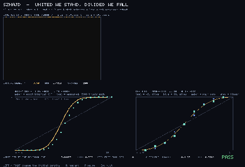
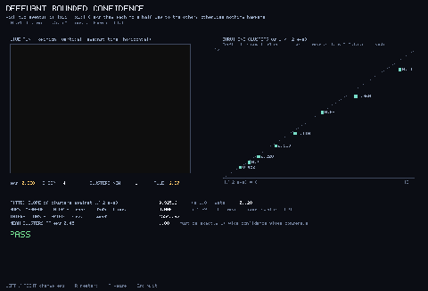
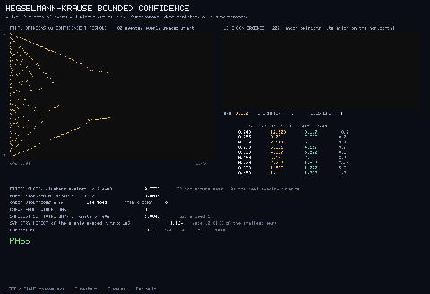

# Opinion Dynamics Gallery

Five models of how a population makes up its mind, written in Flow. Every clip
below is recorded from the real compiled program through the headless
recorder. Every program also measures the thing it is demonstrating, prints the
measurement beside the published value, and returns a nonzero exit code if the
comparison fails, so these are regression tests that happen to draw pictures.

What makes opinion dynamics worth a gallery is that each model has a closed
form to check against. Consensus is not merely observed; the exit probability,
the conserved mean, or the fixed point is computed and compared.

Run any example natively:

```bash
./flow gfx examples/social/<name>.flow
```

Record one headlessly, no display needed:

```bash
FLOW_GFX_RECORD_FRAMES=240 ./flow record examples/social/<name>.flow
```

## Copying a neighbour

| | |
|:---:|:---:|
|  |  |
| **Voter model**. Clifford and Sudbury (1973). Every site copies a random neighbour. The exit probability is measured at eleven densities and gated against the initial density, which it equals exactly because the mean opinion is a bounded martingale.<br>`voter_model.flow` | **Sznajd**. Sznajd-Weron and Sznajd (2000), "united we stand, divided we fall". Persuasion flows outward from an agreeing pair rather than inward to one agent. The well-mixed exit probability has a closed form and is checked against it.<br>`sznajd.flow` |

## Counting heads

| | |
|:---:|:---:|
|  | |
| **Majority rule**. Galam's local rule: the population breaks into random groups of size r, each adopts its own majority, then regroups. Nobody is persuaded by argument. The one-round map is compared against the binomial expression over 200 random regroupings.<br>`majority_rule.flow` | |

## Bounded confidence

Two agents only listen to each other when they already nearly agree. The
threshold decides how many opinions survive.

| | |
|:---:|:---:|
|  |  |
| **Deffuant**. Deffuant, Neau, Amblard and Weisbuch (2000). Pairs meet in the middle when they are within eps. The mean opinion is conserved exactly, which the program checks, because one interaction moves the two agents by equal and opposite amounts.<br>`deffuant.flow` | **Hegselmann-Krause**. Hegselmann and Krause (2002). The same idea made synchronous: every agent takes the mean of everyone it currently finds credible. The limit is verified to be an exact fixed point, agent by agent.<br>`hegselmann_krause.flow` |

## Related

- [Evolutionary Biology](evoleco.md) shares the replicator and game-theoretic
  models that these five sit next to
- [Morphogenesis](morphogenesis.md) for the same recorded-and-gated treatment
  of pattern formation
- [The Example Atlas](../project/example-atlas.md) for how the domains fit
  together
