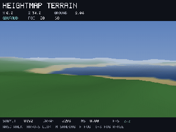
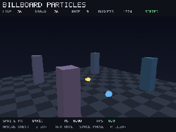
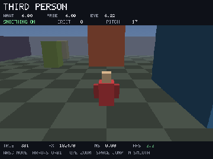
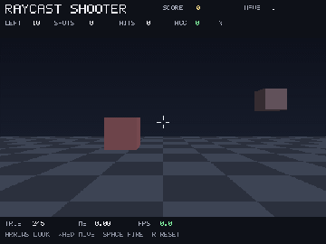

# 3D Gallery

Eight programs on `lib/stdlib/render3d.flow`, a software rasterizer written in
Flow. No GPU is involved: each frame is a packed RGB8 buffer filled a pixel at
a time and handed to `gfx_blit_rgb` once. Every clip below is recorded from the
real compiled program through the headless recorder.

Frame costs are measured over 600 presented frames with writeout disabled, at
480 x 360 on an Apple M4 Max with `clang -O2`. That is a compute cost rather
than a display rate, and each example also shows its own measured frame time on
its HUD.

Run any example natively:

```bash
./flow gfx examples/threed/<name>.flow
```

Record one headlessly, no display needed:

```bash
./flow record examples/threed/<name>.flow --frames 90 --gif out.gif
```

## Geometry and shading

| | |
|:---:|:---:|
|  |  |
| **Spinning solids**. The five Platonic solids from vertex lists alone: faces recovered by a convex-hull plane sweep, then fan-triangulated. Wire, flat, Gouraud and unlit side by side. 0.27 ms<br>`spinning_solids.flow` | **Voxel world**. A 24 x 16 x 24 block field in 8^3 chunks: empty chunks skipped whole, faces emitted only against air, and a raycast block selector. 1.45 ms<br>`voxel_world.flow` |
|  |  |
| **Heightmap terrain**. Four octaves of value noise on a 64 x 64 grid, walked in first person with linear distance fog. Deterministic from a fixed seed. 1.11 ms<br>`heightmap_terrain.flow` | **Billboard particles**. Up to 1200 alpha-blended billboards ordered far to near by a counting sort on quantized depth, tested against solid geometry that writes depth. 1.15 ms<br>`billboard_particles.flow` |

## Cameras and interaction

| | |
|:---:|:---:|
|  |  |
| **FPS camera**. Yaw and pitch camera, per-axis collision resolution against a box level, gravity and jumping at a fixed step. 1.16 ms<br>`fps_camera.flow` | **Third person**. Chase camera with orbit, smoothing, and occlusion pull-in that casts `r3d_ray_aabb` back from the avatar so the view never clips through a wall. 1.48 ms<br>`third_person.flow` |
|  |  |
| **Raycast shooter**. Ray-vs-AABB picking and hitscan from the same `r3d_ray_aabb` query, so the crosshair highlight and the shot cannot disagree. Waves, score, accuracy. 0.66 ms<br>`raycast_shooter.flow` | **Physics 3D**. Rigid spheres under gravity: sphere-plane and sphere-sphere impulse response with restitution, and an honest energy readout that falls to the resting potential. 0.75 ms<br>`physics3d.flow` |

## Related

- [examples/threed/README.md](../../examples/threed/README.md) for the frame
  cost table and what each program is for
- [Graphics 3D](../language/graphics-3d.md) for the renderer's pipeline, matrix
  conventions, fixed caps and limitations
