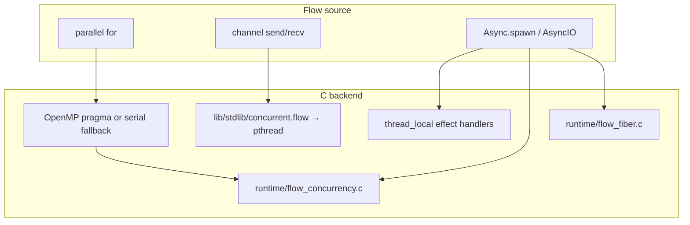

# Flow vs Go: Concurrency

> Status: Phases 1–3b + M:N/netpoll shipping (2026-08-04).  
> Goal: **replace Go** for concurrent services — see [replace-go.md](replace-go.md).

This is the umbrella for the four tracks:

| Track | What | Shipped | Later |
|-------|------|---------|-------|
| **A. Effects-native** | `Async` as effects | TLS; `ThreadedAsync`; **`FiberAsync` asm M:N** + fiber-parked `NetpollAsyncIO` + HTTP bench | True Flow-frame continuations; work-stealing |
| **B. Go-shaped API** | Channels, WaitGroup, threads | send/recv/close, `select2`, condvar WaitGroup | Generic channels, cancel tokens |
| **C. Data-parallel** | `parallel for` | OpenMP when available | Work-stealing pool, GPU sort policies |
| **D. Vision** | This doc + benches | [RESULTS.md](../../benchmarks/concurrency/RESULTS.md) | Public comparison page vs Go |

## Why Flow can beat Go

Go’s win is **ergonomic green threads + channels**. Flow’s wedge is different:

1. **Algebraic effects** — concurrency ops (`spawn`, `delay`, `join`, `AsyncIO`) are
   swappable backends. Business code does not hard-code a runtime. Go cannot swap
   the scheduler at the call-site level. Cancel tokens are a target, not shipped.
2. **No GC** — C backend + manual/arena memory → predictable latency (audio/RT path
   already has `@rt_safe`). Go’s GC is the tax on “faster.”
3. **Data-parallel + GPU** — `parallel for`, SIMD, Metal/unified memory are first-class.
   Go is weak here by design.
4. **Structured concurrency (target)** — scopes that cancel children; typed effect rows
   that make “this function may spawn” visible. Go’s `context.Context` is a bolted-on
   convention; Flow can make it a capability.

Honest today: Go still leads on ecosystem maturity and TSAN-class races. Flow
ships fiber-parked `NetpollAsyncIO`, `select2`/`select4`, `FLOW_RACE=1` lock-order
hooks, and a continuation **scaffold**. Flow wins buffered channel throughput
and **fiber ping-pong** (~2× vs Go on arm64; microbench forces `maxprocs=1`).

## Mental model

## Phase 1 surface (shipped with this doc)

### B — Go-shaped (`lib/stdlib/concurrent.flow`)

- `channel_i32_send` / `try_send` / `recv` / `try_recv` / `close`
- `channel_i32_select2` / `select4` (+ `_try` = non-blocking / default)
- `waitgroup_wait` (mutex + condvar, no spin)
- CondVar / Semaphore / Once with lazy bind on final storage
- Sync structs lead with `ptr`/`i64` so pthread opaque bytes stay 8-aligned
- `thread_spawn` / `thread_join` via runtime (`flow_thread_*`)

### C — Data-parallel

- `parallel for` in C codegen emits `#pragma omp parallel for` under `#ifdef _OPENMP`
- `./flow run` / compile paths pass `-fopenmp` when the toolchain supports it;
  otherwise the loop is correct and serial

### A — Effects + fibers (Phase 3+)

- Effect handler pointers are `_Thread_local` (safe across OS threads)
- `ThreadedAsync` — OS threads (`runtime/flow_concurrency.c`)
- `FiberAsync` — cooperative **M:N** fibers (`runtime/flow_fiber.c` + `flow_fctx_*.S`);
  default workers = `FLOW_MAXPROCS` / CPU count; **per-worker deques + work-stealing**
  (`flow_fiber_steals` / `examples/concurrency/work_steal.flow`);
  effect handlers are **fiber-local** so steal can migrate OS threads safely
- Fiber channel ping-pong **beats Go ~2.4×** on arm64 (asm swap; bench forces
  `maxprocs=1` for a fair switch microbench — see RESULTS.md)
- `NetpollAsyncIO` — kqueue/epoll; **parks the fiber** on poll when on one
- Continuation scaffold (`flow_cont_*`) — C-level API; Flow frames still cannot
  suspend mid-function ([async-effects.md](async-effects.md))

## Speed targets

| Benchmark class | Beat Go by | How |
|-----------------|------------|-----|
| Single-thread numeric | ≈ C, often faster than Go | Existing suite (`benchmarks/`) |
| `parallel for` over arrays | Clear win vs Go chunked goroutines | OpenMP — **measured** |
| Buffered channel throughput | Win on send-all/recv-all | pthread mutex channel — **measured** |
| Channel ping-pong (2 workers) | **Flow fibers ~2.4× faster than Go** | Asm fiber channel switch (`maxprocs=1`) |
| Server RPS / netpoll | HTTP accept-loop microbench | See RESULTS.md |

Live numbers: [benchmarks/concurrency/RESULTS.md](../../benchmarks/concurrency/RESULTS.md)
(`benchmarks/concurrency/run.sh`).

## What we will not do

- Add `async` / `await` keywords before the runtime model is solid
- Pretend `SimulatedAsync` is a scheduler
- Ship GC’d green threads as the only model (effects + OS threads + fibers later)

## Related

- [async-effects.md](async-effects.md) — effect API honesty
- [effects-showcase.md](../effects-showcase.md) — effect system limits
- [comparison.md](../comparison.md) — language comparison table
- `lib/stdlib/concurrent.flow`, `lib/stdlib/async.flow`
- `runtime/flow_concurrency.c`
- `examples/concurrency/`
