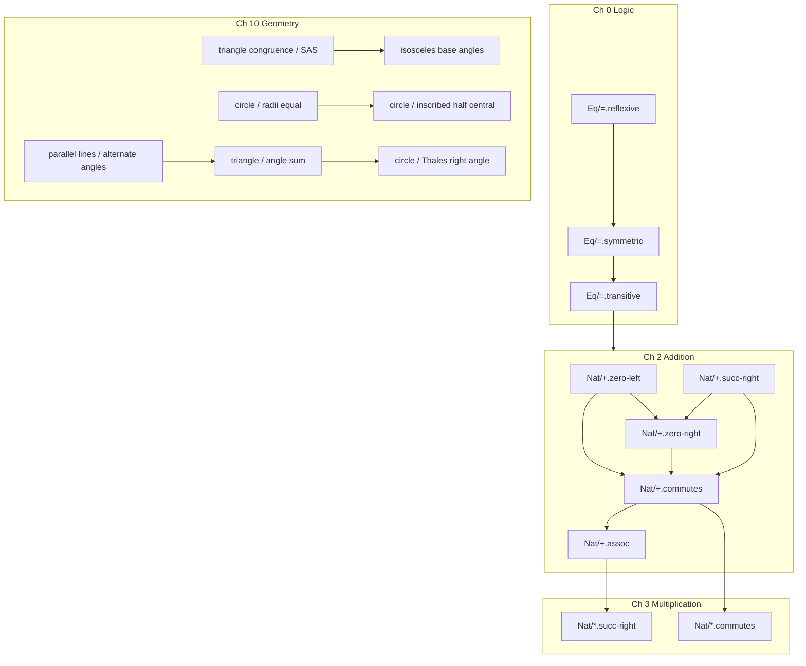

# Flow Math Proof Book, Plan & Completeness Roadmap

> **Status:** Living plan  
> **Goal:** A single, numbered, cross-referenced proof book in the math domain, every step traces to earlier steps or named Claim Paths.

**Master TOC (Mathlib equivalence):** [mathlib-equivalence-toc.md](mathlib-equivalence-toc.md), full 12-phase roadmap, ~150k theorem target, Mathlib module map. Machine-readable manifest: [mathlib-toc.yaml](mathlib-toc.yaml).

This document is the **book contract + Phase 1 chapter detail** for the foundational spine (Peano → Landau → Gries & Schneider scale, without Mathlib bloat).

---

## Design rules (the book contract)

1. **Every proof step is numbered** (①②③…) in generated `.proof.md` / `.proof.tex`.
2. **Every deductive step cites step numbers**, `From ③ and ⑤, we can deduce…`, never free-floating “combining these facts”.
3. **Every `assume` cites a Claim Path**, `Nat/+.zero-left`, with book section anchor once the registry exists.
4. **Trace table** at the bottom of each proof: `⑤ ← ③, ④`.
5. **Tier boundaries are visible**, definition / axiom / derived never blurred.
6. **No synonym creep**, one facet per fingerprint; `flow know --lint-duplicates` in CI.

---

## Book structure (Phase 1 chapters, see master TOC for full corpus)

| Ch | Domain | Morphisms | Target theorems | Status |
|----|--------|-----------|-----------------|--------|
| 0 | `Eq`, `Bool` logic | `=`, `||`, `&&`, `!` | 12 | **2 / 12** |
| 1 | `Nat` core | `succ`, `pred`, `eq` | 8 | **0 / 8** |
| 2 | `Nat` addition | `+` | 10 | **4 / 10** |
| 3 | `Nat` multiplication | `*` | 12 | **0 / 12** |
| 4 | `Nat` order | `<=`, `<` | 14 | **0 / 14** |
| 5 | `Bool` algebra | `||`, `&&`, `!` | 16 | **1 / 16** |
| 6 | `Int` | `+`, `*`, `<=`, `abs` | 18 | **1 / 18** |
| 7 | `Pair`, `Prod` | `fst`, `snd`, `×` | 10 | **0 / 10** |
| 8 | `List` | `append`, `len`, `rev` | 14 | **0 / 14** |
| 9 | `Comb` finite | `card`, `choose` | 12 | **0 / 12** |
| - | Euclid Book I | constructions, congruence | 48 | **48 stubs** |
| - | Analysis appendix | Taylor, derivatives | 2 | **2 stubs** |
| **Σ (in book today)** | | | **123** | **Part I (54) + Part II (19) + Euclid I (48 stepped) + Appendix (2)** |
| **Σ (Phase 1 target)** | | | **200** | |
| **Σ (Mathlib parity)** | | | **~150,000** | see [mathlib-equivalence-toc.md](mathlib-equivalence-toc.md) |

---

## Chapter 0, Logic & equality

**Ontology:** propositional glue used by all later chapters.  
**Literature:** Leibniz (identity), Stoll *Set Theory and Logic* Ch. 2.

| § | Claim Path | Tier | therefore (fingerprint) | needs | Status |
|---|------------|------|-------------------------|-------|--------|
| 0.1 | `Eq/=.reflexive` | axiom | `x = x` | - | ✅ `lib/verify/Eq.flow` |
| 0.2 | `Eq/=.symmetric` | derived | `x = y → y = x` | 0.1 | ✅ `Eq-symmetric.flow` |
| 0.3 | `Eq/=.transitive` | derived | `x = y ∧ y = z → x = z` | 0.1 | ✅ `Eq-transitive.flow` |
| 0.4 | `Eq/=.subst` | derived | equal terms substitute in `+` | 0.3 | ✅ `Eq-subst-add-right.flow` |
| 0.5 | `Bool/||.commutes` | derived | `a ∨ b = b ∨ a` | - | ✅ `lib/verify/Bool.flow` |
| 0.6 | `Bool/&&.commutes` | derived | `a ∧ b = b ∧ a` | 0.5 | ✅ `lib/verify/Bool.flow` |
| 0.7 | `Bool/||.assoc` | derived | `(a∨b)∨c = a∨(b∨c)` | 0.5 | ✅ `Bool-or-assoc.flow` |
| 0.8 | `Bool/&&.assoc` | derived | `(a∧b)∧c = a∧(b∧c)` | 0.6 | ✅ `Bool-and-assoc.flow` |
| 0.9 | `Bool/!.involution` | derived | `!!a = a` | - | ✅ `Bool-not-involution.flow` |
| 0.10 | `Bool/||.identity` | derived | `a ∨ false = a` | 0.5 | ✅ `lib/verify/Bool.flow` |
| 0.11 | `Bool/&&.identity` | derived | `a ∧ true = a` | 0.6 | ✅ `lib/verify/Bool.flow` |
| 0.12 | `Bool/de-morgan.&&-or` | derived | `!(a∧b) = !a ∨ !b` | 0.7-0.9 | ✅ `Bool-de-morgan.flow` |

**File layout:** `lib/verify/Eq.flow`, `lib/verify/Bool.flow`

---

## Chapter 1, Natural numbers (Peano core)

**Ontology:** `Nat` as inductive type, not set-theoretic ω.  
**Literature:** Peano axioms; Landau *Foundations of Analysis* §1.

| § | Claim Path | Tier | claim | Status |
|---|------------|------|-------|--------|
| 1.1 | `Nat/succ.injective` | derived | `succ(m) = succ(n) → m = n` | ✅ `Nat-core.flow` |
| 1.2 | `Nat/pred.succ-left` | definition | `pred(succ(n)) = n` | ✅ `Nat-core.flow` |
| 1.3 | `Nat/pred.succ-right` | definition | `succ(pred(n)) = n` (for `n ≠ 0`) | ✅ `Nat-core.flow` |
| 1.4 | `Nat/eq.decidable` | derived | `m = n ∨ m ≠ n` | ⬜ |
| 1.5 | `Nat/0.not-succ` | derived | `∀n. 0 ≠ succ(n)` | ⬜ |
| 1.6 | `Nat/succ.ne-zero` | derived | `∀n. succ(n) ≠ 0` | ⬜ |
| 1.7 | `Nat/cases.two` | derived | `n = 0 ∨ ∃k. n = succ(k)` | ⬜ |
| 1.8 | `Nat/induction.principle` | meta | induction schema justified | ⬜ |

**File:** `lib/verify/Nat-core.flow` (definitions + structural lemmas)

---

## Chapter 2, Addition on ℕ

**Literature:** Peano recursion; Gries & Schneider Ch. 3.

| § | Claim Path | Tier | Status |
|---|------------|------|--------|
| 2.1 | `Nat/+.zero-left` | definition | ✅ `Nat.flow` |
| 2.2 | `Nat/+.succ-right` | definition | ✅ `Nat.flow` |
| 2.3 | `Nat/+.zero-right` | derived | ✅ `Nat-plus-zero-right.flow` |
| 2.4 | `Nat/+.commutes` | derived | ✅ `Nat-plus-commutes.flow` |
| 2.5 | `Nat/+.assoc` | derived | `(a+b)+c = a+(b+c)` | ✅ `Nat-plus-assoc.flow` |
| 2.6 | `Nat/+.succ-left` | derived | `succ(a)+b = succ(a+b)` | ✅ `Nat-plus-succ-left.flow` |
| 2.7 | `Nat/+.cancel-left` | derived | `a+b = a+c → b = c` | ✅ `Nat-plus-cancel-left.flow` |
| 2.8 | `Nat/+.cancel-right` | derived | `b+a = c+a → b = c` | ✅ `Nat-plus-cancel-right.flow` |
| 2.9 | `Nat/+.mono-right` | derived | `b ≤ c → a+b ≤ a+c` | ✅ `Nat-plus-mono-right.flow` |
| 2.10 | `Nat/+.split-pred` | derived | `n ≠ 0 → n = succ(k)+0` style | ⬜ |

**Dependency spine:** 2.1, 2.2 → 2.3 → 2.4 → 2.5 → 2.6-2.10

---

## Chapter 3, Multiplication on ℕ

| § | Claim Path | Tier | claim | needs |
|---|------------|------|-------|-------|
| 3.1 | `Nat/*.zero-left` | definition | `0 * m = 0` | Ch 2 | ✅ `Nat-mul.flow` |
| 3.2 | `Nat/*.succ-right` | definition | `n * succ(m) = n*m + n` | Ch 2 | ✅ `Nat-mul.flow` |
| 3.3 | `Nat/*.zero-right` | definition | `n * 0 = 0` | 3.1 | ✅ `Nat-mul.flow` |
| 3.4 | `Nat/*.one-left` | derived | `1 * m = m` | 3.1-3.2 | ✅ `Nat-mul-one-left.flow` |
| 3.5 | `Nat/*.one-right` | derived | `m * 1 = m` | 3.4 | ✅ `Nat-mul-one-right.flow` |
| 3.6 | `Nat/*.commutes` | derived | `a * b = b * a` | 3.3-3.5, 2.4 | ✅ `Nat-mul-commutes.flow` |
| 3.7 | `Nat/*.assoc` | derived | `(a*b)*c = a*(b*c)` | 3.6 | ✅ `Nat-mul-assoc.flow` |
| 3.8 | `Nat/*.distrib-left` | derived | `a*(b+c) = a*b + a*c` | 3.7, 2.5 | ✅ `Nat-mul-distrib-left.flow` |
| 3.9 | `Nat/*.distrib-right` | derived | `(a+b)*c = a*c + b*c` | 3.8, 2.4 | ✅ `Nat-mul-distrib-right.flow` |
| 3.10 | `Nat/*.square-def` | definition | `sq(n) = n * n` | 3.2 |
| 3.11 | `Nat/*.square-nonneg` | derived | `sq(n) ≥ 0` | 3.10, Ch 4 |
| 3.12 | `Nat/*.mono` | derived | order respects `*` | Ch 4 |

**File:** `lib/verify/Nat-mul.flow`, `examples/verify/math/derived/Nat-mul-*.flow`

---

## Chapter 4, Order on ℕ

| § | Claim Path | claim |
|---|------------|-------|
| 4.1 | `Nat/<=.refl` | `n ≤ n` | ✅ `Nat-order.flow` |
| 4.2 | `Nat/<=.antisym` | `a ≤ b ∧ b ≤ a → a = b` | ✅ `Nat-order.flow` |
| 4.3 | `Nat/<=.trans` | transitivity | ✅ `Nat-order.flow` |
| 4.4 | `Nat/<.succ` | `a < succ(a)` | ✅ `Nat-order.flow` |
| 4.5 | `Nat/<=.trichotomy` | `a < b ∨ a = b ∨ b < a` |
| 4.6 | `Nat/<=.plus-right` | `a ≤ b → a+c ≤ b+c` |
| 4.7-4.14 | `Nat/<.*` variants | order ↔ multiplication links |

**File:** `lib/verify/Nat-order.flow`

---

## Chapter 5, Boolean algebra (full)

Extends Ch 0 with distributivity, absorption, completeness of case splits.

| § | Claim Path | Status |
|---|------------|--------|
| 5.1-5.16 | `Bool/*` facets | 1 / 16 done |

---

## Chapter 6, Integers

| § | Claim Path | Status |
|---|------------|--------|
| 6.1 | `Int/+.def` | definition as pair quotient | ⬜ |
| 6.2 | `Int/*.square-nonneg` | derived | ✅ `Int-square-nonneg.flow` |
| 6.3-6.18 | `Int/+.*`, `Int/*.*`, `Int/<=.*` | ⬜ |

**File:** `lib/verify/Int.flow`

---

## Chapter 7, Pairs & products

`Pair/fst.project`, `Pair/snd.project`, `Prod/×.assoc`, etc.

**File:** `lib/verify/Pair.flow`

---

## Chapter 8, Lists

`List/append.assoc`, `List/len.append`, `List/rev.rev`, induction on structure.

**File:** `lib/verify/List.flow`

---

## Chapter 9, Finite combinatorics

`Comb/card.union`, `Comb/choose.sym`, Pascal recurrence, all derived from Ch 2-4.

**File:** `lib/verify/Comb.flow`

---

## Generated book artifacts

| Output | Command | Contents |
|--------|---------|----------|
| Per-theorem `.proof.md` | `flow doc proof -r` | Numbered steps + **Trace** table |
| Per-chapter PDF | `flow doc book --chapter 2` | *(planned)* |
| Full book PDF | `flow doc book` | All 126 proofs, continuous numbering |
| Claim registry | `flow know <path>` | Chapter § + step trace |

---

## Completeness roadmap (6 phases)

### Phase A, Traceable prose (**now**)
- [x] Step numbers in proof tables
- [x] Cross-references in English (`From ③ and ⑤…`)
- [x] Trace legend (`⑤ ← ③, ④`)
- [ ] Book § anchors in `assume` lines (`invoking 2.1 Nat/+.zero-left`)

### Phase B, Chapter 0 + 1 (logic & Nat core), **2 weeks**
- [ ] `lib/verify/Eq.flow`, symmetric, transitive, subst
- [ ] `lib/verify/Nat-core.flow`, pred/succ lemmas
- [ ] Header lint: every theorem has `means`, `from`, `tier`, `needs`
- [ ] `flow know --lint-duplicates` in CI

### Phase C, Finish Ch 2-3 (addition & multiplication), **3 weeks**
- [ ] `Nat/+.assoc`, `Nat/+.succ-left`
- [ ] Full `Nat-mul.flow` definition block + derived tree
- [ ] `flow verify` checker (SMT for small steps, induction scaffold)

### Phase D, Order & Bool (Ch 4-5), **3 weeks**
- [ ] `Nat-order.flow` with trichotomy
- [ ] Complete Bool algebra chapter
- [ ] Case-split proofs auto-number branches (done for `||.commutes`)

### Phase E, Int, Pair, List (Ch 6-8), **4 weeks**
- [ ] Int as derived from Nat pairs
- [ ] List induction library
- [ ] `has property` on `function` for runtime specs

### Phase F, Book build & pedagogy, **2 weeks**
- [ ] `flow doc book`, continuous theorem numbering across chapters
- [ ] Internal cross-book refs: `assume Nat/+.zero-left` → “see **Theorem 2.1**”
- [ ] Single PDF: `build/proofs/flow-math-book.pdf`
- [ ] VS Code: click ③ → jump to step ③ in `.flow` source

---

## File tree (target)

```
lib/verify/
  Eq.flow              # Ch 0 (part)
  Bool.flow             # Ch 0 + 5
  Nat-core.flow         # Ch 1
  Nat.flow              # Ch 2 definitions
  Nat-mul.flow          # Ch 3 definitions
  Nat-order.flow        # Ch 4
  Int.flow              # Ch 6
  Pair.flow             # Ch 7
  List.flow             # Ch 8
  Comb.flow             # Ch 9

examples/verify/math/derived/
  Nat-plus-zero-right.flow    # 2.3 ✅
  Nat-plus-commutes.flow      # 2.4 ✅
  Nat-plus-assoc.flow         # 2.5 ⬜
  Nat-mul-commutes.flow       # 3.6 ⬜
  …
```

---

## Chapter 10, Euclidean geometry (diagram-backed)

**Ontology:** the Euclidean plane, points, lines, circles, angles.  
**Literature:** Euclid *Elements* Books I & III; Heath translation.  
**Artifacts:** every theorem ships `.proof.md`, `.proof.tex`, `.proof.svg`, and `.proof-diagram.tex` via `flow doc proof`.  
**Bundle PDF:** `flow doc geometry-bundle` → `build/proofs/geometry-proofs-side-by-side.pdf`.

| § | Claim Coordinate | Tier | therefore (fingerprint) | needs | Status |
|---|------------------|------|-------------------------|-------|--------|
| 10.1 | `«Geometry» «parallel lines» «alternate angles are equal»` | axiom | alternate interior angles equal | - | ✅ `parallel-lines-alternate.flow` |
| 10.2 | `«Geometry» «triangle congruence» «side-angle-side implies congruence»` | axiom | SAS ⇒ congruence | - | ✅ `triangle-congruence-sas.flow` |
| 10.3 | `«Geometry» «intersecting lines» «vertical angles are equal»` | derived | vertical angles equal | - | ✅ `vertical-angles.flow` |
| 10.4 | `«Geometry» «isosceles triangle» «base angles are equal»` | derived | base angles equal | 10.2 | ✅ `isosceles-base-angles.flow` |
| 10.5 | `«Geometry» «triangle» «interior angles sum to two right angles»` | derived | α + β + γ = 180° | 10.1 | ✅ `triangle-angle-sum.flow` |
| 10.6 | `«Geometry» «right triangle» «the Pythagorean relation holds»` | derived | c² = a² + b² | - | ✅ `pythagoras.flow` |
| 10.7 | `«Geometry» «circle» «radii from the centre are equal»` | definition | OA = OB | - | ✅ `circle-radii-equal.flow` |
| 10.8 | `«Geometry» «circle» «inscribed angle is half the central angle»` | derived | ∠APB = ½∠AOB | 10.7 | ✅ `inscribed-angle-half-central.flow` |
| 10.9 | `«Geometry» «circle» «Thales right angle in semicircle»` | derived | ∠ACB = 90° | 10.5 | ✅ `thales-right-angle.flow` |

**File layout:**

```
examples/verify/geometry/
  parallel-lines-alternate.flow
  triangle-congruence-sas.flow
  vertical-angles.flow
  isosceles-base-angles.flow
  triangle-angle-sum.flow
  pythagoras.flow
  circle-radii-equal.flow
  inscribed-angle-half-central.flow
  thales-right-angle.flow
```

**Diagram registry** (`src/flow/geometry_diagram.py`): `parallel-lines-alternate`, `triangle-congruence-sas`, `vertical-angles`, `isosceles-base-angles`, `triangle-angle-sum`, `right-triangle-pythagoras`, `thales-right-angle`, `inscribed-angle-half-central`.

---

## Dependency graph (spine)



---

## What “complete” means

| Criterion | Target |
|-----------|--------|
| Theorem count | 135 Claim Paths across 11 chapters |
| Trace coverage | 100% of deductive steps cite ≥1 prior step or named § |
| Orphan derived facts | 0 (every derived has `used-by` or export) |
| Duplicate fingerprints | 0 (CI enforced) |
| Literature links | 100% `@from` with URL |
| Checker | `flow verify` passes entire `lib/verify` + `derived/` |
| Book PDF | `flow doc bundle` → `build/proofs/flow-proof-book.pdf` (unified, continuous numbering) |
| Geometry diagrams | 100% of Ch 10 theorems auto-generate SVG + TikZ |

---

## One sentence

**The Flow proof book ships today as one PDF, `flow doc bundle`, with Part I (logic and arithmetic, 7 theorems), Euclid Book I (48 propositions), and an analysis appendix (2 theorems); the master build order for Mathlib equivalence lives in [mathlib-equivalence-toc.md](mathlib-equivalence-toc.md).**