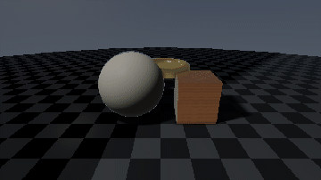
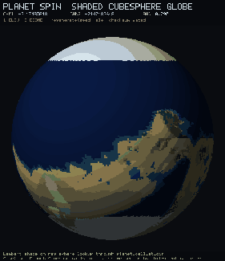
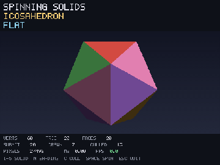

<div class="wiki-hero">

<h1 class="wiki-hero-brand">Flow</h1>
<p class="wiki-hero-eyebrow">v1.0.1 · systems through time</p>

<p class="wiki-hero-title">Write with effects.<br>Compile like C.</p>

<p class="wiki-hero-lead">
A statically typed language where evolution through time is the primary
abstraction: dynamics, algebraic effects, and built-in autodiff on dual
C / MLIR backends.
</p>

<div class="wiki-hero-actions">
  <a href="start-here.md" class="wiki-cta wiki-cta-primary">Start here</a>
  <a href="demos/overview.md" class="wiki-cta">Showcase</a>
  <a href="effects-showcase.md" class="wiki-cta">Effects &amp; capabilities</a>
  <a href="getting-started.md" class="wiki-cta">Install</a>
  <a href="tutorials/index.html" class="wiki-cta">Interactive tutorials</a>
</div>

<pre class="wiki-hero-code"><code class="language-flow">flow Pendulum {
    state angle: f64 = 0.5
    state velocity: f64 = 0.0
    param damping: f64 = 0.3

    angle evolves as velocity
    velocity evolves as -9.81 * sin(angle) - damping * velocity
}</code></pre>

</div>

<div class="wiki-stat-row" aria-label="Documentation at a glance">
<span><strong>19</strong> book chapters</span>
<span><strong>257</strong> interactive lessons</span>
<span><strong>24</strong> effect patterns</span>
<span><strong>150+</strong> recorded demos</span>
<span><strong>12</strong> visual collections</span>
<span><strong>64</strong> photoreal FSL shaders</span>
</div>

## Documentation

Python-style entry points. Pick a section; the sidebar tabs mirror this map.

<nav class="wiki-doc-index" aria-label="Documentation sections">

<a class="wiki-doc" href="book/README.md">
<strong>The Flow Book</strong>
<span>Guided chapters from first program through effects, evolution, autodiff, and media.</span>
</a>

<a class="wiki-doc" href="tutorials/index.html">
<strong>Interactive tutorials</strong>
<span>Browser lessons with a live runner: beginner tracks through graphics, shaders, and RT audio.</span>
</a>

<a class="wiki-doc" href="getting-started.md">
<strong>Install &amp; quick start</strong>
<span>Clone, compile <code>hello_world</code>, open a native window, run the test suite.</span>
</a>

<a class="wiki-doc" href="start-here.md">
<strong>Start here (beginners)</strong>
<span>Zero-to-running path for people new to programming or new to Flow.</span>
</a>

<a class="wiki-doc" href="effects-showcase.md">
<strong>Effects &amp; capabilities cookbook</strong>
<span>24 concrete patterns: handler swaps, nested scopes, multi-effect capabilities, DI, testing, strict rows, state policy, retry, timeout, and async.</span>
</a>

<a class="wiki-doc" href="demos/overview.md">
<strong>Demo showcase</strong>
<span>A visual front door into shaders, games, 3D, morphogenesis, neuroscience, planets, evolution and live WASM.</span>
</a>

<a class="wiki-doc" href="language/spec-index.md">
<strong>Language reference</strong>
<span>Spec index, syntax, types, modules, grammar, spans, WASM, graphics.</span>
</a>

<a class="wiki-doc" href="library/stdlib-reference.md">
<strong>Standard library</strong>
<span>Core APIs, autodiff, audio DSP, RT safety, and memory helpers.</span>
</a>

<a class="wiki-doc" href="DEVELOPMENT.md">
<strong>CLI &amp; tooling</strong>
<span>Commands, LSP, targets, and how to work on the compiler itself.</span>
</a>

<a class="wiki-doc" href="vision.md">
<strong>Vision</strong>
<span>Why evolution is the primary abstraction, and what that buys you at compile time.</span>
</a>

<a class="wiki-doc" href="comparison.md">
<strong>Comparison</strong>
<span>Flow vs C, Rust, Zig, Mojo, and the MATLAB / Simulink lane.</span>
</a>

<a class="wiki-doc" href="third-party/flow-verify.md">
<strong>Optional proofs</strong>
<span>flow-verify is third-party. Useful for formal claims; not required to write Flow.</span>
</a>

</nav>

---

## Effects & capabilities

If you are evaluating Flow's effect system, start with the cookbook rather than the language spec.
It uses the syntax the current compiler actually accepts and links directly to runnable programs.

| I want to see… | Jump straight to |
|---|---|
| the smallest complete effect | [The model in 30 seconds](effects-showcase.md#the-model-in-30-seconds) |
| swapping production and test implementations | [Swap implementations](effects-showcase.md#5-swap-implementations-without-changing-business-code) |
| nested dynamic scoping | [Nested handler override](effects-showcase.md#6-override-a-handler-in-a-nested-dynamic-scope) |
| one capability handling several effects | [Multi-effect capability](effects-showcase.md#7-handle-several-effects-with-one-capability) |
| handlers calling other effects | [Handler composition](effects-showcase.md#8-let-one-handler-perform-another-effect) |
| dependency injection without a framework | [Database DI](effects-showcase.md#16-use-effects-for-dependency-injection) |
| strict effect rows | [Effect rows](effects-showcase.md#10-declare-an-effect-row-on-a-function) |
| stateful loops with stateless capabilities | [Explicit state + policy](effects-showcase.md#19-keep-mutable-state-explicit-use-the-effect-as-policy) |
| timeout and retry | [Timeout](effects-showcase.md#20-model-timeout-policy-as-an-effect) · [Retry](effects-showcase.md#21-model-retry-policy-as-an-effect) |
| async through effects | [Async](effects-showcase.md#22-express-async-operations-through-an-effect-interface) |
| every runnable effect example | [Runnable example map](effects-showcase.md#runnable-example-map) |

<p class="wiki-section-foot">
<a href="effects-showcase.md">Open the effects &amp; capabilities cookbook →</a>
<span class="wiki-dot">·</span>
<a href="../examples/effects/showcase.flow">Open the runnable checkout showcase →</a>
</p>

---

## What Flow looks like

Three signatures of the language. Full write-ups live under Language and Library.

<div class="wiki-showcase">

<div class="wiki-showcase-item">
<p class="wiki-showcase-label">Algebraic effects</p>
<p class="wiki-showcase-desc">Call sites name typed effect interfaces. Enclosing handlers swap I/O, inventory, logging, time, configuration, and test policy for a dynamic scope.</p>

```flow-pseudocode
effect Inventory {
    stock_of(sku: i32) -> i32,
    reserve(sku: i32, qty: i32) -> i32,
}

handle Inventory, Notify with TestBackend {
    let order_id: i32 = place_order(2002, 1)
}
```

<p class="wiki-showcase-more"><a href="effects-showcase.md">24-pattern effects cookbook →</a></p>
</div>

<div class="wiki-showcase-item">
<p class="wiki-showcase-label">Evolution</p>
<p class="wiki-showcase-desc"><code>flow</code> / <code>evolves</code> make continuous and hybrid dynamics syntax, with solvers attached.</p>

```flow
flow Pendulum {
    state angle: f64 = 0.5
    state velocity: f64 = 0.0
    param damping: f64 = 0.3

    angle evolves as velocity
    velocity evolves as -9.81 * sin(angle) - damping * velocity
}
```

<p class="wiki-showcase-more"><a href="book/13-evolution-and-dynamics.md">Book · Evolution →</a></p>
</div>

<div class="wiki-showcase-item">
<p class="wiki-showcase-label">Built-in autodiff</p>
<p class="wiki-showcase-desc">Forward mode with dual numbers in the language, not a bolted-on library.</p>

```flow-pseudocode
function quadratic(x: Dual, a: f32, b: f32, c: f32) -> Dual {
    return a * x * x + b * x + c
}

let x: Dual = dx(2.0)
let q: Dual = quadratic(x, 2.0, 3.0, 1.0)
# q.val = 15, q.grad = 11
```

<p class="wiki-showcase-more"><a href="library/autodiff-guide.md">Autodiff guide →</a></p>
</div>

</div>

---

## See Flow moving

This is the curated **showcase**, not the whole example bank. Each tile opens a proper gallery. GIFs are recordings of compiled Flow output: CPU `gfx` galleries use the headless framebuffer, while FSL shader GIFs come from the offscreen Metal renderer.

<div class="demo-showcase-grid">

<figure class="demo-tile demo-tile-featured">
<a class="demo-tile-media" href="demos/shaders.md"></a>
<figcaption><div class="demo-tile-title"><strong>Photoreal FSL</strong><span class="demo-badge">GPU</span></div>64 procedural shader studies, from glass and metals to full ray-marched scenes.<div class="demo-actions"><a href="demos/shaders.md">Open gallery →</a></div></figcaption>
</figure>

<figure class="demo-tile">
<a class="demo-tile-media" href="demos/games.md"></a>
<figcaption><div class="demo-tile-title"><strong>Games</strong><span class="demo-badge">Playable</span></div>25 complete games with native and browser paths.<div class="demo-actions"><a href="demos/games.md">Open gallery →</a></div></figcaption>
</figure>

<figure class="demo-tile">
<a class="demo-tile-media" href="demos/morphogenesis.md"></a>
<figcaption><div class="demo-tile-title"><strong>Morphogenesis</strong><span class="demo-badge">Dynamics</span></div>Pattern formation where the trajectory is the subject.<div class="demo-actions"><a href="demos/morphogenesis.md">Open gallery →</a></div></figcaption>
</figure>

<figure class="demo-tile">
<a class="demo-tile-media" href="demos/neuro.md"></a>
<figcaption><div class="demo-tile-title"><strong>Neurons &amp; networks</strong><span class="demo-badge">Science</span></div>Spikes, cables, plasticity, attractors and network dynamics with quantitative gates.<div class="demo-actions"><a href="demos/neuro.md">Open gallery →</a></div></figcaption>
</figure>

<figure class="demo-tile">
<a class="demo-tile-media" href="demos/planet.md"></a>
<figcaption><div class="demo-tile-title"><strong>Planet pipeline</strong><span class="demo-badge">Procedural</span></div>Tectonics through erosion, climate and biomes on a cubesphere.<div class="demo-actions"><a href="demos/planet.md">Open gallery →</a></div></figcaption>
</figure>

<figure class="demo-tile">
<a class="demo-tile-media" href="demos/threed.md"></a>
<figcaption><div class="demo-tile-title"><strong>3D renderer</strong><span class="demo-badge">CPU</span></div>A software rasterizer written in Flow, down to the packed RGB framebuffer.<div class="demo-actions"><a href="demos/threed.md">Open gallery →</a></div></figcaption>
</figure>

</div>

<nav class="wiki-paths" aria-label="Browse demo collections by intent">
<a class="wiki-path" href="demos/overview.md#rendering"><span class="wiki-path-kicker">Render</span><strong>Visual &amp; GPU</strong><span>FSL shaders, 3D, planets and procedural generation.</span></a>
<a class="wiki-path" href="demos/overview.md#systems-through-time"><span class="wiki-path-kicker">Evolve</span><strong>Systems through time</strong><span>Morphogenesis, neurons, evolutionary biology, social dynamics and the evolution suite.</span></a>
<a class="wiki-path" href="demos/overview.md#interactive"><span class="wiki-path-kicker">Play</span><strong>Interactive</strong><span>Complete games and the live WebAssembly collection.</span></a>
</nav>

<p class="wiki-section-foot">
<a href="demos/overview.md">Open the full demo showcase →</a>
<span class="wiki-dot">·</span>
<a href="demos/shaders.md">64-shader FSL gallery →</a>
<span class="wiki-dot">·</span>
<a href="wasm/index.html">Live WASM demos →</a>
</p>

---

## Install in five minutes

```bash
git clone https://github.com/flooooooooooow/flow.git
cd flow
./flow run examples/basics/hello_world.flow
./flow gfx examples/evolution/lorenz_gfx.flow   # native window
./flow test --strict --tier2                    # type-check + corpus
```

More detail: [Quick start](getting-started.md) · [CLI reference](DEVELOPMENT.md) · [Start here](start-here.md)

Everyday commands:

```bash
./flow run program.flow        # C backend (default)
./flow mlir-run program.flow   # MLIR pipeline
./flow lsp                     # editor support
```

---

## Project

| | |
|---|---|
| Version | 1.0.1 · [changelog](project/CHANGELOG.md) |
| License | MIT |
| Source | [github.com/flooooooooooow/flow](https://github.com/flooooooooooow/flow) |
| Community | [Discord](https://discord.gg/YK7VaHy24T) · [Discussions](https://github.com/flooooooooooow/flow/discussions) |
| Optional proofs | [flow-verify](third-party/flow-verify.md) (third-party, not required to use Flow) |