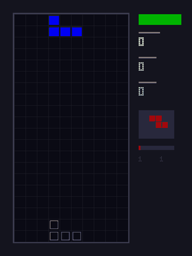
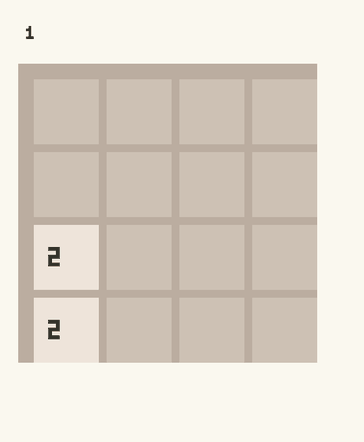

<div class="wiki-hero">

<p class="wiki-hero-eyebrow">Flow · v0.9</p>

<h1 class="wiki-hero-title">Write with effects.<br>Compile like C.</h1>

<p class="wiki-hero-lead">
A statically-typed language for describing systems that evolve through time —
dynamics, analysis, and control alongside algebraic effects, built-in autodiff,
and dual C / MLIR backends at native speed.
</p>

<div class="wiki-hero-actions">
  <a href="getting-started.md" class="wiki-cta wiki-cta-primary">Install &amp; run</a>
  <a href="demos/overview.md" class="wiki-cta">Gallery</a>
  <a href="tutorials/index.html" class="wiki-cta">Interactive tutorials</a>
  <a href="vision.md" class="wiki-cta">The vision</a>
</div>

<pre class="wiki-hero-code"><code class="language-flow">flow Pendulum {
    state angle: f64 = 0.5
    state velocity: f64 = 0.0
    param damping: f64 = 0.3

    angle evolves as velocity
    velocity evolves as -9.81 * sin(angle) - damping * velocity
}</code></pre>

</div>

> [!tip] New here?
> Start with the [5-minute quick start](getting-started.md), then open the [interactive tutorial app](tutorials/index.html) and run examples in your browser.

> [!note] Vision
> Flow's founding vision — the evolution of systems through time as the primary abstraction — is laid out on the [Vision page](vision.md) (full text: `VISION.md` at the repo root).

---

## Why Flow

<div class="wiki-card-grid">

<div class="wiki-card">
<strong>Algebraic effects</strong>
<p>Swap I/O, logging, and state without rewriting call sites. Statically bound handlers compile to direct calls.</p>
</div>

<div class="wiki-card">
<strong>Built-in autodiff</strong>
<p>Forward and reverse mode for optimization and ML — not a bolt-on library.</p>
</div>

<div class="wiki-card">
<strong>Dual compilation</strong>
<p>Portable C by default; MLIR/LLVM for JIT when you need it. Dynamics, structs, and effects run on both.</p>
</div>

<div class="wiki-card">
<strong>Real-time audio</strong>
<p>Native DSP paths, Metal graphics, and systems patterns in one language.</p>
</div>

</div>

---

## See it run

Every clip below is a recording of the compiled program itself — the frames come
straight out of the native `gfx` backend, not from a mock-up. Regenerate them all
with `python3 scripts/record_demos.py`.

<div class="wiki-demo-grid">

<figure class="wiki-demo">

<figcaption>

**[Lorenz attractor](../examples/evolution/lorenz_gfx.flow)** — a `flow` block with
an RK4 solver, stepped and drawn each frame.

</figcaption>
</figure>

<figure class="wiki-demo">

<figcaption>

**[Tetris](../examples/games/tetris_gfx.flow)** — a complete game loop: rotation,
line clears, scoring, ghost piece.

</figcaption>
</figure>

<figure class="wiki-demo">

<figcaption>

**[2048](../examples/games/2048_gfx.flow)** — grid logic and tile merging under
scripted input.

</figcaption>
</figure>

</div>

**[Full game gallery →](demos/overview.md)** — every gallery in one place.

<details class="wiki-demo-links">
<summary>Jump to a gallery</summary>

| Gallery | What's inside |
|---|---|
| [Games](demos/games.md) | 25 complete games, each with a recorded GIF |
| [Morphogenesis](demos/morphogenesis.md) | 40 pattern-formation simulations |
| [Neurons](demos/neuro.md) | 15 spiking-dynamics simulations |
| [Evolutionary Biology](demos/evoleco.md) | 25 pop-gen / evo-game / ecology sims |
| [Planets](demos/planet.md) | 7 staged cubesphere planet demos |
| [Procedural Generation](demos/procgen.md) | 8 noise / heightmap / WFC / biome demos |
| [Numerical Methods](demos/numerical.md) | Adaptive FMM, gated vs direct |
| [Evolution Suite](demos/evolution.md) | 34 systems evolving through time |
| [WebAssembly](demos/wasm.md) | Games &amp; demos running live in a browser |

</details>

---

## Start here

| Path | What you'll do |
|------|----------------|
| [Quick Start](getting-started.md) | Install, compile, run `hello_world` |
| [Interactive Tutorials](tutorials/index.html) | Edit &amp; run **257** lessons across language, systems, and domain tracks |
| [Beginner guide](tutorials/beginner.md) | Variables, functions, control flow |
| [Playground](playground/index.html) | Syntax explorer with verified examples (compile locally with `./flow run`) |
| [Game gallery](demos/games.md) | 24 complete games, each with a recorded GIF |
| [Morphogenesis gallery](demos/morphogenesis.md) | 40 pattern-formation simulations, each with a recorded GIF |
| [Neuron gallery](demos/neuro.md) | 15 spiking-dynamics simulations, each gated and recorded |
| [Evolutionary biology gallery](demos/evoleco.md) | 25 pop-gen / evo-game / ecology sims, each gated and recorded |
| [Planet gallery](demos/planet.md) | 7 staged cubesphere planet demos, each gated and recorded |
| [Procedural generation gallery](demos/procgen.md) | 8 noise / heightmap / WFC / biome demos, each gated and recorded |
| [Numerical gallery](demos/numerical.md) | Adaptive FMM (CGR 1988), gated vs direct and recorded |
| [Evolution suite](demos/evolution.md) | 34 systems evolving through time, each gated on a measurement |
| [Training game AIs](tutorials/game-ai.md) | Q-learning, GA, and policy gradients that measurably learn |
| [ML on a MacBook](tutorials/ml-on-macbook.md) | Digit classifier, parallel training, the Metal path |
| [Comparison](comparison.md) | Flow vs C, Rust, Zig, Mojo |
| [Effects showcase](effects-showcase.md) | Algebraic effects with honest limitations |
| [Autodiff guide](library/autodiff-guide.md) | Forward/reverse AD patterns |
| [Manual memory](library/memory.md) · [RT safety](library/rt-safety.md) | Arenas, allocators, and real-time constraints |
| [Benchmarks](project/benchmark-results.md) | Flow ≈ C on microbenchmarks |

---

## Reference

- [Language Spec](LANGUAGE_SPEC.md) — complete syntax and semantics
- [Grammar](language/grammar.md) · [Formal EBNF](grammar.ebnf)
- [Types](language/types.md) · [Functions](language/functions.md) · [Modules](language/modules.md)
- [Standard Library](library/stdlib-reference.md)
- [Effects Showcase](effects-showcase.md) — algebraic effects walkthrough (with honest limitations)

---

## Tooling

```bash
./flow run program.flow       # compile via C (default)
./flow test --strict --tier2  # strict type-checking (default) + corpus compile checks
./flow mlir program.flow      # emit MLIR
./flow mlir-run program.flow  # MLIR pipeline
./flow jit program.flow       # JIT execution
./flow lsp                    # LSP: diagnostics, go-to-def, references, rename
```

→ [CLI &amp; development](DEVELOPMENT.md) · [Python target](python-target.md)

---

## Optional: flow-verify

Formal math proofs live in the **third-party** [flow-verify](third-party/flow-verify.md) library — not required for everyday Flow programming.

- [Proof catalog](third-party/flow-verify-catalog.md) — browse 1000+ stepped proofs
- [Euclid Books I–VI](third-party/flow-verify-catalog.md) — Elements corpus (see catalog)

---

## Project

| | |
|---|---|
| Version | 0.9.0 ([changelog](project/CHANGELOG.md)) |
| License | MIT |
| Repository | [github.com/flooooooooooow/flow](https://github.com/flooooooooooow/flow) |
| Community | [Discord](https://discord.gg/YK7VaHy24T) · [GitHub Discussions](https://github.com/flooooooooooow/flow/discussions) |
| Docs | [flooooooooooow.github.io/flow](https://flooooooooooow.github.io/flow/) |
| Roadmap | [Language](project/language-roadmap.md) · [Wiki](wiki-roadmap.md) |