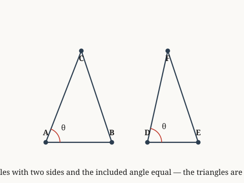

# examples.verify.euclid.book-i

*If two triangles have two sides and the included angle equal, the triangles are congruent.*

**Source.** euclid — Elements, Book I, Proposition 4

## Axiom 1 — If two triangles have two sides and the included angle equal, the triangles are congruent

**Coordinate.** the Euclidean plane · Euclid Book I · Proposition 4: side-angle-side congruence · **Axiom**

*Source: euclid — Elements, Book I, Proposition 4*

> **Goal.** If two triangles have two sides and the included angle equal, the triangles are congruent
>
> $$\triangle ABC = \triangle DEF$$

**Figure.**

| | **Proof** | | **Math** |
|:---:|:---|:---:|:---|
| ① | We accept proposition 4: side-angle-side congruence for Book I of the Elements in the Euclidean plane without proof — an ontological commitment, not a lemma. |  |  |
| ② | We invoke the derived fact: segment_AB == segment_DE. |  |  |
| ③ | We invoke the derived fact: segment_AC == segment_DF. |  |  |
| ④ | We invoke the derived fact: angle_BAC == angle_EDF. |  |  |
| ⑤ | We invoke the derived fact: Common Notion 4: things coinciding with one another are equal. |  |  |
| ⑥ | From step 2, step 3, step 4, and step 5, we can deduce that segment BC equals segment EF. | ⑥ | $\text{segment BC} = \text{segment EF}$ |
| ⑦ | This holds immediately by the stated axiom: angle ABC equals angle DEF. | ⑦ | $\angle ABC = \angle DEF$ |
| ⑧ | This holds immediately by the stated axiom: angle ACB equals angle DFE. | ⑧ | $\angle ACB = \angle DFE$ |
| ⑨ | This holds immediately by the stated axiom: triangle ABC equals triangle DEF. Hence proven. | ⑨ | $\triangle ABC = \triangle DEF$ |

**Trace.** Each step lists the earlier steps it depends on.

| Step | Uses |
|:---:|:---|
| ⑥ | step 2, step 3, step 4, and step 5 |

`the Euclidean plane · Euclid Book I · Proposition 4: side-angle-side congruence`
