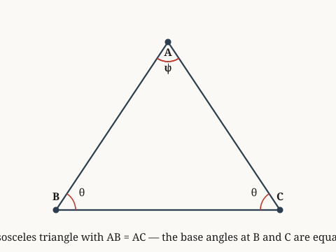

# examples.verify.euclid.book-iv

*To construct an isosceles triangle having each of the angles at the base double the remaining one.*

**Source.** euclid — Elements, Book IV, Proposition 10

## Derived fact 1 — To construct an isosceles triangle having each of the angles at the base double the remaining one

**Coordinate.** the Euclidean plane · Euclid Book IV · Proposition 10: to construct an isosceles triangle with base angles double the vertex · **Derived fact**

*Source: euclid — Elements, Book IV, Proposition 10*

*Built on: proposition 4: side-angle-side congruence, for Book I of the Elements in on the Euclidean plane, proposition 32: the angle between tangent and chord equals the angle in the alternate segment, for Euclid Book III on the Euclidean plane*

> **Goal.** To construct an isosceles triangle having each of the angles at the base double the remaining one
>
> $$\text{isosceles triangle with double base angles}$$

**Figure.**

| | **Proof** | | **Math** |
|:---:|:---|:---:|:---|
| ① | We prove that proposition 10: to construct an isosceles triangle with base angles double the vertex for Euclid Book IV the Euclidean plane. |  |  |
| ② | Let ABC = isosceles_triangle. |  |  |
| ③ | Let angle_A = vertex_angle. |  |  |
| ④ | Let angle_B = base_angle. |  |  |
| ⑤ | From step 2, step 3, and step 4, we can deduce that angle B equals 2 times angle A. | ⑤ | $\angle B = 2 * \angle A$ |
| ⑥ | We invoke the axiom governing Book I of the Elements in the Euclidean plane: proposition 4: side-angle-side congruence, for Book I of the Elements in on the Euclidean plane. |  |  |
| ⑦ | We invoke the derived fact governing Euclid Book III the Euclidean plane: proposition 32: the angle between tangent and chord equals the angle in the alternate segment, for Euclid Book III on the Euclidean plane. |  |  |
| ⑧ | From step 6 and step 7, this implies isosceles triangle with double base angles. Hence proven. | ⑧ | $\text{isosceles triangle with double base angles}$ |

**Trace.** Each step lists the earlier steps it depends on.

| Step | Uses |
|:---:|:---|
| ⑤ | step 2, step 3, and step 4 |
| ⑧ | step 6 and step 7 |

`the Euclidean plane · Euclid Book IV · Proposition 10: to construct an isosceles triangle with base angles double the vertex`
