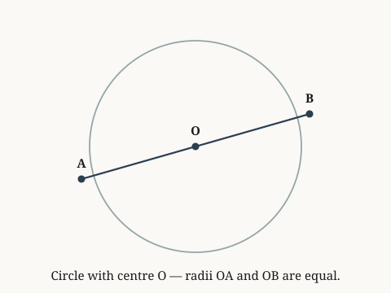

# circle-radii-equal

*All radii of a circle from the centre to the circumference are equal.*

**Source.** euclid — Elements, Book I, Definition 15

## Definition 1 — All radii of a circle from the centre to the circumference are equal

**Coordinate.** the Euclidean plane · circle · radii from the centre are equal · **Definition**

*Source: euclid — Elements, Book I, Definition 15*

> **Goal.** All radii of a circle from the centre to the circumference are equal
>
> $$OA = OB$$

**Figure.**

| | **Proof** | | **Math** |
|:---:|:---|:---:|:---|
| ① | We stipulate radii from the centre are equal for circles in the Euclidean plane — this is a definition, not a derived fact. |  |  |
| ② | This follows directly from the definition: radius OA equals radius OB. Hence proven. | ② | $OA = OB$ |

`the Euclidean plane · circle · radii from the centre are equal`
