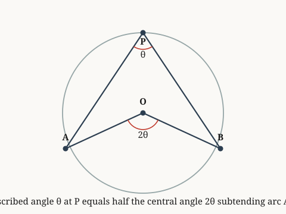

# examples.verify.geometry

*An inscribed angle not on a diameter is less than one right angle.*

**Source.** euclid — Elements, Book III, Proposition 20

## Derived fact 1 — angle APB is less than one right angle when arc AB is less than a semicircle

**Coordinate.** the Euclidean plane · circle · inscribed angle less than one right · **Derived fact**

*Source: euclid*

*Built on: an inscribed angle equals half the central angle on the same arc, inscribed angle on diameter is right, for circles in on the Euclidean plane*

> **Goal.** angle APB is less than one right angle when arc AB is less than a semicircle
>
> $$\angle APB < 90^\circ$$

**Figure.**

| | **Proof** | | **Math** |
|:---:|:---|:---:|:---|
| ① | We prove that inscribed angle less than one right for circles in the Euclidean plane. |  |  |
| ② | We invoke the derived fact governing circles in the Euclidean plane: an inscribed angle equals half the central angle on the same arc. |  |  |
| ③ | We invoke the derived fact governing circles in the Euclidean plane: inscribed angle on diameter is right, for circles in on the Euclidean plane. |  |  |
| ④ | From step 2 and step 3, this implies angle APB < one right angle. Hence proven. | ④ | $\angle APB < 90^\circ$ |

**Trace.** Each step lists the earlier steps it depends on.

| Step | Uses |
|:---:|:---|
| ④ | step 2 and step 3 |

`the Euclidean plane · circle · inscribed angle less than one right`
