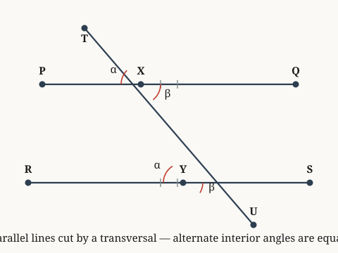

# parallel-lines-alternate

*When parallel lines are cut by a transversal, alternate interior angles are equal.*

**Source.** euclid — Elements, Book I, Proposition 29

## Axiom 1 — When parallel lines are cut by a transversal, alternate interior angles are equal

**Coordinate.** the Euclidean plane · parallel lines · alternate angles are equal · **Axiom**

*Source: euclid — Elements, Book I, Proposition 29*

> **Goal.** When parallel lines are cut by a transversal, alternate interior angles are equal
>
> $$\alpha = \beta$$

**Figure.**

| | **Proof** | | **Math** |
|:---:|:---|:---:|:---|
| ① | We accept alternate angles are equal for parallel lines in the Euclidean plane without proof — an ontological commitment, not a lemma. |  |  |
| ② | This holds immediately by the stated axiom: angle α equals angle β. Hence proven. | ② | $\alpha = \beta$ |

`the Euclidean plane · parallel lines · alternate angles are equal`
