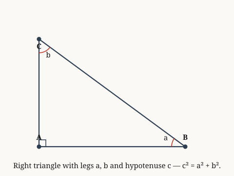

# examples.verify.geometry

*Both legs of a right triangle are shorter than the hypotenuse.*

**Source.** euclid — Elements, Book I, Proposition 47

## Derived fact 1 — b < c when a < c in a right triangle

**Coordinate.** the Euclidean plane · right triangle · second leg is shorter than hypotenuse · **Derived fact**

*Source: euclid*

*Built on: each leg is shorter than hypotenuse, for right triangles in on the Euclidean plane*

> **Goal.** b < c when a < c in a right triangle
>
> $$b < c$$

**Figure.**

| | **Proof** | | **Math** |
|:---:|:---|:---:|:---|
| ① | We prove that second leg is shorter than hypotenuse for right triangles in the Euclidean plane. |  |  |
| ② | We invoke the derived fact governing right triangles in the Euclidean plane: each leg is shorter than hypotenuse, for right triangles in on the Euclidean plane. |  |  |
| ③ | From step 2, this implies b < c. Hence proven. | ③ | $b < c$ |

**Trace.** Each step lists the earlier steps it depends on.

| Step | Uses |
|:---:|:---|
| ③ | step 2 |

`the Euclidean plane · right triangle · second leg is shorter than hypotenuse`
