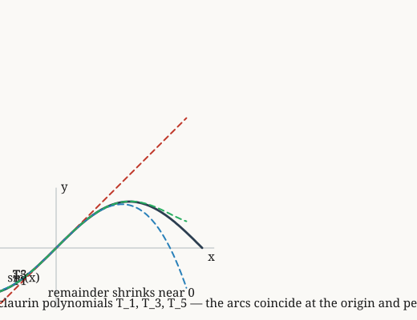

# taylor-sin-maclaurin

*Near the origin, sin(x) agrees with each successive Maclaurin partial sum.*

**Source.** brook taylor — https://en.wikipedia.org/wiki/Taylor_series

## Derived fact 1 — Near the origin, sin(x) agrees with each successive Maclaurin partial sum

**Coordinate.** real analysis · Taylor series · sin equals its Maclaurin series near zero · **Derived fact**

*Source: brook taylor — https://en.wikipedia.org/wiki/Taylor_series*

*Built on: the derivatives of sine at zero follow the alternating pattern of the Maclaurin series*

> **Goal.** Near the origin, sin(x) agrees with each successive Maclaurin partial sum
>
> $$\forall x \in \mathbb{R}\quad S_{5}(x) = \sin(x) \quad (x \to 0)$$

**Figure.**

| | **Proof** | | **Math** |
|:---:|:---|:---:|:---|
| ① | We prove that sin equals its Maclaurin series near zero for Taylor series on real analysis. |  |  |
| ② | We invoke the definitional clause governing smooth functions on real analysis: the derivatives of sine at zero follow the alternating pattern of the Maclaurin series. |  |  |
| ③ | From step 2, the Maclaurin coefficients match the known derivatives of sine at zero, so each partial sum agrees with sin(x) to the next order, so taylor sin(x, order 5) equals sin(x) in a neighbourhood of zero. Hence proven. | ③ | $S_{5}(x) = \sin(x) \quad (x \to 0)$ |

**Trace.** Each step lists the earlier steps it depends on.

| Step | Uses |
|:---:|:---|
| ③ | step 2 |

`real analysis · Taylor series · sin equals its Maclaurin series near zero`
