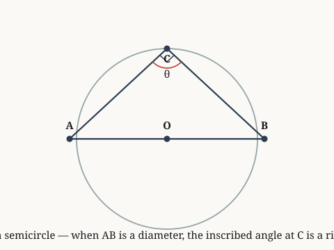

# examples.verify.geometry

*Thales configuration gives inscribed angle half the central angle.*

**Source.** euclid — Elements, Book III, Propositions 20 and 31

## Derived fact 1 — angle ACB equals half of angle AOB on diameter AB

**Coordinate.** the Euclidean plane · circle · Thales inscribed is half central · **Derived fact**

*Source: euclid*

*Built on: an angle inscribed in a semicircle is a right angle, an inscribed angle equals half the central angle on the same arc*

> **Goal.** angle ACB equals half of angle AOB on diameter AB
>
> $$\angle ACB = \tfrac{1}{2}\angle AOB$$

**Figure.**

| | **Proof** | | **Math** |
|:---:|:---|:---:|:---|
| ① | We prove that thales inscribed is half central for circles in the Euclidean plane. |  |  |
| ② | We invoke the derived fact governing circles in the Euclidean plane: an angle inscribed in a semicircle is a right angle. |  |  |
| ③ | We invoke the derived fact governing circles in the Euclidean plane: an inscribed angle equals half the central angle on the same arc. |  |  |
| ④ | From step 2 and step 3, this implies angle ACB equals half of angle AOB. Hence proven. | ④ | $\angle ACB = \tfrac{1}{2}\angle AOB$ |

**Trace.** Each step lists the earlier steps it depends on.

| Step | Uses |
|:---:|:---|
| ④ | step 2 and step 3 |

`the Euclidean plane · circle · Thales inscribed is half central`
