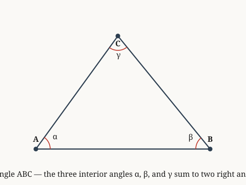

# examples.verify.geometry

*An exterior angle and its adjacent interior angle sum to two right angles.*

**Source.** euclid — Elements, Book I, Proposition 13

## Derived fact 1 — exterior at C plus angle C equals two right angles

**Coordinate.** the Euclidean plane · triangle · exterior plus adjacent interior is two right · **Derived fact**

*Source: euclid*

*Built on: exterior angle equals remote interior sum, for triangles in on the Euclidean plane, the three interior angles of a triangle sum to two right angles*

> **Goal.** exterior at C plus angle C equals two right angles
>
> $$\text{exterior at C} + \angle C = 180^\circ$$

**Figure.**

| | **Proof** | | **Math** |
|:---:|:---|:---:|:---|
| ① | We prove that exterior plus adjacent interior is two right for triangles in the Euclidean plane. |  |  |
| ② | We invoke the derived fact governing triangles in the Euclidean plane: exterior angle equals remote interior sum, for triangles in on the Euclidean plane. |  |  |
| ③ | We invoke the derived fact governing triangles in the Euclidean plane: the three interior angles of a triangle sum to two right angles. |  |  |
| ④ | From step 2 and step 3, this implies exterior at C plus angle C equals two right angles. Hence proven. | ④ | $\text{exterior at C} + \angle C = 180^\circ$ |

**Trace.** Each step lists the earlier steps it depends on.

| Step | Uses |
|:---:|:---|
| ④ | step 2 and step 3 |

`the Euclidean plane · triangle · exterior plus adjacent interior is two right`
