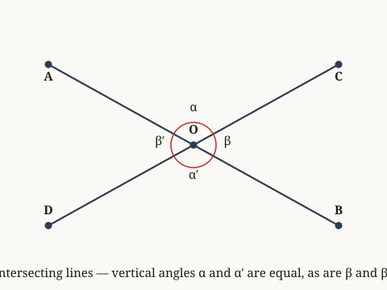

# vertical-angles

*Vertical angles formed by intersecting lines are equal.*

**Source.** euclid — Elements, Book I, Proposition 15

## Derived fact 1 — Vertical angles formed by intersecting lines are equal

**Coordinate.** the Euclidean plane · intersecting lines · vertical angles are equal · **Derived fact**

*Source: euclid — Elements, Book I, Proposition 15*

> **Goal.** Vertical angles formed by intersecting lines are equal
>
> $$\alpha = \alpha'$$

**Figure.**

| | **Proof** | | **Math** |
|:---:|:---|:---:|:---|
| ① | We prove that vertical angles are equal for intersecting lines in the Euclidean plane. |  |  |
| ② | α and β form a straight angle, and so do β and α′, hence α equals α′, so angle α equals angle α′. Hence proven. | ② | $\alpha = \alpha'$ |

`the Euclidean plane · intersecting lines · vertical angles are equal`
